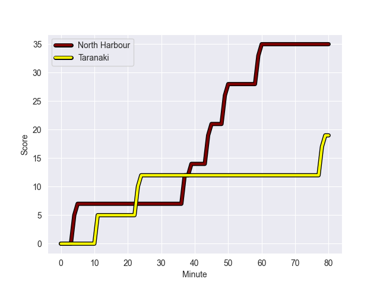
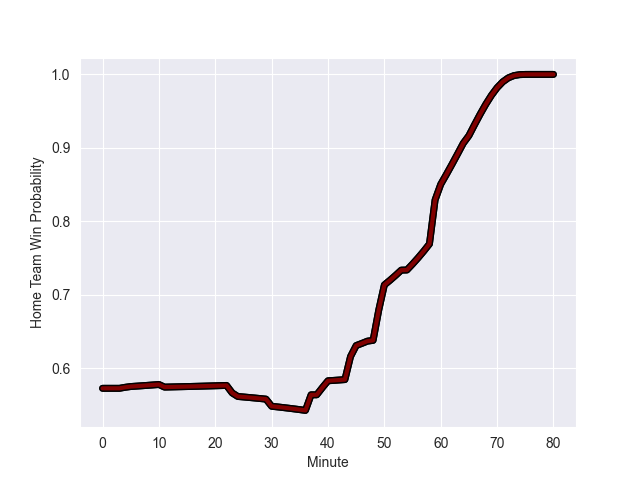

---  
layout: page  
title: Taranaki at North Harbour; 19.0-35.0  
date: 2022-09-24 21:05:00 18:00:00 -0500  
categories: match review  
---
# Prediction: North Harbour by 16.3

North Harbour by 11.3 on a neutral field
## Scores over Time

## Win Probability over Time

# Pre-Match Prediction: North Harbour by 15.9

North Harbour by 10.9 on a neutral pitch

|   Away Minutes | Away Player                   |   Away elo |   Away Percentile |   Number |   Home Percentile |   Home elo | Home Player       |   Home Minutes |
|---------------:|:------------------------------|-----------:|------------------:|---------:|------------------:|-----------:|:------------------|---------------:|
|             60 | Jared Proffit                 |      73.5  |                 8 |        1 |                43 |      80.24 | Tevita Langi      |             65 |
|             56 | Bradley Slater                |      81.22 |                50 |        2 |                74 |      86.24 | Ray Niuia         |             50 |
|             60 | Donald Brighouse              |      67.48 |                 2 |        3 |                70 |      86.22 | Alex Fidow        |             48 |
|             74 | Hemopo Cunningham             |      79.29 |                40 |        4 |                56 |      82.16 | Isoa Nasilasila   |             80 |
|             50 | Mitch Brown                   |      86.02 |                70 |        5 |                76 |      89.06 | Danny Drake       |             54 |
|             50 | Tom Florence                  |      81.08 |                49 |        6 |                67 |      84.78 | Tamarau McGahan   |             80 |
|             80 | Michael Loft                  |      77.65 |                22 |        7 |                77 |      88.57 | Jed Melvin        |             60 |
|             80 | Kaylum Boshier                |      73.88 |                11 |        8 |                73 |      88.88 | Cameron Suafoa    |             80 |
|             50 | Logan Crowley                 |      71.88 |                 5 |        9 |                 4 |      71.56 | Jamie Booth       |             60 |
|             80 | Daniel Waite                  |      75.4  |                14 |       10 |                82 |      94.42 | Bryn Gatland      |             80 |
|             80 | Josh Setu                     |      76.26 |                18 |       11 |                90 |      99.6  | Tevita Li         |             80 |
|             80 | Teihorangi Walden             |      68.08 |                 1 |       12 |                62 |      84.89 | Denny Solomona    |             54 |
|             60 | Meihana Grindlay              |      78.86 |                33 |       13 |                90 |      99.29 | Mark Telea        |             65 |
|             80 | Jacob Ratumaitavuki-Kneepkens |      95.98 |                85 |       14 |                48 |      82.74 | Kade Banks        |             69 |
|             50 | Stephen Perofeta              |      97.86 |                89 |       15 |                67 |      88.14 | Shaun Stevenson   |             80 |
|             30 | Scott Jury                    |      77.29 |                28 |       19 |                27 |      77.9  | Felix Kalapu      |             26 |
|             30 | Millennium Sanerivi           |      79.81 |                42 |       20 |                66 |      86.44 | Lotu Inisi        |             20 |
|             30 | Liam Blyde                    |      88.35 |                73 |       21 |                42 |      79.91 | Siaosi Nginingini |             20 |
|             30 | Adam Lennox                   |      75.46 |                17 |       22 |                37 |      79.31 | Jack Heighton     |             26 |

