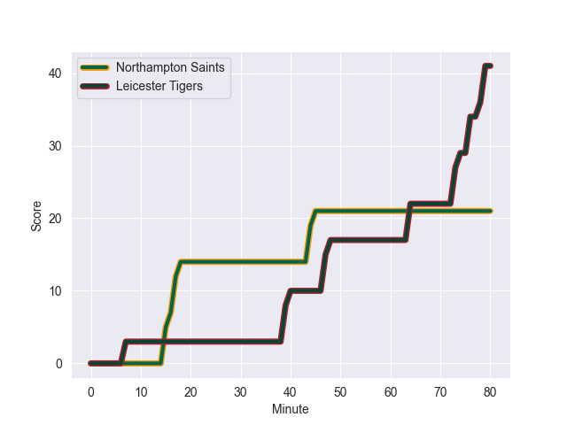
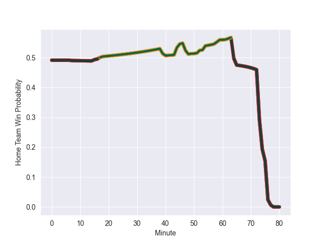

---  
layout: page  
title: Leicester Tigers at Northampton Saints; 41.0-21.0  
date: 2022-09-24 10:00:00 18:00:00 -0500  
categories: match review  
---
# Prediction: Northampton Saints by 3.4

Leicester Tigers by 1.6 on a neutral field
## Scores over Time

## Win Probability over Time

# Pre-Match Prediction: Leicester Tigers by 3.6

Leicester Tigers by 1.4 on a neutral pitch

|   Away Minutes | Away Player         |   Away elo |   Away Percentile |   Number |   Home Percentile |   Home elo | Home Player          |   Home Minutes |
|---------------:|:--------------------|-----------:|------------------:|---------:|------------------:|-----------:|:---------------------|---------------:|
|             65 | James Cronin        |      91.96 |                83 |        1 |                48 |      80.77 | Emmanuel Iyogun      |             77 |
|             80 | Charlie Clare       |      76.51 |                18 |        2 |                73 |      85.57 | Sam Matavesi         |             65 |
|             80 | Ollie Chessum       |      79.18 |                38 |        4 |                63 |      83.19 | Lukhan Salakaia-Loto |             80 |
|             48 | Calum Green         |      97.07 |                89 |        5 |                17 |      76.64 | Alex Coles           |             80 |
|             80 | George Martin       |      89.26 |                77 |        6 |                90 |      98.42 | Courtney Lawes       |             50 |
|             54 | Tommy Reffell       |      96.03 |                89 |        7 |                91 |      99.64 | Lewis Ludlam         |             74 |
|             80 | Hanro Liebenberg    |     103.61 |                91 |        8 |                54 |      83.14 | Juarno Augustus      |             80 |
|             60 | Jack van Poortvliet |      90.23 |                80 |        9 |                88 |      98.73 | Alex Mitchell        |             80 |
|             80 | Freddie Burns       |     109    |                97 |       10 |               100 |     119.56 | Dan Biggar           |             65 |
|             73 | Nemani Nadolo       |     103.2  |                92 |       11 |                24 |      77.83 | Matt Proctor         |             74 |
|             80 | Jimmy Gopperth      |      97.18 |                84 |       12 |                89 |      98.94 | Rory Hutchinson      |             80 |
|             61 | Guy Porter          |      78.04 |                27 |       13 |                43 |      80.76 | Fraser Dingwall      |             80 |
|             65 | Harry Potter        |      79.43 |                38 |       14 |                79 |      91.3  | Tommy Freeman        |             78 |
|             80 | Freddie Steward     |      87.82 |                67 |       15 |                90 |     100.34 | George Furbank       |             80 |
|              7 | Joe Taufete'e       |      84.63 |                70 |       16 |                97 |     104.42 | Mike Haywood         |             15 |
|             15 | Francois van Wyk    |      91.2  |                83 |       17 |                86 |      91.96 | Ethan Waller         |              3 |
|             21 | Joe Heyes           |      81.85 |                49 |       18 |                89 |      94.8  | Paul Hill            |             28 |
|             32 | Harry Wells         |     103.52 |                95 |       19 |                89 |      96.67 | Alex Moon            |             30 |
|             26 | Olly Cracknell      |      65.55 |                 0 |       20 |                31 |      78.36 | Angus Scott-Young    |              6 |
|             20 | Ben Youngs          |      96.67 |                84 |       21 |                11 |      75.68 | Tom James            |              6 |
|             15 | Chris Ashton        |     125.07 |               100 |       23 |                98 |     111.32 | Tom Collins          |              2 |

