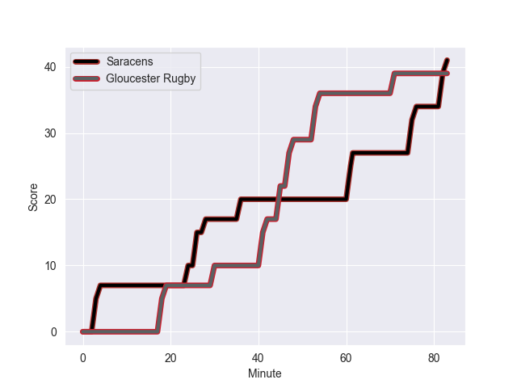
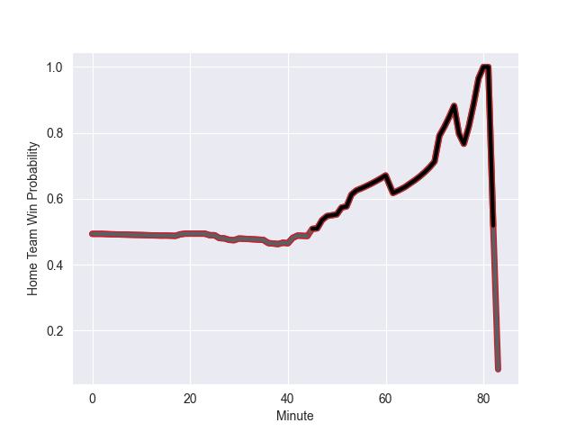

---  
layout: page  
title: Gloucester Rugby at Saracens; 39.0-41.0  
date: 2022-09-24 10:00:00 18:00:00 -0500  
categories: match review  
---
# Prediction: Saracens by 5.8

Saracens by 0.8 on a neutral field
## Scores over Time

## Win Probability over Time

# Pre-Match Prediction: Saracens by 7.6

Saracens by 2.6 on a neutral pitch

|   Away Minutes | Away Player         |   Away elo |   Away Percentile |   Number |   Home Percentile |   Home elo | Home Player       |   Home Minutes |
|---------------:|:--------------------|-----------:|------------------:|---------:|------------------:|-----------:|:------------------|---------------:|
|             15 | Harry Elrington     |      83.68 |                64 |        1 |                95 |     101.27 | Mako Vunipola     |             51 |
|             61 | Jack Singleton      |      97.13 |                92 |        2 |                98 |     112.99 | Jamie George      |             51 |
|             61 | Fraser Balmain      |      71.88 |                 6 |        3 |                31 |      78.37 | Christian Judge   |             54 |
|             83 | Freddie Clarke      |      91.63 |                82 |        4 |                61 |      83.33 | Theo McFarland    |             61 |
|             83 | Alex Craig          |      77.52 |                29 |        5 |                42 |      79.54 | Hugh Tizard       |             83 |
|             83 | Ruan Ackermann      |     100.45 |                92 |        6 |                44 |      81.96 | Andy Christie     |             54 |
|             46 | Harry Taylor        |      78.12 |                28 |        7 |                94 |     102.6  | Ben Earl          |             83 |
|             83 | Albert Tuisue       |      83.1  |                50 |        8 |                96 |     114.74 | Billy Vunipola    |             83 |
|             65 | Ben Meehan          |      79.71 |                45 |        9 |                41 |      79.82 | Ivan van Zyl      |             71 |
|             83 | Adam Hastings       |     108.42 |                93 |       10 |                97 |     115    | Owen Farrell      |             83 |
|             15 | Ollie Thorley       |     106.77 |                95 |       11 |                68 |      85.47 | Alex Lewington    |             83 |
|             83 | Mark Atkinson       |      97.52 |                87 |       12 |                83 |      95.74 | Duncan Taylor     |             39 |
|             83 | Chris Harris        |      87.78 |                70 |       13 |                50 |      81.91 | Alex Lozowski     |             71 |
|             83 | Louis Rees-Zammit   |      82.74 |                60 |       14 |                71 |      86.67 | Max Malins        |             83 |
|             83 | Lloyd Evans         |      88.35 |                68 |       15 |                 9 |      73.4  | Elliot Daly       |             83 |
|             22 | Santiago Socino     |      89.2  |                82 |       16 |                72 |      85.57 | Tom Woolstencroft |             32 |
|             68 | Val Rapava-Ruskin   |      90.11 |                83 |       17 |                24 |      77.6  | Eroni Mawi        |             32 |
|             22 | Jamal Ford-Robinson |      75.49 |                15 |       18 |                17 |      76.26 | Alec Clarey       |             29 |
|             37 | Jordy Reid          |      80.83 |                47 |       20 |                93 |     100.84 | Jackson Wray      |             29 |
|             18 | Charlie Chapman     |      83.92 |                63 |       21 |                15 |      74.29 | Ruben de Haas     |             12 |
|             68 | Billy Twelvetrees   |     102.23 |                93 |       22 |                64 |      85.6  | Manu Vunipola     |             12 |

