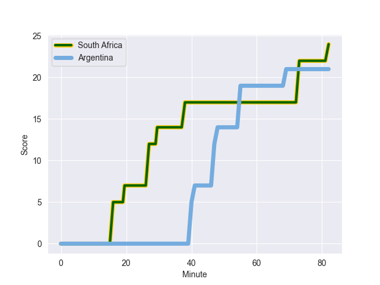
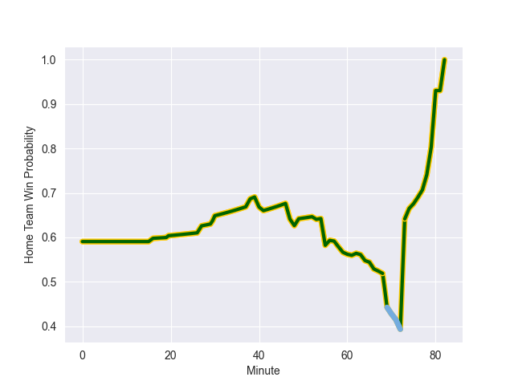

---  
layout: page  
title: Argentina at South Africa; 21.0-38.0  
date: 2022-09-24 11:05:00 18:00:00 -0500  
categories: match review  
---
# Prediction: South Africa by 18.4

South Africa by 13.4 on a neutral field
## Scores over Time

## Win Probability over Time

# Pre-Match Prediction: South Africa by 17.2

South Africa by 12.2 on a neutral pitch

|   Away Minutes | Away Player           |   Away elo |   Away Percentile |   Number |   Home Percentile |   Home elo | Home Player          |   Home Minutes |
|---------------:|:----------------------|-----------:|------------------:|---------:|------------------:|-----------:|:---------------------|---------------:|
|             61 | Nahuel Tetaz Chaparro |      88.79 |                79 |        1 |                98 |     109.92 | Steven Kitshoff      |             58 |
|             66 | Julian Montoya        |      96.2  |                91 |        2 |                84 |      91.44 | Malcolm Marx         |             69 |
|             38 | Eduardo Bello         |      67.53 |                 2 |        3 |                73 |      86.71 | Frans Malherbe       |             58 |
|             82 | Matias Alemanno       |      98.19 |                90 |        4 |                96 |     105.19 | Eben Etzebeth        |             82 |
|             82 | Tomas Lavanini        |      89.47 |                77 |        5 |                86 |      93.79 | Lood de Jager        |             71 |
|             82 | Juan Martin Gonzalez  |      74.72 |                11 |        6 |                85 |      92.78 | Siya Kolisi          |             82 |
|             82 | Marcos Kremer         |      74.62 |                10 |        7 |                74 |      88.05 | Pieter-Steph du Toit |             49 |
|             30 | Pablo Matera          |     102.22 |                89 |        8 |                82 |      91.92 | Jasper Wiese         |             49 |
|             64 | Gonzalo Bertranou     |      71.86 |                 5 |        9 |                69 |      85.96 | Jaden Hendrikse      |             62 |
|             56 | Juan Imhoff           |      98.48 |                88 |       11 |                97 |     109.98 | Makazole Mapimpi     |             82 |
|             74 | Jeronimo de la Fuente |      94.88 |                82 |       12 |                89 |      99.01 | Damian de Allende    |             82 |
|             82 | Matias Moroni         |     102.58 |                94 |       13 |                86 |      96.63 | Jesse Kriel          |             82 |
|             82 | Emiliano Boffelli     |      84.84 |                66 |       14 |                86 |      95.98 | Canan Moodie         |             82 |
|             82 | Juan Cruz Mallia      |      74.25 |                12 |       15 |                97 |     107.54 | Willie le Roux       |             53 |
|             16 | Agustin Creevy        |     115.45 |                99 |       16 |                83 |      92.15 | Bongi Mbonambi       |             13 |
|             52 | Joel Sclavi           |      76.71 |                24 |       18 |                61 |      81.06 | Vincent Koch         |             24 |
|             30 | Guido Petti           |      75.95 |                22 |       19 |                94 |     102.01 | Franco Mostert       |             11 |
|             18 | Tomas Cubelli         |      88.6  |                76 |       21 |                62 |      83.53 | Kwagga Smith         |             33 |
|             23 | Benjamin Urdapilleta  |     109.5  |                96 |       22 |                85 |      97.5  | Faf de Klerk         |             20 |
|             26 | Bautista Delguy       |      87.78 |                73 |       23 |                83 |      94.12 | Kurt-Lee Arendse     |             29 |

