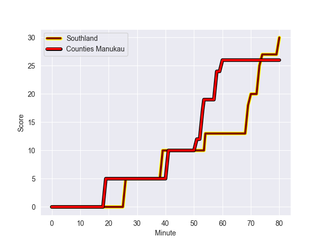
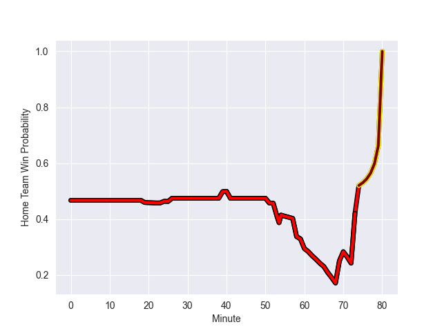

---  
layout: page  
title: Counties Manukau at Southland; 26.0-30.0  
date: 2022-09-24 23:35:00 18:00:00 -0500  
categories: match review  
---
# Prediction: Counties Manukau by 0.6

Counties Manukau by 5.6 on a neutral field
## Scores over Time

## Win Probability over Time

# Pre-Match Prediction: Counties Manukau by 1.0

Counties Manukau by 6.0 on a neutral pitch

|   Away Minutes | Away Player         |   Away elo |   Away Percentile |   Number |   Home Percentile |   Home elo | Home Player     |   Home Minutes |
|---------------:|:--------------------|-----------:|------------------:|---------:|------------------:|-----------:|:----------------|---------------:|
|             66 | Ezekiel Lindenmuth  |      69.58 |                 4 |        1 |                 1 |      62.6  | Joe Walsh       |             24 |
|             55 | Zuriel Togiatama    |      80.03 |                43 |        2 |                 5 |      70.86 | Sam Stewart     |             65 |
|             51 | Suetena Asomua      |      77.28 |                24 |        3 |                 0 |      57.78 | Morgan Mitchell |             80 |
|             80 | William Furniss     |      80.83 |                47 |        4 |                53 |      79.11 | Grayson Knapp   |             80 |
|             80 | Sam Slade           |      73.98 |                16 |        5 |                 8 |      71.48 | Josh Bekhuis    |             80 |
|             80 | Alex McRobbie       |      68.02 |                 4 |        6 |                 5 |      70.58 | Matt James      |             80 |
|             69 | Adam Brash          |      79.89 |                40 |        7 |                37 |      79.1  | Hayden Michaels |             62 |
|             23 | Sam Tuifua          |      81.44 |                47 |        8 |                19 |      76.02 | Blair Ryall     |             51 |
|             62 | Jonathan Taumateine |      74.59 |                17 |        9 |                 1 |      68.5  | Jay Renton      |             80 |
|             80 | Riley Hohepa        |      76.12 |                15 |       10 |                25 |      75.32 | Jack MacLeod    |             80 |
|             69 | Peniasi Malimali    |      77.38 |                24 |       11 |                 7 |      71.98 | Rory van Vugt   |             80 |
|             80 | AJ Alatimu          |      79.11 |                38 |       12 |                19 |      77.14 | Matt Whaanga    |             80 |
|             80 | Nikolai Foliaki     |      61.66 |                 0 |       13 |                 1 |      68.7  | Viliami Fine    |             80 |
|             80 | Tevita Ofa          |      80.2  |                42 |       14 |                14 |      75.41 | Michael Manson  |             67 |
|             80 | Ahsee Tuala         |      88.36 |                73 |       15 |                37 |      79.32 | Robbie Robinson |             80 |
|             57 | Jadin Kingi         |      78.18 |                31 |       19 |                19 |      75.55 | Caleb Aperahama |             18 |

