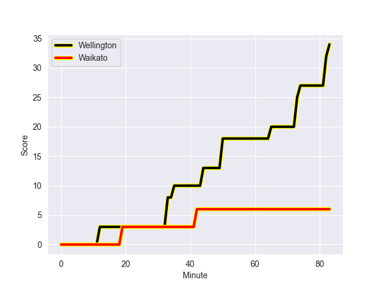
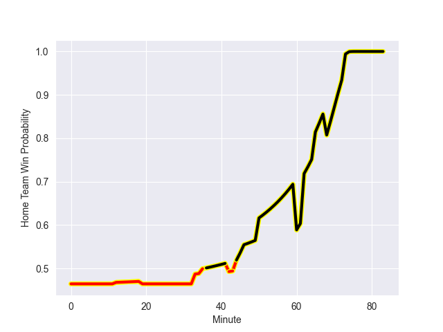

---  
layout: page  
title: Waikato at Wellington; 6.0-34.0  
date: 2022-09-24 00:35:00 18:00:00 -0500  
categories: match review  
---
# Prediction: Waikato by 1.2

Waikato by 6.2 on a neutral field
## Scores over Time

## Win Probability over Time

# Pre-Match Prediction: Waikato by 0.1

Waikato by 5.1 on a neutral pitch

|   Away Minutes | Away Player          |   Away elo |   Away Percentile |   Number |   Home Percentile |   Home elo | Home Player           |   Home Minutes |
|---------------:|:---------------------|-----------:|------------------:|---------:|------------------:|-----------:|:----------------------|---------------:|
|             46 | Ayden Johnstone      |      95.13 |                89 |        1 |                80 |      89.27 | Xavier Numia          |             74 |
|             66 | Rhys Marshall        |     107.26 |                97 |        2 |                90 |      96.01 | Asafo Aumua           |             68 |
|             46 | Sosefo Kautai        |      87.18 |                76 |        3 |                48 |      81.01 | Pek Cowan             |             83 |
|             83 | James Tucker         |      94.76 |                88 |        4 |                27 |      77.19 | James Blackwell       |             83 |
|             83 | Laghlan McWhannell   |      97.9  |                90 |        5 |                49 |      81.08 | Dom Bird              |             68 |
|             83 | Hamilton Burr        |      80.98 |                48 |        6 |                11 |      74.76 | Caleb Delany          |             65 |
|             83 | Mitchell Jacobson    |      81.12 |                50 |        7 |                73 |      87.54 | Du'Plessis Kirifi     |             83 |
|             62 | Samipeni Finau       |      85.34 |                69 |        8 |                34 |      79.37 | Peter Lakai           |             83 |
|             65 | Xavier Roe           |      76.72 |                23 |        9 |                85 |      97.27 | TJ Perenara           |             58 |
|             83 | Damian McKenzie      |     100.94 |                90 |       10 |                35 |      79.08 | Aidan Morgan          |             50 |
|             83 | Daniel Sinkinson     |      84.58 |                65 |       11 |                12 |      75.03 | Pepesana Patafilo     |             60 |
|             75 | D'Angelo Leuila      |      87.69 |                69 |       12 |                29 |      78.37 | Riley Higgins         |             83 |
|             76 | Bailyn Sullivan      |      78.77 |                32 |       13 |                56 |      83.03 | Billy Proctor         |             83 |
|             72 | Liam Coombes-Fabling |      89.2  |                74 |       14 |                96 |     109.1  | Julian Savea          |             83 |
|             83 | Tepaea Cook-Savage   |      79.42 |                37 |       15 |                59 |      84.79 | Ruben Love            |             83 |
|             22 | Pita Anae Ah-Sue     |      85.73 |                73 |       16 |                 7 |      72.26 | James O'Reilly        |             15 |
|             37 | George Dyer          |      78.58 |                33 |       18 |                81 |      88.68 | Tietie Tuimauga       |             13 |
|             25 | Patrick McCurran     |      83.84 |                63 |       19 |                27 |      77.93 | Taine Plumtree        |             15 |
|             21 | Jack Lam             |      62.19 |                 1 |       20 |                14 |      76.16 | Keelan Whitman        |             18 |
|             18 | Cortez Ratima        |      89.07 |                76 |       21 |                68 |      85.14 | Richard Judd          |             25 |
|             15 | Tana Tuhakaraina     |      80.3  |                44 |       22 |                 8 |      73.56 | Jackson Garden-Bachop |             33 |
|             11 | Mosese Dawai         |      93.57 |                84 |       23 |                41 |      80.92 | Connor Garden-Bachop  |             23 |

