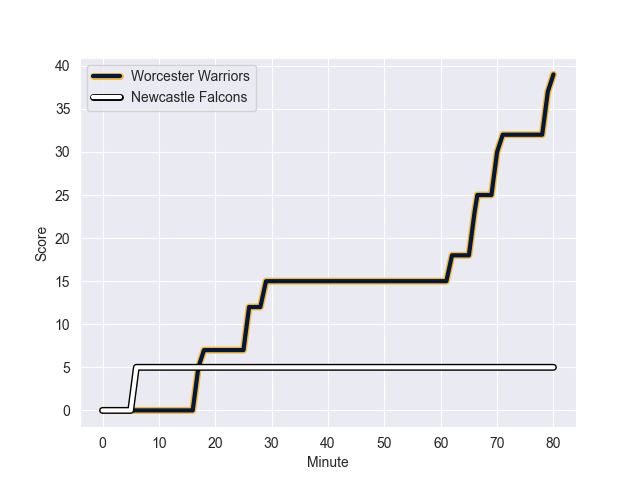
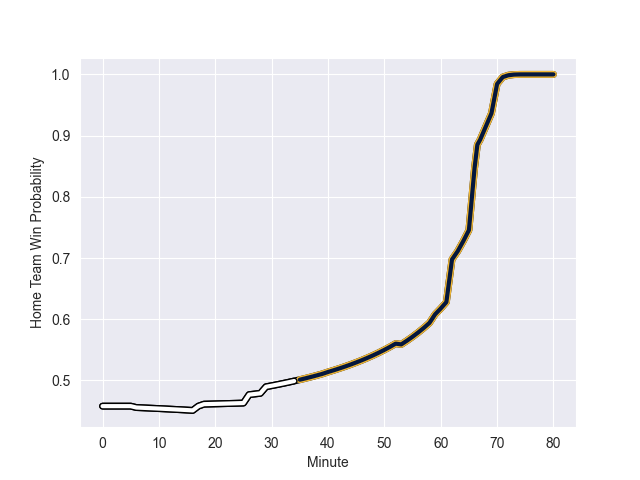

---  
layout: page  
title: Newcastle Falcons at Worcester Warriors; 5.0-39.0  
date: 2022-09-24 10:00:00 18:00:00 -0500  
categories: match review  
---
# Prediction: Newcastle Falcons by 1.8

Newcastle Falcons by 6.8 on a neutral field
## Scores over Time

## Win Probability over Time

# Pre-Match Prediction: Newcastle Falcons by 0.8

Newcastle Falcons by 5.8 on a neutral pitch

|   Away Minutes | Away Player             |   Away elo |   Away Percentile |   Number |   Home Percentile |   Home elo | Home Player         |   Home Minutes |
|---------------:|:------------------------|-----------:|------------------:|---------:|------------------:|-----------:|:--------------------|---------------:|
|             40 | Phil Brantingham        |      80.67 |                45 |        1 |                68 |      84.64 | Murray McCallum     |             74 |
|             67 | George McGuigan         |      77.65 |                25 |        2 |                66 |      83.56 | Curtis Langdon      |             66 |
|             67 | Trevor Davison          |      66.04 |                 1 |        3 |                31 |      77.5  | Jay Tyack           |             74 |
|             53 | Greg Peterson           |      67.65 |                 3 |        4 |                 7 |      70.18 | Joe Batley          |             80 |
|             80 | Sebastian de Chaves     |      73.77 |                13 |        5 |                 2 |      66.72 | Andrew Kitchener    |             66 |
|             80 | Sean Robinson           |      85.49 |                70 |        6 |                 0 |      65.51 | Fergus Lee-Warner   |             80 |
|             59 | Connor Collett          |      93.51 |                82 |        7 |                14 |      75.94 | Cameron Neild       |             62 |
|             80 | Callum Chick            |      71.35 |                 5 |        8 |                26 |      77.85 | Thomas Dodd         |             80 |
|             69 | Cameron Nordli-Kelemeti |      78.06 |                32 |        9 |                19 |      75.46 | Gareth Simpson      |             72 |
|             63 | Brett Connon            |      80.08 |                41 |       10 |                 0 |      63.53 | Billy Searle        |             80 |
|             80 | Mateo Carreras          |      77.18 |                14 |       11 |                60 |      82.65 | Duhan van der Merwe |             80 |
|             80 | George Wacokecoke       |      76.32 |                17 |       12 |                47 |      81.45 | Francois Venter     |             72 |
|             80 | Ben Stevenson           |      80.55 |                41 |       13 |                 4 |      69.91 | Ollie Lawrence      |             80 |
|             80 | Adam Radwan             |      98.7  |                88 |       14 |                 9 |      73.92 | Alex Hearle         |             69 |
|             63 | Alex Tait               |      85.77 |                60 |       15 |                23 |      76.87 | James Shillcock     |             80 |
|             13 | Charlie Maddison        |      77.18 |                20 |       16 |                 1 |      66.01 | Hame Faiva          |             14 |
|             27 | George Merrick          |      81.59 |                56 |       19 |                19 |      75.05 | Graham Kitchener    |             14 |
|             21 | Jamie Blamire           |      81.85 |                55 |       20 |                78 |      90.63 | Matt Kvesic         |             18 |
|             11 | Josh Barton             |      80.17 |                45 |       21 |                97 |     110.76 | Will Chudley        |              8 |
|             17 | Tom Penny               |      94.26 |                83 |       23 |                49 |      81.7  | Noah Heward         |             11 |

