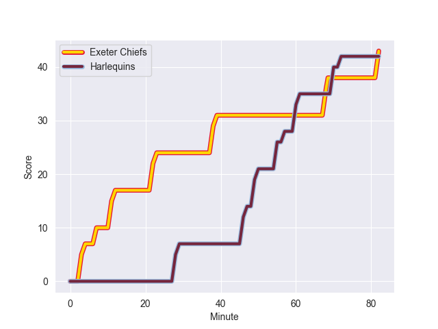
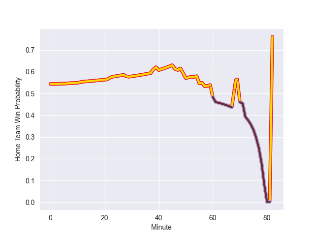

---  
layout: page  
title: Harlequins at Exeter Chiefs; 42.0-43.0  
date: 2022-09-25 10:00:00 18:00:00 -0500  
categories: match review  
---
# Prediction: Exeter Chiefs by 14.2

Exeter Chiefs by 9.2 on a neutral field
## Scores over Time

## Win Probability over Time

# Pre-Match Prediction: Exeter Chiefs by 17.0

Exeter Chiefs by 12.0 on a neutral pitch

|   Away Minutes | Away Player           |   Away elo |   Away Percentile |   Number |   Home Percentile |   Home elo | Home Player          |   Home Minutes |
|---------------:|:----------------------|-----------:|------------------:|---------:|------------------:|-----------:|:---------------------|---------------:|
|             57 | Santiago Garcia Botta |      92.11 |                85 |        1 |                64 |      83.94 | Alec Hepburn         |             53 |
|             53 | Jack Walker           |      77.27 |                25 |        2 |                75 |      87.19 | Luke Cowan-Dickie    |             48 |
|             82 | Wilco Louw            |      97.75 |                93 |        3 |                96 |     102.6  | Harry Williams       |             60 |
|             57 | George Hammond        |      84.25 |                66 |        4 |                85 |      93.78 | Ruben van Heerden    |             50 |
|             82 | Irne Herbst           |      90.02 |                78 |        5 |                88 |      95.12 | Jonny Gray           |             82 |
|             82 | Jack Kenningham       |      88.37 |                76 |        6 |                98 |     111.69 | Dave Ewers           |             50 |
|             82 | Will Evans            |      75.22 |                12 |        7 |                40 |      79.78 | Christ Tshiunza      |             82 |
|             69 | Archie White          |      81.95 |                50 |        8 |                 9 |      72.16 | Richard Capstick     |             82 |
|             40 | Lewis Gjaltema        |      81.3  |                51 |        9 |                71 |      86.67 | Stu Townsend         |             50 |
|             82 | Marcus Smith          |      91.32 |                77 |       10 |                35 |      79.1  | Harvey Skinner       |             82 |
|             82 | Cadan Murley          |      74.41 |                10 |       11 |                92 |     101.84 | Olly Woodburn        |             82 |
|             82 | Lennox Anyanwu        |      81.64 |                48 |       12 |                87 |      97.3  | Ian Whitten          |             82 |
|             82 | Luke Northmore        |      86.96 |                67 |       13 |                90 |      99.69 | Henry Slade          |             76 |
|             82 | Joe Marchant          |      90.16 |                78 |       14 |                98 |     112.43 | Jack Nowell          |             82 |
|             82 | Tyrone Green          |      73.97 |                12 |       15 |                93 |     104.66 | Joe Simmonds         |             57 |
|              6 | George Head           |      82.86 |                62 |       16 |                92 |      97.77 | Jack Yeandle         |             34 |
|             23 | Simon Kerrod          |      76.33 |                16 |       18 |                61 |      83.94 | Patrick Schickerling |             22 |
|             25 | Dino Lamb             |      88.23 |                74 |       19 |                70 |      85.99 | Dafydd Jenkins       |             32 |
|             13 | Matas Jurevicius      |      80.42 |                45 |       20 |                67 |      86.73 | Sam Simmonds         |             32 |
|             42 | Danny Care            |     130.44 |               100 |       21 |                13 |      74.16 | Sam Maunder          |             32 |
|              0 | Tommaso Allan         |      83.31 |                57 |       22 |                78 |      91.58 | Rory O'Loughlin      |              6 |
|              0 | Nick David            |      79.49 |                38 |       23 |                74 |      90.34 | Stuart Hogg          |             25 |

