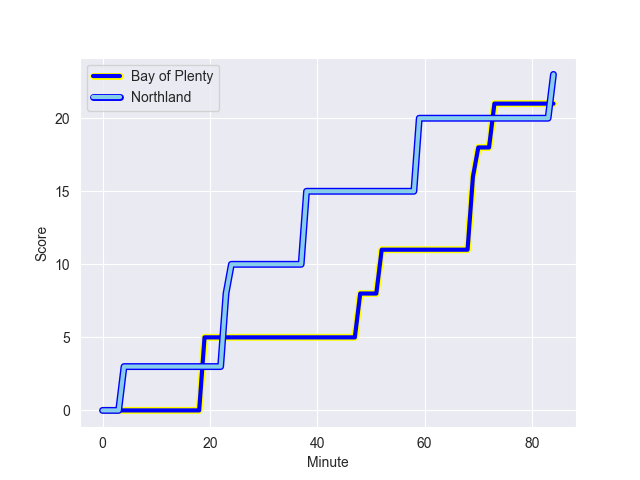
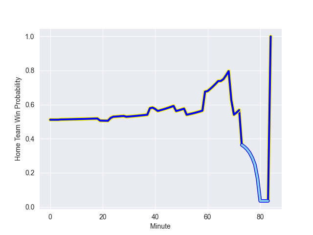

---  
layout: page  
title: Northland at Bay of Plenty; 23.0-21.0  
date: 2022-09-27 23:05:00 18:00:00 -0500  
categories: match review  
---
# Prediction: Bay of Plenty by 6.9

Bay of Plenty by 1.9 on a neutral field
## Scores over Time

## Win Probability over Time

# Pre-Match Prediction: Bay of Plenty by 5.6

Bay of Plenty by 0.6 on a neutral pitch

|   Away Minutes | Away Player           |   Away elo |   Away Percentile |   Number |   Home Percentile |   Home elo | Home Player          |   Home Minutes |
|---------------:|:----------------------|-----------:|------------------:|---------:|------------------:|-----------:|:---------------------|---------------:|
|             66 | Jarred Adams          |      84.93 |                68 |        1 |                69 |      85.84 | Haereiti Hetet       |             41 |
|             60 | Bruce Kauika-Petersen |      72.27 |                 8 |        2 |                72 |      85.73 | Anaru Rangi          |             41 |
|             65 | Ofa Tu'ungafasi       |     102.9  |                95 |        3 |                28 |      79.06 | Jeff Thwaites        |             52 |
|             84 | Josh Goodhue          |      76.17 |                21 |        4 |                 3 |      67.55 | Manaaki Selby-Rickit |             41 |
|             78 | Sam Caird             |      63.26 |                 1 |        5 |                45 |      81.87 | Zane Kapeli          |             84 |
|             58 | Liam Hallam-Eames     |      71.85 |                11 |        6 |                43 |      80.13 | Kohan Herbert        |             84 |
|             60 | Jonah Mau'u           |      78.44 |                32 |        7 |                32 |      79.52 | Veveni Lasaqa        |             84 |
|             84 | Matt Polwart-Matich   |      83.08 |                60 |        8 |                 2 |      68.55 | Penitoa Finau        |             29 |
|             70 | Lisati Milo-Harris    |      74.16 |                20 |        9 |                41 |      80.27 | Luke Donaldson       |             73 |
|             70 | Rivez Reihana         |      74.08 |                 9 |       10 |                41 |      80.22 | Lucas Cashmore       |             84 |
|             84 | Jone Macilai-Tori     |      80.79 |                46 |       11 |                15 |      75.06 | Sekuini Tanimo       |             40 |
|             84 | Tamati Tua            |      82.74 |                58 |       13 |                12 |      75.54 | Lalamilo Lalamilo    |             84 |
|             84 | Pisi Leilua           |      73.32 |                 8 |       14 |                22 |      76.79 | Taylor Haugh         |             84 |
|             32 | Rob Rush              |      76.16 |                19 |       20 |                15 |      75.45 | Nikora Broughton     |             55 |
|             14 | Daniel Hawkins        |      65.03 |                 0 |       22 |                76 |      89.85 | Nigel Ah Wong        |             44 |
|             24 | Heremaia Murray       |      77.37 |                24 |       23 |                75 |      89.45 | Emoni Narawa         |             43 |

