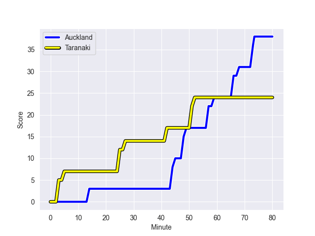
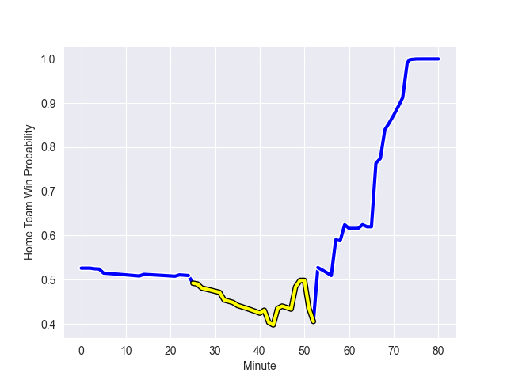

---  
layout: page  
title: Taranaki at Auckland; 24.0-38.0  
date: 2022-09-30 23:35:00 18:00:00 -0500  
categories: match review  
---
# Prediction: Auckland by 10.7

Auckland by 5.7 on a neutral field
## Scores over Time

## Win Probability over Time

# Pre-Match Prediction: Auckland by 9.9

Auckland by 4.9 on a neutral pitch

|   Away Minutes | Away Player                   |   Away elo |   Away Percentile |   Number |   Home Percentile |   Home elo | Home Player         |   Home Minutes |
|---------------:|:------------------------------|-----------:|------------------:|---------:|------------------:|-----------:|:--------------------|---------------:|
|             35 | Jared Proffit                 |      74.93 |                14 |        1 |                77 |      86.56 | Alex Hodgman        |             80 |
|             53 | Ricky Riccitelli              |      80.23 |                46 |        2 |                31 |      78.13 | Soane Vikena        |             49 |
|             45 | Donald Brighouse              |      69.86 |                 4 |        3 |                65 |      83.26 | Marcel Renata       |             45 |
|             60 | Jesse Parete                  |      67.53 |                 5 |        4 |                37 |      78.5  | Josh Beehre         |             79 |
|             80 | Tupou Vaa'i                   |      90.46 |                82 |        5 |                51 |      81.24 | Hamish Dalzell      |             80 |
|             80 | Pita Gus Sowakula             |      80.97 |                48 |        6 |                72 |      85.09 | Blake Gibson        |             80 |
|             80 | Michael Loft                  |      79.47 |                42 |        7 |                30 |      77.97 | Adrian Choat        |             22 |
|             41 | Kaylum Boshier                |      72.6  |                13 |        8 |                24 |      76.37 | Jackson Pugh        |             80 |
|             64 | Logan Crowley                 |      72.98 |                11 |        9 |                 6 |      70.97 | Taufa Funaki        |             79 |
|             63 | Stephen Perofeta              |      98.47 |                92 |       10 |                83 |      92.18 | Harry Plummer       |             80 |
|             80 | Kini Naholo                   |      86.93 |                74 |       11 |                86 |      94.68 | Salesi Rayasi       |              5 |
|             80 | Daniel Waite                  |      76.2  |                19 |       12 |                98 |     111.21 | Bryce Heem          |             32 |
|             50 | Daniel Rona                   |      81.92 |                50 |       13 |                14 |      74.87 | AJ Lam              |             80 |
|             80 | Josh Setu                     |      77.31 |                24 |       14 |                 6 |      70.04 | Roger Tuivasa-Sheck |             80 |
|             80 | Jacob Ratumaitavuki-Kneepkens |      93.96 |                87 |       15 |                87 |      95.16 | Jordan Trainor      |             80 |
|             27 | Bradley Slater                |      84.97 |                73 |       16 |                 6 |      70.83 | Leni Apisai         |             31 |
|             45 | Mitch O'Neill                 |      79.64 |               nan |       17 |               nan |      80.01 | Josh Fusitua        |             31 |
|             35 | Kyle Stewart                  |      81.01 |                50 |       18 |                97 |     105    | Angus Ta'avao       |             35 |
|             20 | Mitch Brown                   |      89.29 |                79 |       19 |                17 |      73.45 | Connor Vest         |              1 |
|             39 | Millennium Sanerivi           |      80.04 |                45 |       20 |                54 |      81.48 | Terrell Peita       |             58 |
|             16 | Adam Lennox                   |      76.42 |                20 |       21 |                13 |      73.15 | Manu Paea           |              1 |
|             30 | Teihorangi Walden             |      70.18 |                 7 |       22 |                72 |      86.26 | Simon Hickey        |             48 |
|             17 | Matt McKenzie                 |      77.89 |                28 |       23 |                57 |      83.33 | Corey Evans         |             75 |

