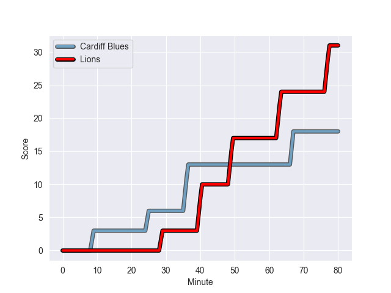
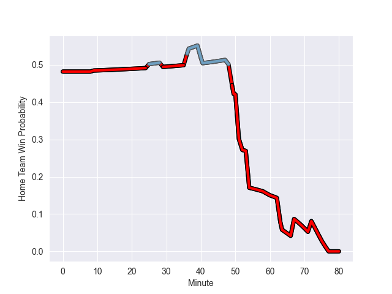

---  
layout: page  
title: Lions at Cardiff Blues; 31-18  
date: 2022-09-30 20:35:00 18:00:00 -0500  
categories: match review  
---
# Prediction: Cardiff Blues by 1.8

Lions by 3.2 on a neutral field
## Scores over Time

## Win Probability over Time

# Pre-Match Prediction: Lions by 2.0

Lions by 3.0 on a neutral pitch

|   Away Minutes | Away Player              |   Away elo |   Away Percentile |   Number |   Home Percentile |   Home elo | Home Player       |   Home Minutes |
|---------------:|:-------------------------|-----------:|------------------:|---------:|------------------:|-----------:|:------------------|---------------:|
|             54 | Sti Sithole              |      83.04 |                64 |        1 |                71 |      83.61 | Bradley Thyer     |             51 |
|             62 | PJ Botha                 |      75.51 |                17 |        2 |                37 |      79.22 | Liam Belcher      |             60 |
|             62 | Ruan Dreyer              |     108.4  |                98 |        3 |                97 |     106.75 | Dillon Lewis      |             51 |
|             80 | Pieter Jansen van Vuuren |      81.22 |                49 |        4 |                60 |      83.08 | Lopeti Timani     |             80 |
|             80 | Reinhard Nothnagel       |      96.04 |                89 |        5 |                63 |      83.36 | Seb Davies        |             52 |
|             48 | Sibusiso Sangweni        |      75.86 |                17 |        6 |                34 |      78.05 | Josh Turnbull     |             80 |
|             59 | Emmanuel Tshituka        |      68.86 |                 4 |        7 |                76 |      86.36 | James Botham      |             47 |
|             80 | Francke Horn             |      91.96 |                83 |        8 |                84 |      92.75 | Taulupe Faletau   |             80 |
|             59 | Sanele Nohamba           |      85.18 |                69 |        9 |                92 |      97.49 | Lloyd Williams    |             72 |
|             78 | Gianni Dean Lombard      |      78.72 |                33 |       10 |                84 |      93.52 | Jarrod Evans      |             80 |
|             80 | Quan Horn                |      87.92 |                76 |       11 |                 7 |      71.31 | Theo Cabango      |             80 |
|             80 | Marius Louw              |      88.11 |                75 |       12 |                22 |      76.96 | Max Llewellyn     |             51 |
|             80 | Henco van Wyk            |      84.73 |                63 |       13 |                95 |     104.46 | Rey Lee-Lo        |             80 |
|             26 | Leolin Zas               |      90.19 |                82 |       14 |                 0 |      60.18 | Owen Lane         |             33 |
|             80 | Marnitz Boshoff          |     105.81 |                97 |       15 |                34 |      80.19 | Rhys Priestland   |             80 |
|             54 | Zander du Plessis        |      85.28 |                65 |       16 |                30 |      78.09 | Mason Grady       |             47 |
|             32 | Ruhan Straeuli           |      84.65 |               nan |       17 |                14 |      72.7  | Will Boyde        |             33 |
|             26 | Jean-Pierre Smith        |      91.33 |                87 |       18 |                41 |      78.63 | Corey Domachowski |             29 |
|             21 | Ruan Venter              |      83.27 |                63 |       19 |                92 |     100.82 | Uilisi Halaholo   |             29 |
|             21 | Morne Van den Berg       |      76.3  |                18 |       20 |                57 |      82.35 | Dimitri Arhip     |             29 |
|             18 | Jaco Visagie             |      82.39 |                54 |       21 |                 2 |      64.54 | Rory Thornton     |             28 |
|             18 | Mahe Vailanu             |      85.85 |                80 |       22 |                12 |      75.1  | Kirby Myhill      |             20 |
|              2 | Jordan Hendrikse         |      81.02 |                48 |       23 |                46 |      79.22 | Lewis Jones       |              8 |

