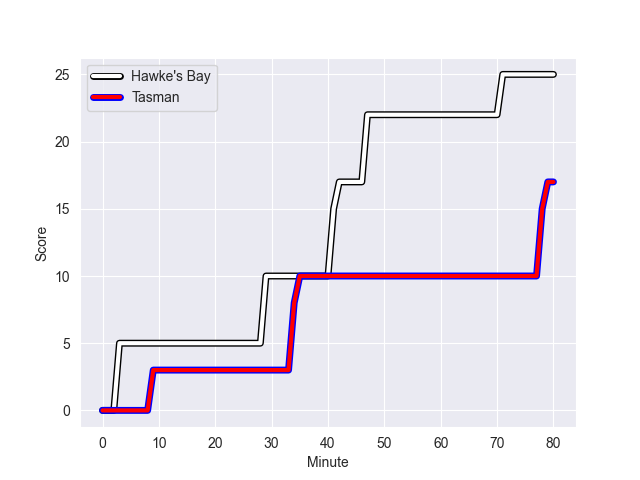
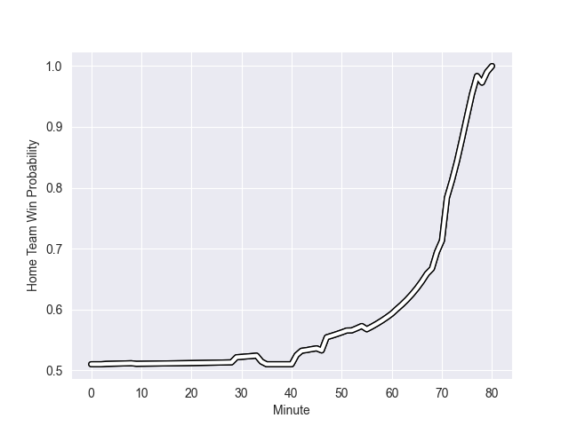

---  
layout: page  
title: Tasman at Hawke's Bay; 17.0-25.0  
date: 2022-09-30 02:05:00 18:00:00 -0500  
categories: match review  
---
# Prediction: Hawke's Bay by 6.7

Hawke's Bay by 1.7 on a neutral field
## Scores over Time

## Win Probability over Time

# Pre-Match Prediction: Hawke's Bay by 8.2

Hawke's Bay by 3.2 on a neutral pitch

|   Away Minutes | Away Player            |   Away elo |   Away Percentile |   Number |   Home Percentile |   Home elo | Home Player          |   Home Minutes |
|---------------:|:-----------------------|-----------:|------------------:|---------:|------------------:|-----------:|:---------------------|---------------:|
|             52 | Kershawl Sykes-Martin  |      80.41 |                44 |        1 |                42 |      80.27 | Pouri Rakete-Stones  |             80 |
|             68 | Andrew Makalio         |      87.4  |                78 |        2 |                14 |      75.5  | Tyrone Thompson      |             61 |
|             52 | Atu Moli               |      89.76 |                81 |        3 |                37 |      79.09 | Joe Apikotoa         |             76 |
|             68 | Mahroni Ngakuru        |      70.06 |                 5 |        4 |                91 |      99.35 | Isaia Walker-Leawere |             69 |
|             80 | Quinten Strange        |      82.93 |                62 |        5 |                63 |      82.98 | Tom Parsons          |             80 |
|             80 | Max Hicks              |      79.96 |                41 |        6 |                21 |      77.26 | Marino Mikaele-Tu'u  |             80 |
|             69 | Fletcher Anderson      |      84.93 |                68 |        7 |                37 |      79.13 | Sam Smith            |             44 |
|             80 | Sione Talitui          |      84.93 |                61 |        8 |                48 |      82.3  | Devan Flanders       |             80 |
|             69 | Noah Hotham            |      78.37 |                36 |        9 |                86 |      97.35 | Brad Weber           |             55 |
|             80 | William Havili         |      79.47 |                37 |       10 |                21 |      76.93 | Lincoln McClutchie   |             80 |
|             80 | Macca Springer         |      81.54 |                50 |       11 |                53 |      81.77 | Lolagi Visinia       |             74 |
|             80 | Alex Nankivell         |      88.82 |                72 |       12 |                60 |      84.53 | Danny Toala          |             80 |
|             74 | Levi Aumua             |      84.67 |                61 |       13 |                81 |      93.59 | Stacey Ili           |             55 |
|             58 | Fetuli Paea            |      86.94 |                71 |       14 |                80 |      92.67 | Neria Foma'i         |             80 |
|             46 | Taine Robinson         |      76.19 |                18 |       15 |                64 |      87.18 | Chase Tiatia         |             80 |
|             12 | Quentin MacDonald      |      96.94 |                92 |       16 |                43 |      78.89 | Kianu Kereru-Symes   |             19 |
|             28 | Ryan Coxon             |      80.52 |                37 |       17 |                43 |      80.14 | Mark Braidwood       |              4 |
|             28 | Samuel Matenga         |      78.87 |                28 |       18 |                67 |      84.47 | Joel Hintz           |              0 |
|             11 | Hugh Renton            |      66.06 |                 4 |       19 |                99 |     123.74 | Bryn Evans           |             11 |
|             12 | Viliami Napa'a         |      82.72 |                57 |       20 |                50 |      80.45 | Josh Kaifa           |             36 |
|             11 | Louie Chapman          |      80.52 |                43 |       21 |                31 |      76.53 | Folau Fakatava       |             25 |
|             34 | Leicester Fainga'anuku |      92.3  |                81 |       22 |                70 |      89.69 | Caleb Makene         |              6 |
|             28 | Sevu Reece             |     108.16 |                97 |       23 |                57 |      82.17 | Ollie Sapsford       |             25 |

