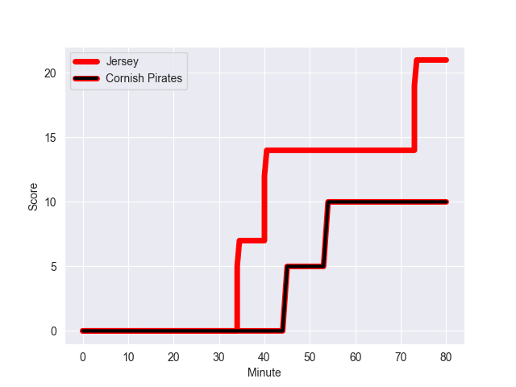
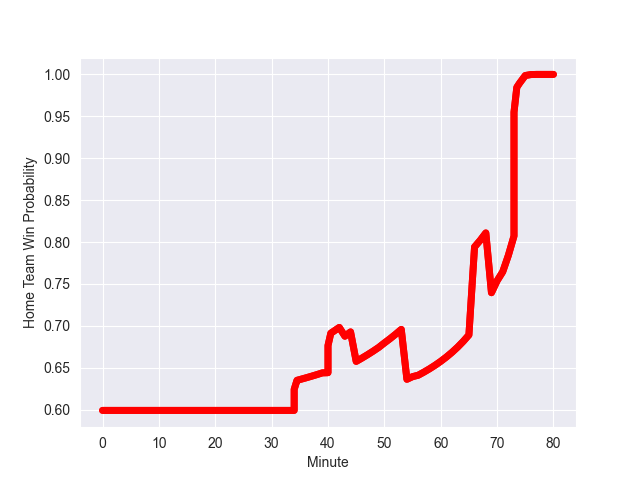

---  
layout: page  
title: Cornish Pirates at Jersey; 10-21  
date: 2022-09-30 20:15:00 18:00:00 -0500  
categories: match review  
---
# Prediction: Jersey by 22.5

Jersey by 17.5 on a neutral field
## Scores over Time

## Win Probability over Time

# Pre-Match Prediction: Jersey by 13.3

Jersey by 8.3 on a neutral pitch

|   Away Minutes | Away Player            |   Away elo |   Away Percentile |   Number |   Home Percentile |   Home elo | Home Player                 |   Home Minutes |
|---------------:|:-----------------------|-----------:|------------------:|---------:|------------------:|-----------:|:----------------------------|---------------:|
|             43 | Marlen Walker          |      76.3  |                20 |        1 |                65 |      84.38 | Samuel Alexander Grahamslaw |             80 |
|             75 | William Crane          |      78.08 |                30 |        2 |                80 |      87.56 | Antonio TJ Harris           |             69 |
|             40 | Harvey Beaton          |      77.64 |                26 |        3 |                74 |      85.63 | Steven Longwell             |             69 |
|             66 | James Fender           |      78.63 |                44 |        4 |                89 |      96.39 | Sean O'Connor               |             56 |
|             80 | Will Britton           |      72.23 |                12 |        5 |                98 |     116.36 | Macauley Cook               |             80 |
|             80 | Alex Everett           |      76.85 |                22 |        6 |                11 |      74.14 | James Dun                   |             56 |
|             66 | John Stevens           |      85.14 |                73 |        7 |                71 |      84.81 | Lewis Wynne                 |             80 |
|             80 | Sebastian Nagle-Taylor |      79.44 |                41 |        8 |                69 |      85.5  | Alun Lawrence               |             80 |
|             50 | Ruaridh Dawson         |      78.1  |               nan |        9 |                86 |      92.09 | James Elliott               |             71 |
|             80 | Arwel Robson           |      78.67 |                33 |       10 |                66 |      84.41 | Russell Bennett             |             80 |
|             80 | Robin Wedlake          |      76.9  |                23 |       11 |                67 |      84.14 | Tomi Lewis                  |             80 |
|             80 | Joe Elderkin           |      78.04 |                29 |       12 |                60 |      84.11 | Jordan Holgate              |             80 |
|             69 | Rory Parata            |      88.8  |                76 |       13 |                45 |      81.42 | Alex McHenry                |             80 |
|             43 | Callum Sirker          |      69.71 |                 5 |       14 |                72 |      86.18 | Ben Woollett                |             80 |
|             80 | Alexander AJ Cant      |      84.24 |                69 |       15 |                73 |      90.25 | Brendan Owen                |             80 |
|             40 | Matt Johnson           |      80.59 |               nan |       16 |                87 |      93.93 | Max Argyle                  |             24 |
|             37 | Jack Andrew            |      88.98 |                86 |       17 |                63 |      83.4  | Hamish Bain                 |             24 |
|             37 | Tom Kessell            |      81.13 |                52 |       18 |                76 |      85.92 | Eoghan Clarke               |             11 |
|             30 | Carwyn Penny           |      77.32 |                25 |       19 |               nan |      81.7  | Monty Weatherby             |             11 |
|             14 | Josh Williams          |      80    |               nan |       20 |                79 |      89.84 | Dan Barnes                  |              9 |
|             14 | Will Gibson            |      79.29 |                44 |       21 |                 0 |      14.9  | Solomone Kata               |             80 |
|             11 | Garyn Smith            |      75.04 |                15 |       22 |                 0 |      14.9  | Solomone Kata               |             80 |
|              5 | Morgan Nelson          |      79.68 |               nan |       23 |                 0 |      14.9  | Solomone Kata               |             80 |

