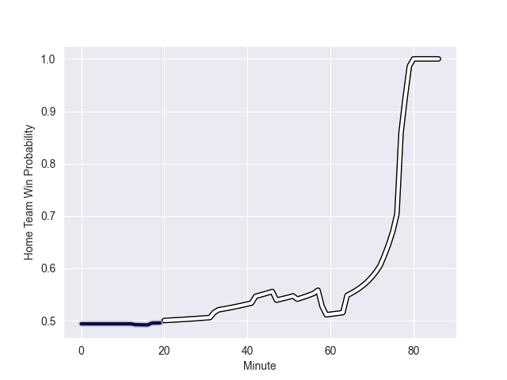

---  
layout: page  
title: Bristol Rugby at Newcastle Falcons; 15.0-30.0  
date: 2022-09-30 14:45:00 18:00:00 -0500  
categories: match review  
---
# Prediction: Newcastle Falcons by 4.0

Bristol Rugby by 1.0 on a neutral field
## Scores over Time

## Win Probability over Time

# Pre-Match Prediction: Bristol Rugby by 1.5

Bristol Rugby by 3.5 on a neutral pitch

|   Away Minutes | Away Player     |   Away elo |   Away Percentile |   Number |   Home Percentile |   Home elo | Home Player         |   Home Minutes |
|---------------:|:----------------|-----------:|------------------:|---------:|------------------:|-----------:|:--------------------|---------------:|
|             59 | Jake Woolmore   |      84.11 |                70 |        1 |                87 |      89.81 | Adam Brocklebank    |             62 |
|             65 | Will Capon      |      77.21 |                22 |        2 |                18 |      76.05 | George McGuigan     |             86 |
|             57 | Kyle Sinckler   |      97.31 |                94 |        3 |                 2 |      66.13 | Trevor Davison      |             74 |
|             74 | Ed Holmes       |      80.69 |                49 |        4 |                 0 |      58.25 | Greg Peterson       |             86 |
|             59 | Joe Joyce       |      90.56 |                83 |        5 |                71 |      84.65 | Sean Robinson       |             86 |
|             86 | Chris Vui       |      85.82 |                75 |        6 |                97 |     110.09 | Will Welch          |             86 |
|             86 | Jake Heenan     |      75.92 |                17 |        7 |                85 |      91.53 | Connor Collett      |             59 |
|             86 | Magnus Bradbury |      76.23 |                23 |        8 |                 4 |      66.55 | Callum Chick        |             86 |
|             52 | Andy Uren       |      72.22 |                13 |        9 |                 9 |      72    | Sam Stuart          |             86 |
|             59 | AJ MacGinty     |      96.36 |               nan |       10 |               nan |      86.59 | Tian Schoeman       |             86 |
|             86 | Henry Purdy     |      94.1  |                88 |       11 |                 8 |      71.76 | Mateo Carreras      |             86 |
|             86 | Piers O'Conor   |      70.41 |                 7 |       12 |                43 |      80.49 | Matias Orlando      |             83 |
|             86 | Jack Bates      |      74.48 |                13 |       13 |                97 |     107.48 | Matias Moroni       |             86 |
|             42 | Luke Morahan    |     125.58 |                99 |       14 |                92 |     100.05 | Adam Radwan         |             86 |
|             86 | Richard Lane    |      82.04 |                58 |       15 |                93 |     100.09 | Tom Penny           |             86 |
|             21 | Harry Thacker   |      92.09 |                88 |       16 |                71 |      84.14 | Charlie Maddison    |              0 |
|             27 | Yann Thomas     |     103.94 |                96 |       17 |                87 |      88.93 | Logovi'i Mulipola   |             24 |
|             29 | Max Lahiff      |      87.72 |                81 |       18 |                64 |      83.21 | Richard Palframan   |             12 |
|             27 | John Hawkins    |      79.38 |                47 |       19 |                61 |      82.82 | Sebastian de Chaves |              0 |
|             12 | Daniel Thomas   |      89.91 |                84 |       20 |                65 |      82.21 | Jamie Blamire       |             27 |
|             34 | Harry Randall   |      87.71 |                77 |       21 |                43 |      79.03 | Josh Barton         |              0 |
|             27 | Callum Sheedy   |      88.31 |                77 |       22 |                12 |      73.56 | Pete Lucock         |              3 |
|             44 | Sam Bedlow      |      86.13 |                68 |       23 |                12 |      73.65 | George Wacokecoke   |              0 |

