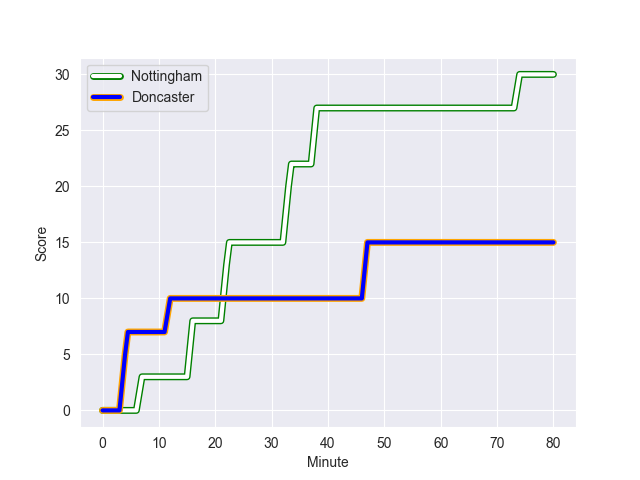

---  
layout: page  
title: Doncaster at Nottingham; 15-30  
date: 2022-09-30 20:45:00 18:00:00 -0500  
categories: match review  
---
# Prediction: Doncaster by 3.3

Doncaster by 8.3 on a neutral field
## Scores over Time

## Win Probability over Time

# Pre-Match Prediction: Doncaster by 5.1

Doncaster by 10.1 on a neutral pitch

|   Away Minutes | Away Player          |   Away elo |   Away Percentile |   Number |   Home Percentile |   Home elo | Home Player               |   Home Minutes |
|---------------:|:---------------------|-----------:|------------------:|---------:|------------------:|-----------:|:--------------------------|---------------:|
|             40 | Jake Pope            |      80    |               nan |        1 |                 5 |      71.15 | Toby Williams             |             50 |
|             47 | George Roberts       |      83.83 |                68 |        2 |                53 |      81.15 | Harry Clayton             |             50 |
|             70 | Jake Armstrong       |      83.33 |                65 |        3 |                67 |      83.66 | Dan Richardson            |             50 |
|             80 | John Kelly           |      92.02 |                85 |        4 |                62 |      82.99 | Iosefa Danny Wayne Fiaola |             80 |
|             73 | Ben Murphy           |      85.58 |                70 |        5 |                68 |      84.98 | Thomas Manz               |             80 |
|             80 | Martin Molina        |      83.73 |                68 |        6 |                73 |      86.88 | George Cox                |             65 |
|             58 | Sam Hudson           |      93.51 |                87 |        7 |                63 |      82.92 | Nathan Tweedy             |             80 |
|             55 | Thom Smith           |      82.23 |                54 |        8 |                26 |      76.8  | Josh Poullet              |             80 |
|             80 | Alex Dolly           |      95.63 |                89 |        9 |                66 |      84.04 | Liam Slatem               |             55 |
|             80 | Sam Olver            |      86.01 |                69 |       10 |                 9 |      72.41 | Sam Hollingsworth         |             80 |
|             80 | Robbie Smith         |      75.35 |                16 |       11 |                23 |      78.33 | Harry Graham              |             80 |
|             80 | Connor Edwards       |      84.14 |                60 |       12 |                13 |      73.92 | Javiah Pohe               |             60 |
|             70 | Joe Margetts         |      91.62 |                81 |       13 |                62 |      84.3  | Charlie Thacker           |             80 |
|             80 | George Simpson       |      84.72 |                69 |       14 |                 6 |      70.6  | David Williams            |             80 |
|             73 | Maliq Holden         |      90.95 |                84 |       15 |                64 |      85.25 | Jordan Olowofela          |             64 |
|             40 | Ben Carlile          |      77.42 |                25 |       16 |                18 |      75.89 | Ben Betts                 |             30 |
|             33 | George Edgson        |      90.05 |                84 |       17 |                69 |      85.8  | Jack Dickinson            |             30 |
|             25 | Evan Mintern         |      83.22 |                59 |       18 |                25 |      79.22 | Aniseko Sio               |             30 |
|             10 | Karl Garside         |      80.07 |                43 |       19 |                17 |      75.05 | Sam Edwards               |             25 |
|             10 | Will Yarnell         |      80    |               nan |       20 |                57 |      82.89 | Jack Neville              |             20 |
|              7 | Ehize Ehizode        |      71.41 |                 9 |       21 |                14 |      76.01 | Morgan Bunting            |             16 |
|              7 | Alexander Lloyd-Seed |      80.12 |               nan |       22 |                12 |      73.88 | Carl Kirwan               |             15 |
|             22 | Jared Cardew         |      76.67 |                18 |       23 |                 0 |       6.57 | Solomone Kata             |             80 |

