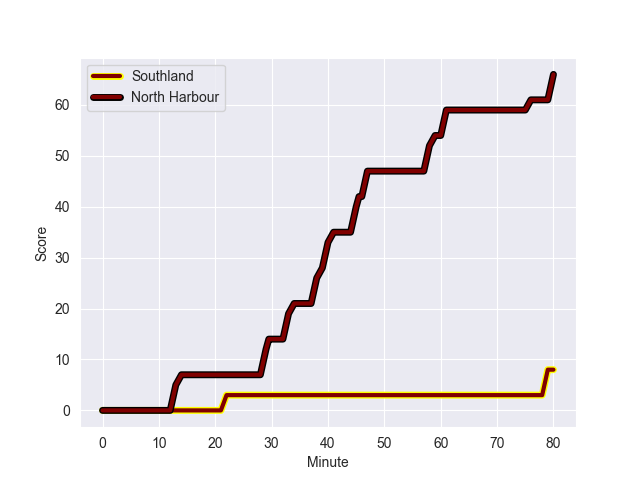
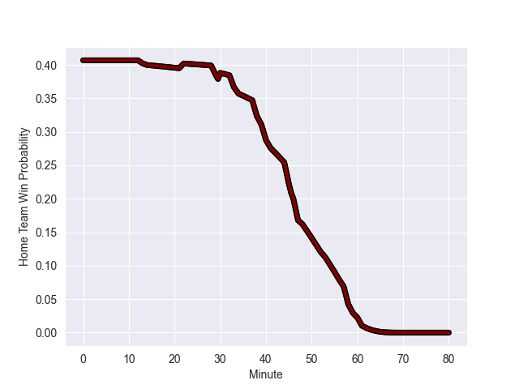

---  
layout: page  
title: North Harbour at Southland; 66.0-8.0  
date: 2022-09-30 21:05:00 18:00:00 -0500  
categories: match review  
---
# Prediction: North Harbour by 11.4

North Harbour by 16.4 on a neutral field
## Scores over Time

## Win Probability over Time

# Pre-Match Prediction: North Harbour by 12.4

North Harbour by 17.4 on a neutral pitch

|   Away Minutes | Away Player       |   Away elo |   Away Percentile |   Number |   Home Percentile |   Home elo | Home Player     |   Home Minutes |
|---------------:|:------------------|-----------:|------------------:|---------:|------------------:|-----------:|:----------------|---------------:|
|             66 | Tevita Langi      |      80.16 |                42 |        1 |                14 |      76.05 | Paula Latu      |             61 |
|             53 | Ray Niuia         |      86.42 |                75 |        2 |                 6 |      72.19 | Sam Stewart     |             41 |
|             64 | Nic Mayhew        |      92.87 |                86 |        3 |                 0 |      59.42 | Morgan Mitchell |             30 |
|             48 | Isoa Nasilasila   |      83.82 |                66 |        4 |                18 |      75.92 | Caleb Aperahama |             61 |
|             73 | Felix Kalapu      |      79.85 |                41 |        5 |                11 |      73.12 | Josh Bekhuis    |             80 |
|             80 | Cameron Suafoa    |      90.67 |                77 |        6 |                47 |      80.75 | Grayson Knapp   |             80 |
|             53 | Tamarau McGahan   |      84.44 |                65 |        7 |                 7 |      72.22 | Matt James      |             80 |
|             80 | Lotu Inisi        |      87.86 |                71 |        8 |                36 |      80.06 | Arese Poliko    |             60 |
|             46 | Jamie Booth       |      72.61 |                 6 |        9 |                 2 |      70.14 | Jay Renton      |             44 |
|             55 | Bryn Gatland      |      96.08 |                83 |       10 |                21 |      76.96 | Jack MacLeod    |             80 |
|             80 | Tevita Li         |     101.27 |                91 |       11 |                22 |      76.78 | Michael Manson  |             80 |
|             22 | Denny Solomona    |      83.95 |                58 |       12 |                31 |      78.78 | Matt Whaanga    |             68 |
|             80 | Mark Telea        |     101.18 |                91 |       14 |                 4 |      70.34 | Viliami Fine    |             80 |
|             80 | Shaun Stevenson   |      89.8  |                73 |       15 |                41 |      80.96 | Robbie Robinson |             80 |
|             34 | Siaosi Nginingini |      80.52 |                48 |       21 |                37 |      77.71 | Jakob Morrison  |             36 |
|             32 | Kade Banks        |      82.05 |                55 |       22 |                12 |      75.85 | William Tufui   |             20 |
|             51 | Jack Heighton     |      78.93 |                36 |       23 |                49 |      81.5  | Kieran Lee      |             12 |

