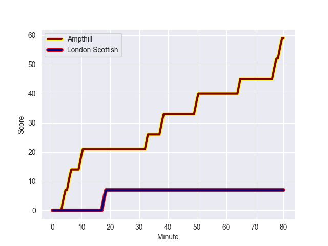
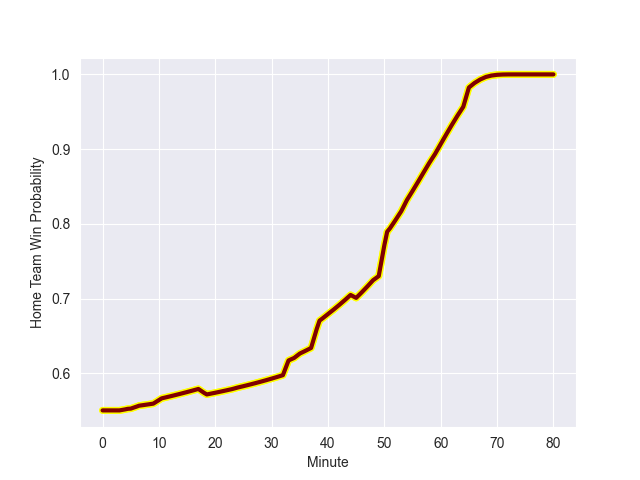

---  
layout: page  
title: London Scottish at Ampthill; 7-59  
date: 2022-10-01 16:00:00 18:00:00 -0500  
categories: match review  
---
# Prediction: Ampthill by 13.8

Ampthill by 8.8 on a neutral field
## Scores over Time

## Win Probability over Time

# Pre-Match Prediction: Ampthill by 14.4

Ampthill by 9.4 on a neutral pitch

|   Away Minutes | Away Player           |   Away elo |   Away Percentile |   Number |   Home Percentile |   Home elo | Home Player          |   Home Minutes |
|---------------:|:----------------------|-----------:|------------------:|---------:|------------------:|-----------:|:---------------------|---------------:|
|             40 | Jordan Els            |      80.58 |                63 |        1 |                46 |      80.54 | Griff Phillipson     |             50 |
|             51 | Austin Wallis         |      77.57 |                26 |        2 |                42 |      79.49 | Sid Blackmore        |             24 |
|             45 | Sam Gratton           |      78.47 |               nan |        3 |                42 |      79.89 | Joe Sproston         |             50 |
|             80 | David Douglas Bridge  |      77.36 |                29 |        4 |                86 |      92.28 | Charlie Beckett      |             80 |
|             59 | Matt Wilkinson        |      75.58 |                21 |        5 |               nan |      80.2  | Alfie Bell           |             58 |
|             49 | Brian Tuilagi         |      65.74 |                 2 |        6 |                40 |      78.82 | Harry Wilson         |             80 |
|             80 | Dan Cuthbert          |      79.31 |               nan |        7 |                13 |      74.41 | Caleb Montgomery     |             80 |
|             80 | Cameron King          |      67.79 |                 6 |        8 |                41 |      79.56 | Paddy Ryan           |             35 |
|             80 | Luca Petrozzi         |      72.63 |                11 |        9 |               nan |      78.99 | Peter White          |             63 |
|             68 | Harry Sheppard        |      74.92 |                14 |       10 |                43 |      80.25 | Gwyn Parks           |             72 |
|             80 | Zach Clow             |      78.53 |               nan |       11 |                48 |      80.51 | Ben Cambriani        |             80 |
|             54 | Robert David McCallum |      75.44 |                16 |       12 |                67 |      85.68 | Joshua Bragman       |             80 |
|             80 | Theo Manihera         |      75.53 |                17 |       13 |                29 |      77.94 | Rekeiti Ma'asi-White |             80 |
|             45 | Noah Ferdinand        |      56.64 |                 0 |       14 |                28 |      77.64 | Conor Rankin         |             80 |
|             80 | Cameron Anderson      |      73.37 |                11 |       15 |                47 |      80.54 | Will Partington      |             50 |
|             40 | Tom Osborne           |      80    |               nan |       16 |               nan |      80.1  | Matt Gallagher       |             56 |
|             35 | William Hobson        |      79.59 |                41 |       17 |                69 |      84.19 | Cai Devine           |             45 |
|             35 | Sam Smith             |      80    |               nan |       18 |                38 |      79.2  | Rob Hardwick         |             30 |
|             31 | Will Trenholm         |      73.06 |                10 |       19 |               nan |      80    | Archie McArthur      |             30 |
|             29 | Lawrence Mason        |      79.85 |               nan |       20 |               nan |      80    | Tomas Bacon          |             30 |
|             26 | Daniel Nutton         |      66.72 |                 2 |       21 |               nan |      78.92 | James Tunney         |             22 |
|             21 | Angus Southon         |      81.58 |                61 |       22 |                40 |      79.13 | Lewis Finlay         |             17 |
|             12 | Ed Hoadley            |      64.57 |                 1 |       23 |                48 |      81.42 | Charlie Hudson       |              8 |

