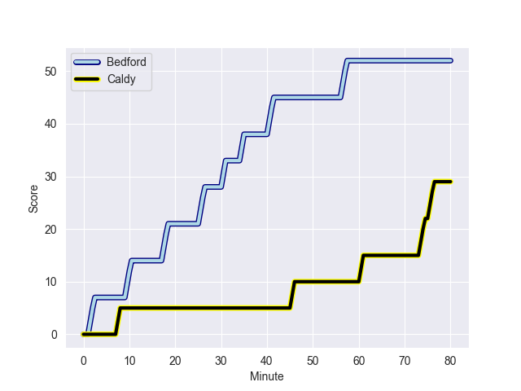
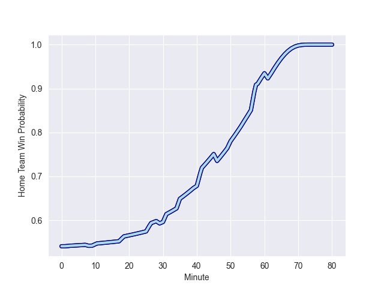

---  
layout: page  
title: Caldy at Bedford; 29-52  
date: 2022-10-01 16:00:00 18:00:00 -0500  
categories: match review  
---
# Prediction: Bedford by 12.1

Bedford by 7.1 on a neutral field
## Scores over Time

## Win Probability over Time

# Pre-Match Prediction: Bedford by 12.7

Bedford by 7.7 on a neutral pitch

|   Away Minutes | Away Player         |   Away elo |   Away Percentile |   Number |   Home Percentile |   Home elo | Home Player          |   Home Minutes |
|---------------:|:--------------------|-----------:|------------------:|---------:|------------------:|-----------:|:---------------------|---------------:|
|             52 | Adam Aigbokhae      |      78.61 |                34 |        1 |                20 |      76.41 | Joey Conway          |             58 |
|             62 | Oliver Hearn        |      77.24 |                23 |        2 |                78 |      86.89 | Jacob Fields         |             58 |
|             29 | Andrew Darlington   |      61.37 |                 1 |        3 |                71 |      84.71 | Ed Prowse            |             58 |
|             54 | Sam Dickinson       |      82.4  |                58 |        4 |                69 |      85.13 | Robin Williams       |             62 |
|             80 | Thomas Sanders      |      77.03 |                27 |        5 |                18 |      74.63 | Huw Taylor           |             80 |
|             80 | Harrison Crowe      |      77.12 |                23 |        6 |                47 |      80.38 | Jac Arthur           |             80 |
|             60 | Callum Ridgway      |      76.63 |                20 |        7 |                35 |      79.34 | Charles Rylands      |             80 |
|             80 | Josiah Dickinson    |      76.63 |                26 |        8 |                31 |      78.06 | Tui Uru              |             54 |
|             40 | Joseph Murray       |      78.77 |               nan |        9 |               nan |      80.02 | Jake Garside         |             50 |
|             80 | Ezra Hinchcliffe    |      77.4  |                26 |       10 |                72 |      87.25 | William Maisey       |             80 |
|             80 | Dan Bibby           |      76.63 |                21 |       11 |                67 |      84.25 | Dean Adamson         |             80 |
|             50 | Michael Barlow      |      79.24 |               nan |       12 |                68 |      86.21 | Michael Le Bourgeois |             80 |
|             80 | Michael Cartmill    |      76.74 |                21 |       13 |                67 |      85.87 | Ethan Grayson        |             80 |
|             80 | Nick Royle          |      75.99 |                18 |       14 |                48 |      80.54 | Patrick Tapley       |             58 |
|             40 | Rhys Hayes          |      76.63 |                21 |       15 |                60 |      84.12 | George Hendy         |             58 |
|             51 | Ryan Higginson      |      79.24 |                39 |       16 |                88 |      94.37 | Alex Day             |             30 |
|             40 | Elliott Gourlay     |      79.24 |               nan |       17 |                25 |      76.58 | Jordan Onojaife      |             26 |
|             40 | Anerin (Nye) Thomas |      80    |               nan |       18 |                37 |      79.52 | Sean French          |             22 |
|             30 | Benjamin Jones      |      77.61 |                27 |       19 |                 6 |      70.16 | Louis Grimoldby      |             22 |
|             28 | Nathan Rushton      |      78.48 |                30 |       20 |                61 |      82.35 | Jack Hughes          |             22 |
|             26 | Martin Gerrard      |      78.79 |               nan |       21 |                47 |      81.32 | Corrie Barrett       |             22 |
|             20 | Thomas Parry        |      79.51 |               nan |       22 |               nan |      80.12 | Monty Royston        |             22 |
|             18 | Thomas Clarke       |      80    |               nan |       23 |               nan |      80.22 | Emeka Atuanya        |             18 |

