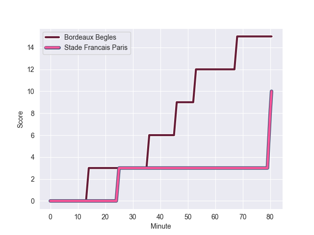
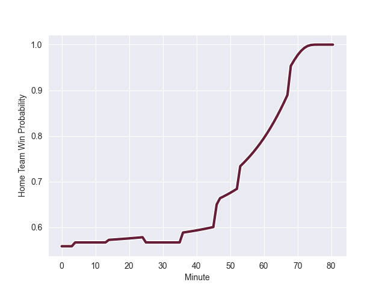

---  
layout: page  
title: Stade Francais Paris at Bordeaux Begles; 10-15  
date: 2022-10-01 15:00:00 18:00:00 -0500  
categories: match review  
---
# Prediction: Bordeaux Begles by 15.2

Bordeaux Begles by 10.2 on a neutral field
## Scores over Time

## Win Probability over Time

# Pre-Match Prediction: Bordeaux Begles by 8.7

Bordeaux Begles by 3.7 on a neutral pitch

|   Away Minutes | Away Player          |   Away elo |   Away Percentile |   Number |   Home Percentile |   Home elo | Home Player            |   Home Minutes |
|---------------:|:---------------------|-----------:|------------------:|---------:|------------------:|-----------:|:-----------------------|---------------:|
|             66 | Clement Castets      |      74.24 |                12 |        1 |                23 |      76.97 | Jefferson Poirot       |             66 |
|             58 | Lucas Peyresblanques |      86.24 |                67 |        2 |                50 |      80.5  | Maxime Lamothe         |             48 |
|             59 | Nemo Roelofse        |      77.59 |                26 |        3 |                97 |     106.59 | Ben Tameifuna          |             48 |
|             80 | Hugh Pyle            |      92.05 |                85 |        4 |                92 |      98.99 | Jandré Marais          |             80 |
|             46 | Steven Cummins       |      71.5  |                 8 |        5 |                61 |      82.83 | Mariano Galarza        |             80 |
|             46 | Veresa Ramototabua   |      80    |               nan |        6 |               nan |      80    | Jean-Baptiste Lachaise |              4 |
|             80 | Camille Gerondeau    |      79    |                39 |        7 |                68 |      83.8  | Guido Petti            |             80 |
|             80 | Sekou Macalou        |      90.64 |                84 |        8 |                28 |      77.22 | Caleb Timu             |             60 |
|             61 | Arthur Coville       |      71.82 |                 6 |        9 |                99 |     116.7  | Maxime Lucu            |             80 |
|             80 | Leo Barre            |      80.25 |                43 |       10 |                83 |      92.81 | Matthieu Jalibert      |             80 |
|             47 | Stéphane Ahmed       |      89.56 |                80 |       11 |                 9 |      72.22 | Federico Mori          |             80 |
|             53 | Julien Delbouis      |      87.37 |                73 |       12 |                54 |      82.46 | Tani Vili              |             58 |
|             80 | Telusa Veainu        |     108.91 |                97 |       13 |                84 |      92.84 | Yoram Moefana          |             80 |
|             80 | Nadir Megdoud        |      71.59 |                 7 |       14 |                73 |      86.87 | Geoffrey Cros          |             80 |
|             80 | Kylan Hamdaoui       |      87.82 |                69 |       15 |                56 |      81.75 | Louis Bielle-Biarrey   |             80 |
|             34 | JJ van der Mescht    |      82.64 |                60 |       16 |                80 |      89.14 | Alban Roussel          |             76 |
|             34 | Ryan Chapuis         |      64.77 |                 1 |       17 |                97 |     106.59 | Ben Tameifuna          |             32 |
|             33 | Sione Tui            |      77.45 |                27 |       18 |                95 |     100.66 | Clement Maynadier      |             32 |
|             27 | Jeremy Ward          |      89.53 |                78 |       19 |                71 |      86.88 | Pablo Uberti           |             22 |
|             22 | Laurent Panis        |      79.98 |                46 |       20 |                12 |      71.89 | Thomas Jolmes          |             20 |
|             21 | Giorgi Melikidze     |      87.17 |                77 |       21 |                91 |      94.2  | Lekso Kaulashvili      |             14 |
|             19 | James Hall           |      89.62 |                81 |       22 |                 0 |       9.39 | Solomone Kata          |             80 |
|             14 | Sergo Abramishvili   |      80    |               nan |       23 |                 0 |       9.39 | Solomone Kata          |             80 |

