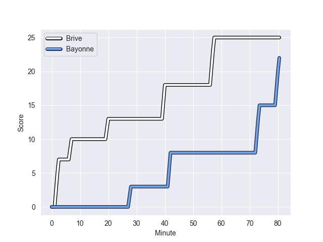
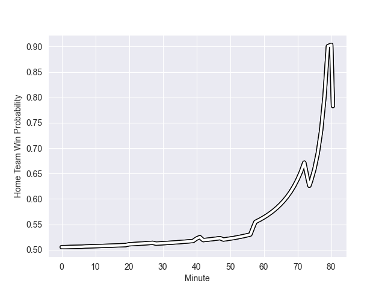

---  
layout: page  
title: Bayonne at Brive; 22-25  
date: 2022-10-01 17:00:00 18:00:00 -0500  
categories: match review  
---
# Prediction: Brive by 5.9

Brive by 0.9 on a neutral field
## Scores over Time

## Win Probability over Time

# Pre-Match Prediction: Brive by 4.2

Bayonne by 0.8 on a neutral pitch

|   Away Minutes | Away Player           |   Away elo |   Away Percentile |   Number |   Home Percentile |   Home elo | Home Player          |   Home Minutes |
|---------------:|:----------------------|-----------:|------------------:|---------:|------------------:|-----------:|:---------------------|---------------:|
|             32 | Matis Perchaud        |      71.83 |                 7 |        1 |                37 |      79.05 | Wesley Tapueluelu    |             51 |
|             52 | Thomas Acquier        |      99.36 |                94 |        2 |                10 |      73.63 | Vano Karkadze        |             41 |
|             32 | Tevita Tatafu         |      78.17 |                31 |        3 |                37 |      79.04 | Marcel van der Merwe |             51 |
|             80 | Manuel Leindekar      |      90.93 |                83 |        4 |                67 |      84.74 | Fabrice Metz         |             59 |
|             40 | Kote Mikautadze       |      66.11 |                 3 |        5 |                76 |      88.54 | Lucas Paulos         |             80 |
|             80 | Mateaki Kafatolu      |      71.81 |                 8 |        6 |                11 |      73.39 | Paul Abadie          |             80 |
|             80 | Mateaki Kafatolu      |      71.81 |                 8 |        6 |                 8 |      73.39 | Paul Abadie          |             80 |
|             80 | Archer Holz           |      84.55 |                72 |        7 |                 8 |      69.54 | Matthieu Voisin      |             80 |
|             59 | Baptiste Heguy        |      77.62 |                27 |        8 |                63 |      84.52 | Abraham Papali'i     |             52 |
|             67 | Maxime Machenaud      |      90.78 |                84 |        9 |                19 |      75.85 | Vaso Lobzhanidze     |             61 |
|             48 | Thomas Dolhagaray     |      87.64 |                73 |       10 |                68 |      85.38 | Stuart Olding        |             80 |
|             80 | Remy Baget            |      82.9  |                63 |       11 |                93 |     101.57 | Axel Muller          |             80 |
|             60 | Guillaume Martocq     |      91.43 |                81 |       12 |                99 |     114.12 | Bundee Aki           |             80 |
|             80 | Sireli Maqala         |      82.11 |                51 |       13 |                93 |     102.21 | Nick Abendanon       |             61 |
|             80 | Victor Hannoun        |      80    |               nan |       14 |                59 |      82.14 | Aaron Grandidier     |             80 |
|             80 | Gaetan Germain        |      92.06 |                80 |       15 |                84 |      93.42 | Thomas Laranjeira    |             80 |
|             48 | Quentin Bethune       |      83.28 |                64 |       16 |                83 |      88.93 | Florian Dufour       |             39 |
|             48 | Pascal Cotet          |      78.49 |                33 |       17 |                 9 |      73.4  | Pietro Ceccarelli    |             29 |
|             40 | Thomas Ceyte          |      88.69 |                77 |       18 |                63 |      82.86 | Malino Vanai         |             29 |
|             32 | Camille Lopez         |     116.76 |                98 |       19 |                45 |      80.08 | Sasha Gue            |             28 |
|             28 | Torsten van Jaarsveld |      94.31 |                91 |       20 |                28 |      78.09 | Guillaume Galletier  |             19 |
|             21 | Uzair Cassiem         |      88.8  |                77 |       21 |                 8 |      73.39 | Paul Abadie          |             19 |
|             21 | Uzair Cassiem         |      88.8  |                77 |       21 |                11 |      73.39 | Paul Abadie          |             19 |
|             20 | Thomas Combezou       |     105.35 |                96 |       22 |                50 |      81.21 | Oskar Rixen          |             21 |
|             13 | Michael Ruru          |      90.5  |               nan |       23 |                 0 |       5.73 | Solomone Kata        |             80 |

