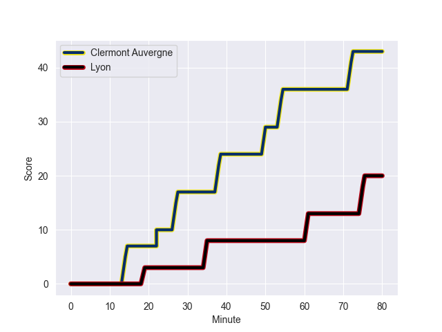
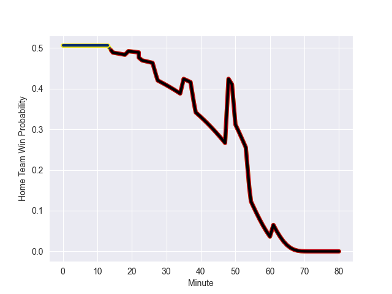

---  
layout: page  
title: Lyon at Clermont Auvergne; 20-43  
date: 2022-10-01 17:00:00 18:00:00 -0500  
categories: match review  
---
# Prediction: Clermont Auvergne by 6.0

Clermont Auvergne by 1.0 on a neutral field
## Scores over Time

## Win Probability over Time

# Pre-Match Prediction: Clermont Auvergne by 5.2

Clermont Auvergne by 0.2 on a neutral pitch

|   Away Minutes | Away Player          |   Away elo |   Away Percentile |   Number |   Home Percentile |   Home elo | Home Player          |   Home Minutes |
|---------------:|:---------------------|-----------:|------------------:|---------:|------------------:|-----------:|:---------------------|---------------:|
|             52 | Hamza Kaabeche       |      72.13 |                 8 |        1 |                78 |      86.67 | Etienne Falgoux      |             52 |
|             52 | Liam Coltman         |      88.21 |                80 |        2 |                57 |      81.81 | Yohan Beheregaray    |             80 |
|             48 | Paulo Tafili         |      77.81 |                41 |        3 |                53 |      81.49 | Peni Ravai Kovekalou |             71 |
|             80 | Temo Mayanavanua     |      81.3  |                55 |        4 |                45 |      79.86 | Thibaud Lanen        |             32 |
|             80 | Izack Rodda          |     100.14 |                93 |        5 |                77 |      88.72 | Tomas Lavanini       |             80 |
|             48 | Felix Lambey         |      96.96 |                90 |        6 |                95 |     104.61 | Wenceslas Lauret     |             80 |
|             52 | Colby Fainga'a       |      70.52 |                 8 |        7 |                29 |      79.43 | Judicael Cancoriet   |             23 |
|             80 | Arno Botha           |     107.82 |                95 |        8 |                48 |      80.47 | Lucas Dessaigne      |             41 |
|             55 | Baptiste Couilloud   |     103.45 |                95 |        9 |                94 |     101.42 | Sebastien Bezy       |             64 |
|             55 | Fletcher Smith       |      66.75 |                 1 |       10 |                80 |      90.08 | Jules Plisson        |             52 |
|             48 | Noa Nakaitaci        |      88.46 |                78 |       11 |                 7 |      71.02 | Remy Grosso          |             80 |
|             80 | Chris Ashton         |     120.37 |                99 |       12 |                65 |      85.21 | Irae Simone          |             80 |
|             80 | Alfred Parisien      |      80.11 |                45 |       13 |                24 |      77.46 | Samuel Ezeala        |             52 |
|             80 | Ethan Dumortier      |      84.37 |                68 |       14 |                99 |     115.91 | Peter Betham         |             80 |
|             80 | Leo Berdeu           |      77.65 |                28 |       15 |                68 |      86.74 | Cam Clark            |             80 |
|             32 | Richie Asiata        |      80.07 |                27 |       16 |                65 |      84.11 | Killian Tixeront     |             57 |
|             32 | Thibault Regard      |      82.25 |                56 |       17 |                77 |      88.72 | Tomas Lavanini       |             48 |
|             32 | Mickael Guillard     |      83.89 |                62 |       18 |                80 |      89.04 | Adrien Pelissie      |             39 |
|             28 | Sebastien Taofifenua |      71.22 |                 6 |       19 |                87 |      99.28 | Julien Heriteau      |             28 |
|             28 | Yanis Charcosset     |      80.18 |                50 |       20 |                90 |      97.27 | George Moala         |             28 |
|             28 | Beka Saghinadze      |      89.93 |                83 |       21 |                81 |      88.35 | Giorgi Beria         |             28 |
|             25 | Tavite Veredamu      |      79.54 |                41 |       22 |               nan |      80.19 | Baptiste Jauneau     |             16 |
|             25 | Jean-Marc Doussain   |     113.03 |                98 |       23 |               nan |      79.86 | Giorgi Dzmanashvili  |              9 |

