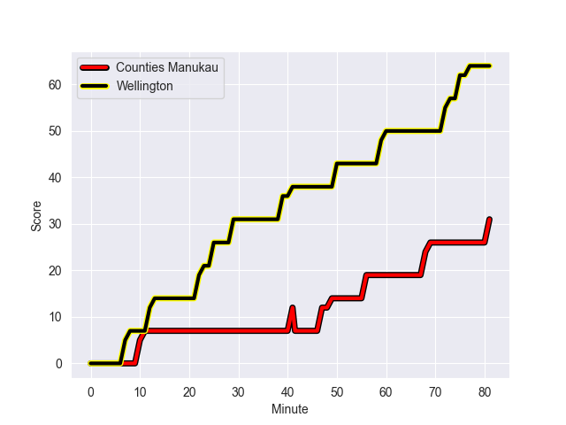
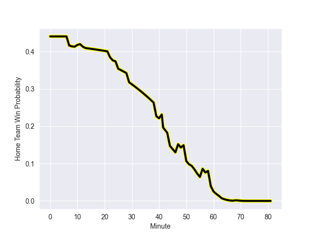

---  
layout: page  
title: Wellington at Counties Manukau; 64.0-31.0  
date: 2022-10-01 21:05:00 18:00:00 -0500  
categories: match review  
---
# Prediction: Wellington by 11.9

Wellington by 16.9 on a neutral field
## Scores over Time

## Win Probability over Time

# Pre-Match Prediction: Wellington by 10.5

Wellington by 15.5 on a neutral pitch

|   Away Minutes | Away Player           |   Away elo |   Away Percentile |   Number |   Home Percentile |   Home elo | Home Player         |   Home Minutes |
|---------------:|:----------------------|-----------:|------------------:|---------:|------------------:|-----------:|:--------------------|---------------:|
|             51 | Xavier Numia          |      89.41 |                57 |        1 |                 0 |      66.09 | Ezekiel Lindenmuth  |             52 |
|              7 | James O'Reilly        |      96.02 |                61 |        2 |                40 |      83.42 | Zuriel Togiatama    |             49 |
|             51 | PJ Sheck              |      81.2  |                30 |        3 |                13 |      77.97 | Suetena Asomua      |             49 |
|             81 | James Blackwell       |      94.3  |                62 |        4 |                33 |      81.49 | William Furniss     |             81 |
|             51 | Dominic Bird          |      83.99 |                44 |        5 |                22 |      79.47 | Samuel Slade        |             40 |
|             81 | Taine Plumtree        |      78.64 |                19 |        6 |                61 |      89.45 | Alex McRobbie       |             81 |
|             60 | Du'Plessis Kirifi     |     107.73 |                87 |        7 |                23 |      79.09 | Adam Brash          |             81 |
|             81 | Keelan Whitman        |      78.12 |                10 |        8 |                34 |      82.22 | Stefano Leavasa     |             51 |
|             63 | Richard Judd          |     110.28 |                87 |        9 |                29 |      80.37 | Cam Roigard         |             76 |
|             81 | Jackson Garden-Bachop |      95.98 |                64 |       10 |                12 |      77.92 | Riley Hohepa        |             81 |
|             81 | Connor Garden-Bachop  |      80.32 |                25 |       11 |                13 |      77.73 | Peniasi Malimali    |             81 |
|             63 | Riley Higgins         |      84.67 |                43 |       12 |                70 |     100.12 | AJ Alatimu          |             66 |
|             81 | Billy Proctor         |     101.3  |                73 |       13 |                 0 |      66.94 | Nikolai Foliaki     |             67 |
|             67 | Nehe Milner-Skudder   |      85.48 |                55 |       14 |                26 |      79.45 | Tevita Ofa          |             81 |
|             58 | Ruben Love            |      92.62 |                58 |       15 |                73 |     100.02 | Ahsee Tuala         |             54 |
|             74 | Asafo Aumua           |     108.66 |                91 |       16 |               nan |      79.48 | Ioane Moananu       |             32 |
|             30 | Solomona Sakalia      |     101.94 |               nan |       17 |                41 |      82.63 | Kauvaka Kaivelata   |             29 |
|             30 | Tietie Tuimauga       |      88.99 |                57 |       18 |               nan |      79.29 | Lionel Evans        |             32 |
|             30 | Caleb Delany          |      81.02 |                35 |       19 |                22 |      77.74 | Jadin Kingi         |             41 |
|             21 | Peter Lakai           |      81.47 |                29 |       20 |               nan |      79.76 | Thor Manase         |             30 |
|             18 | TJ Perenara           |     113.76 |                93 |       21 |                47 |      84.26 | Jonathan Taumateine |             23 |
|             23 | Aidan Morgan          |      80.23 |                26 |       22 |               nan |      80.29 | Nua Soti            |             11 |
|             32 | Julian Savea          |     132.12 |                99 |       23 |               nan |      80.49 | Esau Filimoehala    |             27 |

