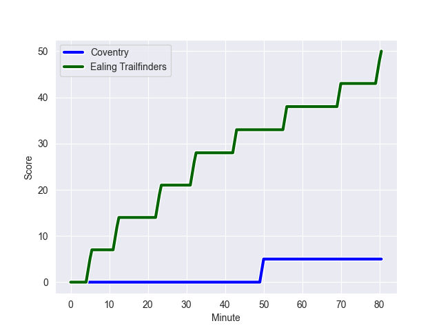
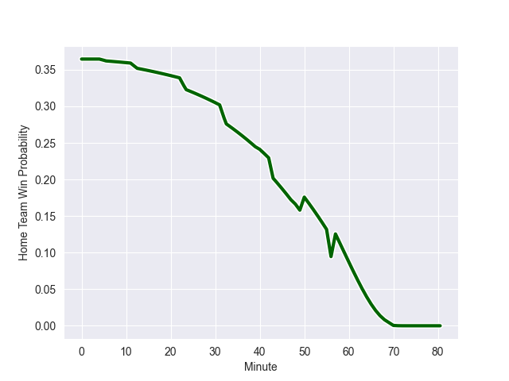

---  
layout: page  
title: Ealing Trailfinders at Coventry; 50-5  
date: 2022-10-01 16:00:00 18:00:00 -0500  
categories: match review  
---
# Prediction: Ealing Trailfinders by 19.1

Ealing Trailfinders by 24.1 on a neutral field
## Scores over Time

## Win Probability over Time

# Pre-Match Prediction: Ealing Trailfinders by 16.9

Ealing Trailfinders by 21.9 on a neutral pitch

|   Away Minutes | Away Player         |   Away elo |   Away Percentile |   Number |   Home Percentile |   Home elo | Home Player           |   Home Minutes |
|---------------:|:--------------------|-----------:|------------------:|---------:|------------------:|-----------:|:----------------------|---------------:|
|             60 | Kyle John Whyte     |      91.69 |                88 |        1 |                53 |      81.5  | Toby Trinder          |             57 |
|             60 | Shaun Malton        |      99.18 |                93 |        2 |                36 |      78.66 | Suva Ma'asi           |             52 |
|             60 | Lewis Thiede        |     106.15 |                97 |        3 |                28 |      76.51 | Jake Bridges          |             52 |
|             80 | Bobby de Wee        |      98.51 |                92 |        4 |                 6 |      69.13 | James Tyas            |             80 |
|             80 | Simon Linsell       |      87.36 |                77 |        5 |                39 |      78.78 | George Smith          |             80 |
|             48 | Rob Farrar          |      81.46 |                55 |        6 |                13 |      74.6  | Fred Betteridge       |             80 |
|             80 | Simon Uzokwe        |      97.37 |                90 |        7 |                71 |      84.67 | Tom Ball              |             80 |
|             60 | Ryan Smid           |     108.66 |                96 |        8 |                51 |      81.66 | Senitiki Nayalo       |             57 |
|             68 | Craig Hampson       |      96.97 |                91 |        9 |               nan |      79.28 | Finlay Ogden          |             48 |
|             80 | Craig Willis        |     104.64 |                93 |       10 |                10 |      73.37 | Evan Mitchell         |             48 |
|             80 | Luke Daniels        |      86.95 |                74 |       11 |                21 |      76.58 | Louis James           |             48 |
|             80 | Reuben Bird-Tulloch |      79.79 |                40 |       12 |                38 |      79.35 | Ollie Betteridge      |             66 |
|             40 | Max Bodilly         |      92.38 |                83 |       13 |                38 |      79.38 | Will Rigg             |             80 |
|             80 | Jonah Holmes        |      91.43 |                80 |       14 |                11 |      73.3  | William Talbot-Davies |             80 |
|             80 | David Johnston      |     101.47 |                93 |       15 |                19 |      76.39 | Louis Brown           |             80 |
|             40 | Steve Shingler      |      87.91 |                74 |       16 |                41 |      79.36 | Patrick Pellegrini    |             32 |
|             32 | Langi Gleeson       |      88.96 |                81 |       17 |                45 |      79.96 | Will Lane             |             32 |
|             20 | Cameron Terry       |      79.59 |                43 |       18 |                42 |      79.55 | James Martin          |             32 |
|             20 | James Gibbons       |      82.78 |                60 |       19 |               nan |      79.04 | Will Biggs            |             28 |
|             20 | Jimmy Roots         |      78.02 |                26 |       20 |               nan |      80    | Archie Maggs          |             28 |
|             20 | Will Montgomery     |      85.8  |                69 |       21 |               nan |      80.39 | Ollie Andrews         |             23 |
|             12 | Jordan Burns        |      91.98 |                86 |       22 |               nan |      79.93 | Frankie Read          |             23 |
|             80 | Solomone Kata       |       4.58 |                 0 |       23 |                40 |      79.8  | Lucas Titherington    |             14 |

