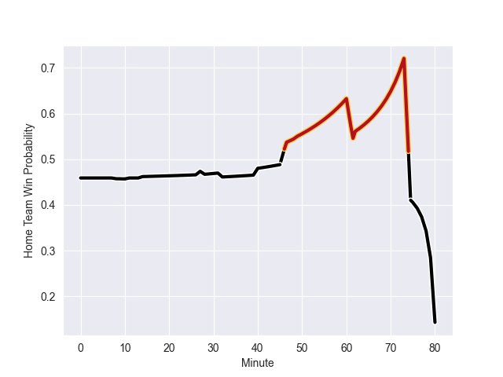

---  
layout: page  
title: Sharks at Dragons; 20-19  
date: 2022-10-01 20:35:00 18:00:00 -0500  
categories: match review  
---
# Prediction: Sharks by 2.1

Sharks by 7.1 on a neutral field
## Scores over Time

## Win Probability over Time

# Pre-Match Prediction: Sharks by 4.5

Sharks by 9.5 on a neutral pitch

|   Away Minutes | Away Player           |   Away elo |   Away Percentile |   Number |   Home Percentile |   Home elo | Home Player       |   Home Minutes |
|---------------:|:----------------------|-----------:|------------------:|---------:|------------------:|-----------:|:------------------|---------------:|
|             57 | Ntuthuko Mchunu       |      80.78 |                57 |        1 |                14 |      75.01 | Aki Seiuli        |             49 |
|             62 | Kerron van Vuuren     |      72.73 |                 9 |        2 |                83 |      89.82 | Elliot Dee        |             49 |
|             57 | Thomas du Toit        |      91.59 |                88 |        3 |                 4 |      69.14 | Lloyd Fairbrother |             53 |
|             80 | Justin Johan Basson   |      79.54 |                45 |        4 |                11 |      72.92 | Will Rowlands     |             80 |
|             57 | Reniel Hugo           |     104.97 |                96 |        5 |                79 |      89.3  | Ben Carter        |             80 |
|             80 | James Venter          |      89.15 |                82 |        6 |                16 |      73.61 | George Nott       |             62 |
|             66 | Dylan Richardson      |      79.38 |                41 |        7 |                31 |      78.06 | Taine Basham      |             80 |
|             80 | Phepsi Buthelezi      |      87.38 |                74 |        8 |                90 |      96.6  | Ross Moriarty     |             80 |
|             67 | Grant Williams        |      86.74 |               nan |        9 |                67 |      84.3  | Rhodri Williams   |             75 |
|             80 | Boeta Chamberlain     |      80.05 |                50 |       10 |                38 |      79.2  | Will Reed         |             75 |
|             75 | Thaakir Abrahams      |      79.37 |                40 |       11 |                74 |      86.96 | Ashton Hewitt     |             28 |
|             73 | Ben Tapuai            |      94.07 |                87 |       12 |                79 |      89.64 | Jack Dixon        |             80 |
|             80 | Manu Tuilagi          |     106.85 |                97 |       13 |                80 |      90.07 | Sio Tomkinson     |             80 |
|             80 | Werner Kok            |      83.74 |                66 |       14 |                66 |      83.52 | Jared Rosser      |             80 |
|             80 | Aphelele Fassi        |     100.91 |                93 |       15 |                15 |      75.07 | Angus O'Brien     |             80 |
|             23 | Dian Bleuler          |      77.1  |                24 |       16 |                 9 |      71.87 | Jordan Williams   |             52 |
|             23 | Carlu Sadie           |      70.21 |                 4 |       17 |                78 |      86.13 | Rob Evans         |             31 |
|             23 | Hyron Andrews         |      80.9  |                49 |       18 |                39 |      79    | Bradley Roberts   |             31 |
|             18 | Daniel Viljoen Jooste |      77.53 |                30 |       19 |                27 |      78.03 | Chris Coleman     |             27 |
|             14 | Sikhumbuzo Notshe     |      98.64 |                91 |       20 |                78 |      90.18 | Aaron Wainwright  |             18 |
|             13 | Cameron Wright        |      76.4  |                21 |       21 |                14 |      74.3  | Max Ojomoh        |              5 |
|              7 | Marnus Potgieter      |      81.34 |                52 |       22 |                45 |      79    | Lewis Jones       |              5 |
|              5 | Anthony Volmink       |      90.49 |                77 |       23 |                 0 |       4.47 | Solomone Kata     |             80 |

