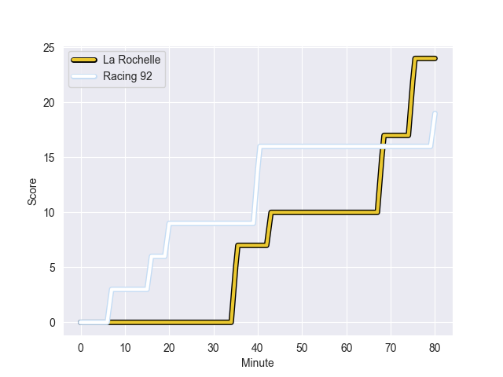
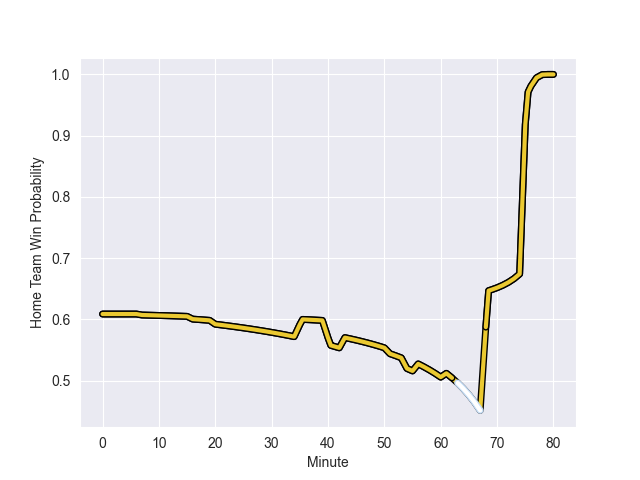

---  
layout: page  
title: Racing 92 at La Rochelle; 19-24  
date: 2022-10-01 21:05:00 18:00:00 -0500  
categories: match review  
---
# Prediction: La Rochelle by 24.2

La Rochelle by 19.2 on a neutral field
## Scores over Time

## Win Probability over Time

# Pre-Match Prediction: La Rochelle by 20.5

La Rochelle by 15.5 on a neutral pitch

|   Away Minutes | Away Player         |   Away elo |   Away Percentile |   Number |   Home Percentile |   Home elo | Home Player           |   Home Minutes |
|---------------:|:--------------------|-----------:|------------------:|---------:|------------------:|-----------:|:----------------------|---------------:|
|             51 | Hassane Kolingar    |      76.95 |                 8 |        1 |                85 |     104.83 | Reda Wardi            |             61 |
|             61 | Janick Tarrit       |      68.92 |                 0 |        2 |                66 |      97.37 | Pierre Bourgarit      |             61 |
|             70 | Cedate Gomes Sa     |     101.79 |                80 |        3 |                98 |     121.29 | Uini Atonio           |             54 |
|             80 | Cameron Woki        |     110.51 |                90 |        4 |                90 |     109.31 | Ultan Dillane         |             61 |
|             58 | Antonie Claassen    |     109.56 |                88 |        5 |                89 |     110.24 | Will Skelton          |             77 |
|             80 | Ibrahim Diallo      |      79.12 |                27 |        6 |                95 |     116    | Remi Bourdeau         |             80 |
|             58 | Baptiste Chouzenoux |     101.1  |                79 |        7 |                96 |     118.29 | Gregory Alldritt      |             80 |
|             58 | Baptiste Chouzenoux |     101.1  |                79 |        7 |                96 |     118.29 | Gregory Alldritt      |             80 |
|             80 | Anthime Hemery      |      82.26 |                38 |        8 |                96 |     118.29 | Gregory Alldritt      |             80 |
|             80 | Anthime Hemery      |      82.26 |                38 |        8 |                96 |     118.29 | Gregory Alldritt      |             80 |
|             64 | Antoine Gibert      |     102.3  |                77 |        9 |                27 |      79.97 | Thomas Berjon         |             56 |
|             80 | Finn Russell        |     116.79 |                93 |       10 |                71 |     100.58 | Mitch Inman           |             80 |
|             80 | Asaeli Tuivuaka     |      76.76 |                10 |       11 |                71 |      96.09 | Arthur Retiere        |             80 |
|             79 | Etienne Dussartre   |      88.59 |                50 |       12 |                63 |      96.25 | Theo Millet           |             80 |
|             80 | Francis Saili       |      95.58 |                61 |       13 |                90 |     109.82 | Dillyn Leyds          |             80 |
|             80 | Donovan Taofifenua  |      84.24 |                52 |       14 |                92 |     113.72 | Marc Andreu           |             80 |
|             80 | Warrick Gelant      |     118.41 |                95 |       15 |                90 |     109.82 | Dillyn Leyds          |             80 |
|             29 | Guram Gogichashvili |      88.47 |                57 |       16 |                71 |      97.85 | Georges-Henri Colombe |             26 |
|             22 | Arthur Iturria      |     113.51 |                92 |       17 |                85 |     107.14 | Tawera Kerr-Barlow    |             24 |
|             22 | Dom Bird            |     102.43 |                77 |       18 |                71 |      99.58 | Quentin Lespiaucq     |             19 |
|             19 | Jonathan Maiau      |      78.91 |               nan |       19 |                82 |     104.13 | Remi Picquette        |             19 |
|             16 | Teddy Iribaren      |     105.05 |                82 |       20 |                47 |      85.74 | Romain Sazy           |              3 |
|             10 | Gia Kharaishvili    |      80.61 |                30 |       21 |                71 |      98.07 | Thierry Paiva         |             19 |
|              1 | Inia Tabuavou       |      79.49 |                22 |       22 |                 0 |      11.39 | Solomone Kata         |             80 |

