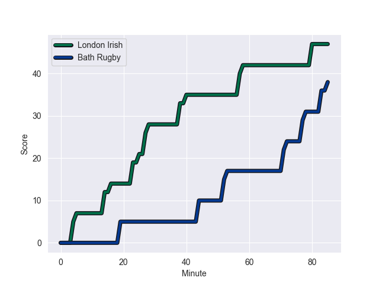
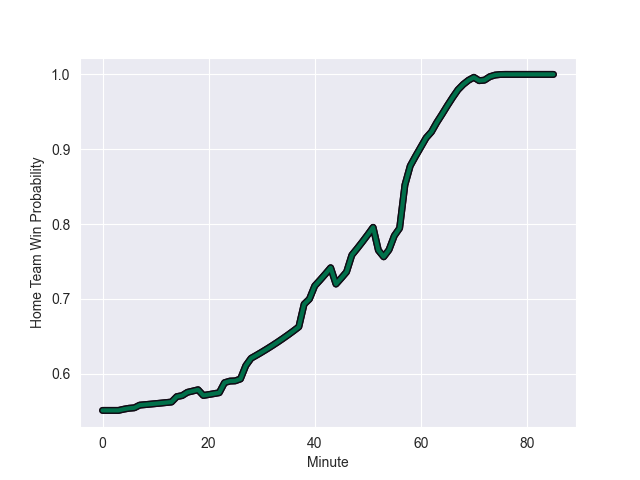

---  
layout: page  
title: Bath Rugby at London Irish; 38.0-47.0  
date: 2022-10-01 10:00:00 18:00:00 -0500  
categories: match review  
---
# Prediction: London Irish by 14.7

London Irish by 9.7 on a neutral field
## Scores over Time

## Win Probability over Time

# Pre-Match Prediction: London Irish by 14.9

London Irish by 9.9 on a neutral pitch

|   Away Minutes | Away Player         |   Away elo |   Away Percentile |   Number |   Home Percentile |   Home elo | Home Player                |   Home Minutes |
|---------------:|:--------------------|-----------:|------------------:|---------:|------------------:|-----------:|:---------------------------|---------------:|
|             55 | Juan Schoeman       |      73.02 |                14 |        1 |                17 |      77.42 | Danilo Fischetti           |             47 |
|             67 | Tom Dunn            |      88.82 |                82 |        2 |                99 |     115.26 | Agustin Creevy             |             82 |
|             62 | Will Stuart         |      69.61 |                 4 |        3 |                 6 |      72.69 | Lovejoy Chawatama          |             47 |
|             85 | Quinn Roux          |      95.6  |                93 |        4 |                81 |      89.5  | Api Ratuniyarawa           |             85 |
|             25 | Josh McNally        |      68.36 |                 6 |        5 |                97 |     110.11 | Rob Simmons                |             62 |
|              7 | GJ van Velze        |      81.11 |               nan |        6 |                18 |      76.55 | Ben Donnell                |             85 |
|             85 | Miles Reid          |      79.1  |                40 |        7 |                89 |      95.41 | Tom Pearson                |             74 |
|             85 | Josh Bayliss        |      74.35 |                15 |        8 |                88 |      94.41 | Matt Rogerson              |             64 |
|             59 | Louis Schreuder     |      69.46 |                 4 |        9 |                68 |      84.65 | Ben White                  |             66 |
|             85 | Orlando Bailey      |      68.19 |                 3 |       10 |                75 |      88.39 | Paddy Jackson              |             85 |
|             85 | Gabriel Hamer-Webb  |      88.37 |                78 |       11 |                25 |      77.39 | Ollie Hassell-Collins      |             85 |
|             58 | Max Ojomoh          |      73    |                10 |       12 |                39 |      79.66 | Benhard Janse van Rensburg |             85 |
|             55 | Jonathan Joseph     |     102.54 |                94 |       13 |                63 |      82.88 | Will Joseph                |             77 |
|             85 | Joe Cokanasiga      |      86.6  |                74 |       14 |                70 |      85.18 | Ben Loader                 |             85 |
|             85 | Matt Gallagher      |      93.83 |                86 |       15 |                55 |      82.38 | Henry Arundell             |             85 |
|             18 | Niall Annett        |      73.84 |                12 |       16 |                70 |      84.63 | Joseph Vajner              |              3 |
|             30 | Lewis Boyce         |      75.27 |                15 |       17 |                87 |      91.51 | Will Goodrick-Clarke       |             38 |
|             23 | D'Arcy Rae          |      66.09 |                 3 |       18 |                72 |      85.05 | Oli Hoskins                |             38 |
|             78 | Tom Ellis           |      75.75 |                16 |       19 |                71 |      86.4  | Josh Caulfield             |             23 |
|             60 | Wesley White        |      78.25 |                33 |       20 |                18 |      76.18 | Juan Martin Gonzalez       |             11 |
|             26 | Max Green           |      78.7  |                37 |       21 |                50 |      81.32 | Chandler Cunningham-South  |             21 |
|             30 | Piers Francis       |      91.03 |                82 |       22 |               nan |      80.43 | Caolan Englefield          |             19 |
|             27 | Ruaridh McConnochie |      83.83 |                68 |       23 |                68 |      87.59 | James Stokes               |              8 |

