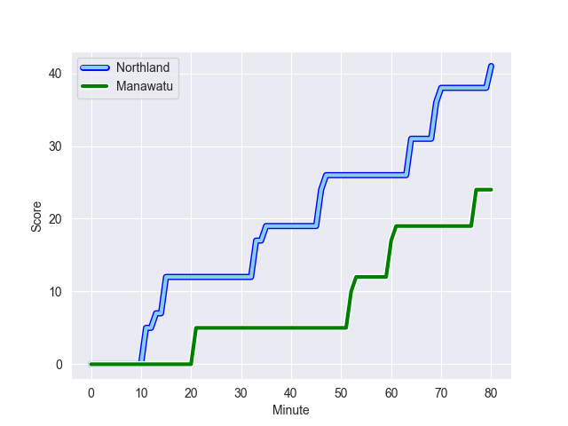
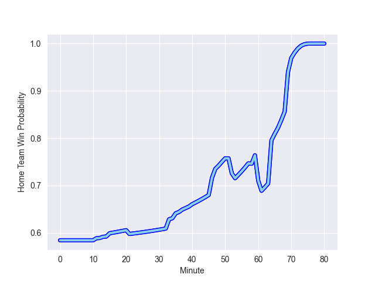

---  
layout: page  
title: Manawatu at Northland; 24.0-41.0  
date: 2022-10-01 21:05:00 18:00:00 -0500  
categories: match review  
---
# Prediction: Northland by 14.8

Northland by 9.8 on a neutral field
## Scores over Time

## Win Probability over Time

# Pre-Match Prediction: Northland by 14.9

Northland by 9.9 on a neutral pitch

|   Away Minutes | Away Player          |   Away elo |   Away Percentile |   Number |   Home Percentile |   Home elo | Home Player           |   Home Minutes |
|---------------:|:---------------------|-----------:|------------------:|---------:|------------------:|-----------:|:----------------------|---------------:|
|             58 | Harrison Allan       |      74.58 |                15 |        1 |                79 |      86.89 | Jarred Adams          |             51 |
|             48 | Leif Schwenke        |      78.25 |                32 |        2 |                14 |      74.61 | Matt Moulds           |             37 |
|             58 | Flyn Yates           |      74.91 |                17 |        3 |                14 |      74.88 | Coree Te Whata-Colley |             51 |
|             80 | Micaiah Torrence     |      72.64 |                13 |        4 |                50 |      80.57 | Allan Craig           |             80 |
|             49 | Ofa Tauatevalu       |      76.22 |                23 |        5 |                16 |      75.47 | Liam Hallam-Eames     |             49 |
|             66 | Potu Leavasa         |      71.37 |                 7 |        6 |                23 |      76.9  | Rob Rush              |             80 |
|             80 | Te Kamaka Howden     |      71.01 |                 7 |        7 |                46 |      80.15 | Jonah Mau'u           |             49 |
|             80 | Brayden Iose         |      65.8  |                 4 |        8 |                67 |      84.95 | Matt Polwart-Matich   |             80 |
|             59 | Luke Campbell        |      66.56 |                 2 |        9 |                66 |      83.99 | Sam Nock              |             54 |
|             59 | Sam Clarke           |      79.9  |               nan |       10 |                18 |      75.9  | Rivez Reihana         |             54 |
|             40 | Ed Fidow             |      66.32 |                 4 |       11 |                28 |      78.28 | Heremaia Murray       |             80 |
|             80 | Jason Emery          |      67.86 |                 4 |       12 |                25 |      77.59 | Blake Hohaia          |             49 |
|             80 | Taniela Filimone     |      80.09 |                45 |       13 |                64 |      84.98 | Tamati Tua            |             80 |
|             80 | Tima Fainga'anuku    |      61.37 |                 0 |       14 |                65 |      83.3  | Jone Macilai-Tori     |             80 |
|             80 | Drew Wild            |      75.48 |                16 |       15 |                56 |      82.89 | Joshua Moorby         |             80 |
|             32 | Ben Strang           |      78.75 |               nan |       16 |                26 |      76.94 | Ross Wright           |             43 |
|             22 | Joseph Gavigan       |      72.5  |                 9 |       17 |               nan |      71.18 | Conan O'Donnell       |             29 |
|             22 | Ropate Rinakama      |      82.29 |                62 |       18 |                18 |      75.39 | Sila Puafisi          |             29 |
|             31 | Josh Taula           |      80    |               nan |       19 |                33 |      77.95 | Josh Goodhue          |             31 |
|             14 | Elyjah Crosswell     |      80.34 |               nan |       20 |                49 |      81.27 | Sam McNamara          |             31 |
|             21 | Logan Henry          |      79.85 |                44 |       21 |                11 |      73.4  | Lisati Milo-Harris    |             26 |
|             40 | Kegan Christian-Goss |      81.28 |                47 |       22 |                 1 |      65.78 | Daniel Hawkins        |             26 |
|             21 | Louis Rogers         |      68.73 |                 4 |       23 |                50 |      81.73 | Rene Ranger           |             31 |

