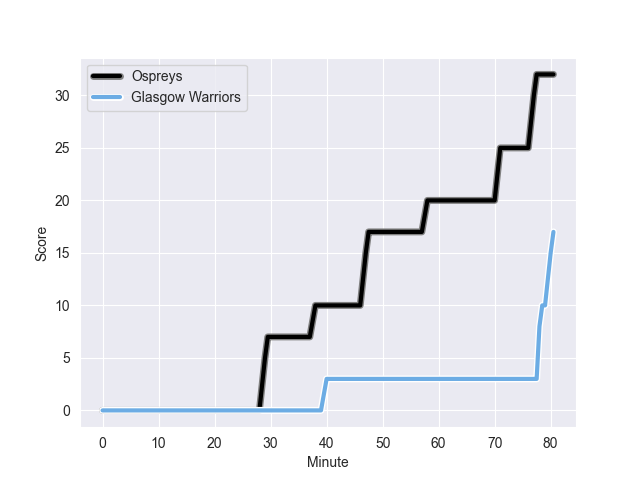

---  
layout: page  
title: Glasgow Warriors at Ospreys; 17-32  
date: 2022-10-01 16:00:00 18:00:00 -0500  
categories: match review  
---
# Prediction: Ospreys by 3.1

Glasgow Warriors by 1.9 on a neutral field
## Scores over Time

## Win Probability over Time

# Pre-Match Prediction: Glasgow Warriors by 3.5

Glasgow Warriors by 1.5 on a neutral pitch

|   Away Minutes | Away Player           |   Away elo |   Away Percentile |   Number |   Home Percentile |   Home elo | Home Player            |   Home Minutes |
|---------------:|:----------------------|-----------:|------------------:|---------:|------------------:|-----------:|:-----------------------|---------------:|
|             45 | Jamie Bhatti          |      87.15 |                76 |        1 |                68 |      83.98 | Nicky Smith            |             72 |
|             45 | Fraser Brown          |      95.66 |                92 |        2 |                93 |      98.29 | Scott Baldwin          |             55 |
|             45 | Zander Fagerson       |     108.15 |                97 |        3 |                 9 |      73.13 | Tom Botha              |             59 |
|             80 | Scott Cummings        |     119.37 |                99 |        4 |                78 |      88.81 | Adam Beard             |             80 |
|             55 | Richie Gray           |      72.59 |                13 |        5 |                93 |     100.34 | Alun Wyn Jones         |             80 |
|             75 | Gregor Brown          |      80    |               nan |        6 |                82 |      89.66 | Dan Lydiate            |             80 |
|             80 | Tom Gordon            |      89.34 |                83 |        7 |                71 |      84.91 | Jac Morgan             |             80 |
|             12 | Jack Dempsey          |      58.24 |                 0 |        8 |                27 |      77.42 | Ethan Roots            |              8 |
|             65 | Ali Price             |      88.64 |                80 |        9 |                45 |      80.02 | Rhys Webb              |             68 |
|             66 | Tom Jordan            |      80    |               nan |       10 |                75 |      88.32 | Gareth Anscombe        |             47 |
|             80 | Rufus McLean          |      81.53 |                54 |       11 |                 0 |      52.7  | Keelan Giles           |             73 |
|             80 | Sam Johnson           |      87.89 |                75 |       12 |                80 |      90.42 | Michael Collins        |             80 |
|             80 | Joe Apikotoa          |      68.64 |               nan |       13 |                92 |     100.48 | Owen Watkin            |             80 |
|             80 | Sebastian Cancelliere |      95.39 |                88 |       14 |                99 |     118.99 | George North           |             80 |
|             80 | Cole Forbes           |      85.51 |                70 |       15 |                43 |      79.76 | Max Nagy               |             80 |
|             68 | Ryan Wilson           |      78.28 |                33 |       16 |                67 |      83.55 | William Griffiths      |             64 |
|             35 | Oli Kebble            |      97.82 |                95 |       17 |                35 |      78.9  | Jack Walsh             |             33 |
|             35 | George Turner         |      98.64 |                92 |       18 |                12 |      74.68 | Dewi Lake              |             25 |
|             35 | Simon Berghan         |      79.64 |                52 |       19 |                 9 |      73.13 | Tom Botha              |             21 |
|             25 | Jean-Luc du Preez     |     113.36 |                99 |       20 |               nan |      81.28 | Reuben Morgan-Williams |             12 |
|             15 | Sean Kennedy          |      76.85 |               nan |       21 |                38 |      78.95 | Rhys Davies            |              8 |
|             14 | Domingo Miotti        |      91.37 |                82 |       22 |               nan |      80    | Rhys Henry             |              8 |
|              5 | Sintu Manjezi         |      79.42 |                44 |       23 |                 3 |      65.07 | Luke Morgan            |              7 |

