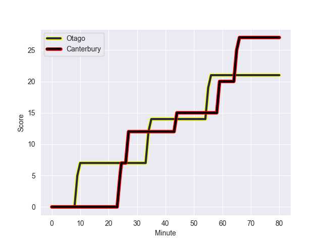
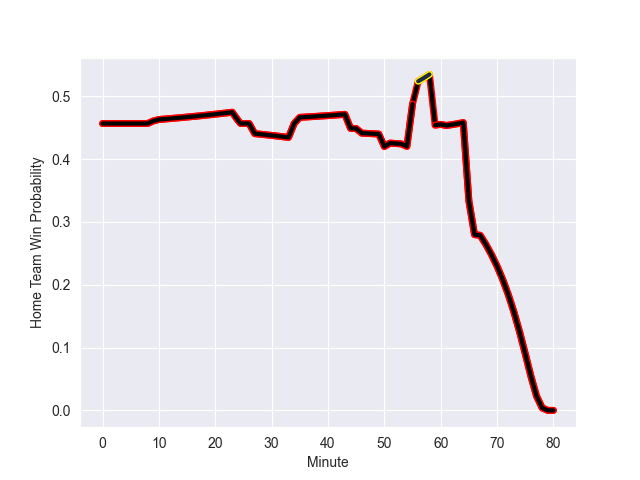

---  
layout: page  
title: Canterbury at Otago; 27.0-21.0  
date: 2022-10-01 02:05:00 18:00:00 -0500  
categories: match review  
---
# Prediction: Canterbury by 2.5

Canterbury by 7.5 on a neutral field
## Scores over Time

## Win Probability over Time

# Pre-Match Prediction: Canterbury by 1.6

Canterbury by 6.6 on a neutral pitch

|   Away Minutes | Away Player        |   Away elo |   Away Percentile |   Number |   Home Percentile |   Home elo | Home Player          |   Home Minutes |
|---------------:|:-------------------|-----------:|------------------:|---------:|------------------:|-----------:|:---------------------|---------------:|
|             56 | Tamaiti Williams   |      82.97 |                59 |        1 |                63 |      83.58 | Abraham Pole         |             67 |
|             56 | Brodie McAlister   |      93.01 |                87 |        2 |                54 |      81.67 | Henry Bell           |             80 |
|             67 | Oli Jager          |      93.63 |                87 |        3 |                40 |      79.71 | Jermaine Ainsley     |             67 |
|             51 | Luke Romano        |      89.93 |                79 |        4 |                77 |      89.54 | Fabian Holland       |             80 |
|             80 | Zach Gallagher     |      83.15 |                61 |        5 |                67 |      84.34 | William Tucker       |             46 |
|             46 | Dom Gardiner       |      82.62 |                60 |        6 |                75 |      88.18 | Oliver Haig          |             67 |
|             80 | Tom Christie       |      98.47 |                90 |        7 |                63 |      84.05 | James Lentjes        |             80 |
|             80 | Billy Harmon       |      86.01 |                69 |        8 |                43 |      80.99 | Christian Lio-Willie |             67 |
|             61 | Fergus Burke       |      81.32 |                46 |       10 |                63 |      85.74 | Cameron Millar       |             80 |
|             80 | George Bridge      |     108.88 |                97 |       11 |                78 |      90.15 | Jona Nareki          |             67 |
|             80 | Rameka Poihipi     |      81.55 |                47 |       12 |                11 |      74.97 | Josh Ioane           |             80 |
|             80 | Braydon Ennor      |      84.61 |                60 |       13 |                 9 |      73.79 | Josh Timu            |             61 |
|             80 | Manasa Mataele     |      88.36 |                73 |       14 |                58 |      82.33 | Freedom Vahaakolo    |             80 |
|             66 | Chay Fihaki        |      92.05 |                76 |       15 |                63 |      86.26 | Sam Gilbert          |             80 |
|             24 | Finlay Brewis      |      87.01 |                72 |       17 |                56 |      81.79 | Tau Koloamatangi     |             13 |
|             29 | Sam Darry          |      80.5  |                45 |       19 |                66 |      84.28 | Josh Dickson         |             34 |
|             34 | Reed Prinsep       |      93.22 |                85 |       20 |                60 |      83.04 | Sean Withy           |             26 |
|             19 | Dallas McLeod      |      89.38 |                74 |       22 |                21 |      77.19 | Ray Nu'u             |             19 |
|             14 | Ngatungane Punivai |      84.25 |                63 |       23 |                59 |      84.17 | Mitchell Scott       |             13 |

