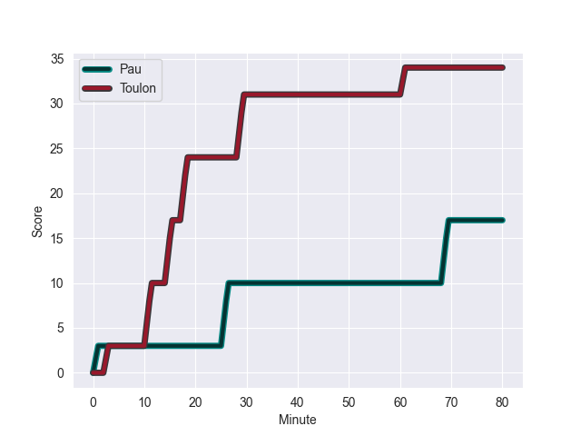
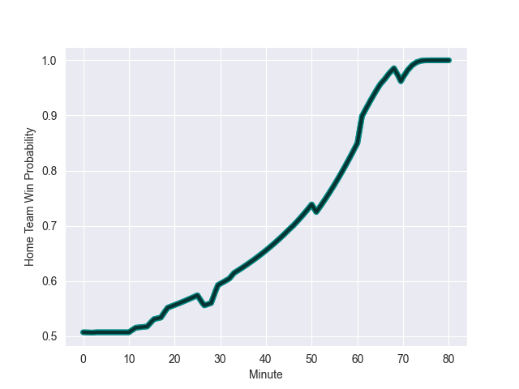

---  
layout: page  
title: Toulon at Pau; 34-17  
date: 2022-10-01 17:00:00 18:00:00 -0500  
categories: match review  
---
# Prediction: Pau by 6.2

Pau by 1.2 on a neutral field
## Scores over Time

## Win Probability over Time

# Pre-Match Prediction: Pau by 3.8

Toulon by 1.2 on a neutral pitch

|   Away Minutes | Away Player                    |   Away elo |   Away Percentile |   Number |   Home Percentile |   Home elo | Home Player         |   Home Minutes |
|---------------:|:-------------------------------|-----------:|------------------:|---------:|------------------:|-----------:|:--------------------|---------------:|
|             51 | Jean-Baptiste Gros             |      95.4  |                92 |        1 |                71 |      84.74 | Remi Seneca         |             51 |
|             51 | Anthony Etrillard              |      83.06 |                64 |        2 |                70 |      84.31 | Lucas Rey           |             33 |
|             51 | Beka Gigashvili                |      92.01 |                88 |        3 |                 9 |      72.85 | Guram Papidze       |             51 |
|             80 | Eben Etzebeth                  |      92.56 |                87 |        4 |                48 |      80.43 | Mariano Galarza     |             80 |
|             80 | Brian Alainu'uese              |      88.87 |                81 |        5 |                24 |      77.38 | Baptiste Pesenti    |             51 |
|             62 | Cornell du Preez               |      82.19 |                64 |        6 |                31 |      78.05 | Sacha Zegueur       |             51 |
|             80 | Charles Ollivon                |     108.61 |                96 |        7 |                99 |     113.77 | Luke Whitelock      |             80 |
|             80 | Charles Ollivon                |     108.61 |                98 |        7 |                99 |     113.77 | Luke Whitelock      |             80 |
|             56 | Facundo Isa                    |     102.53 |                92 |        8 |                73 |      85.32 | Beka Gorgadze       |             50 |
|             66 | Benoit Paillaugue              |      97.61 |                92 |        9 |                83 |      90.99 | Clovis Le bail      |             80 |
|             80 | Ihaia West                     |      74.76 |                14 |       10 |                90 |     100.85 | Zack Henry          |             80 |
|             80 | Harrison Obatoyinbo            |      74.69 |                14 |       11 |                36 |      78.77 | Eoghan Barrett      |             46 |
|             80 | Josaia Raisuqe                 |      69.75 |                 6 |       12 |                81 |      91.5  | Émilien Gailleton   |             80 |
|             70 | Waisea Nayacalevu Vuidravuwalu |     101.27 |                93 |       13 |                52 |      82.9  | Yvan Reilhac        |             80 |
|             70 | Daniel Ikpefan                 |      79.61 |                42 |       14 |                49 |      80.85 | Mathias Colombet    |             51 |
|             80 | Thomas Salles                  |      77.09 |                38 |       15 |                97 |     107.37 | Clement Laporte     |             80 |
|             29 | Dany Priso                     |      79.47 |                41 |       16 |                22 |      77.1  | Youri Delhommel     |             47 |
|             29 | Christopher Tolofua            |      87.27 |                79 |       17 |               nan |      80    | Clement Mondinat    |             34 |
|             29 | Kieran Brookes                 |      83.77 |                67 |       18 |                67 |      84.17 | Sean Dougall        |             30 |
|             24 | Mathieu Bastareaud             |     115.42 |                97 |       19 |                93 |     100.75 | Mickael Capelli     |             29 |
|             18 | Jone Qovu Nailiko              |      96.81 |                89 |       20 |                91 |      98.54 | Thibault Daubagna   |             29 |
|             14 | Jules Danglot                  |      79.69 |                47 |       21 |                28 |      77.28 | Jordan Joseph       |             29 |
|             10 | Mathieu Smaili                 |      82.73 |                60 |       22 |                13 |      75.45 | Nicolas Corato      |             29 |
|             10 | Alofa Alofa                    |      84.15 |                60 |       23 |                95 |     101.28 | Siegfried Fisi'ihoi |             29 |

