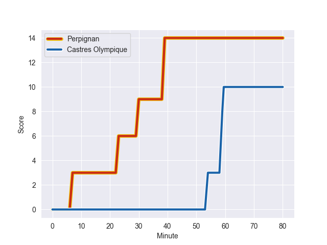
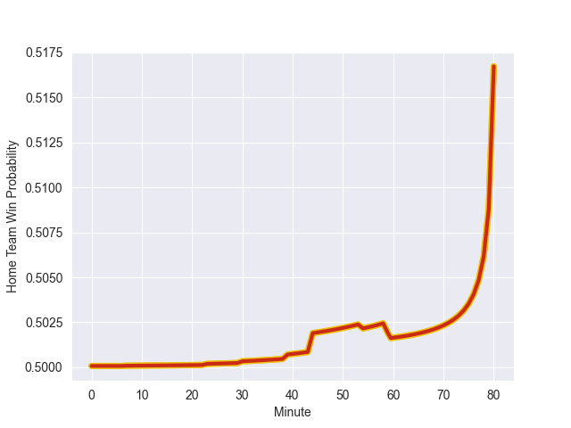

---  
layout: page  
title: Castres Olympique at Perpignan; 10-14  
date: 2022-10-01 17:00:00 18:00:00 -0500  
categories: match review  
---
# Prediction: Perpignan by 5.0

Perpignan by 0.0 on a neutral field
## Scores over Time

## Win Probability over Time

# Pre-Match Prediction: Perpignan by 5.0

Perpignan by 0.0 on a neutral pitch

|   Away Minutes | Away Player          |   Away elo |   Away Percentile |   Number |   Home Percentile |   Home elo | Home Player           |   Home Minutes |
|---------------:|:---------------------|-----------:|------------------:|---------:|------------------:|-----------:|:----------------------|---------------:|
|             44 | Quentin Walcker      |     104.9  |                84 |        1 |                75 |     100.06 | Xavier Chiocci        |             48 |
|             44 | Paula Ngauamo        |     106.4  |                88 |        2 |                47 |      87.83 | Seilala Lam           |             57 |
|             44 | Aurélien Azar        |      79.92 |                26 |        3 |                89 |     108.68 | Siua Halanukonuka     |             51 |
|             80 | Gauthier Maravat     |      71.55 |                 2 |        4 |                57 |      91.12 | Will Witty            |             48 |
|             44 | Florent Vanverberghe |      90.44 |                57 |        5 |                80 |     103.52 | Alexandre Bias        |             53 |
|             80 | Mathieu Babillot     |     108.01 |                87 |        6 |                66 |      94.01 | Alan Brazo            |             80 |
|             44 | Tyler Ardron         |     110.48 |                89 |        7 |                93 |     115.34 | Lucas Bachelier       |             80 |
|             44 | Leone Nakarawa       |     103.92 |                81 |        8 |                14 |      79.05 | Lucas Velarte         |             80 |
|             76 | Santiago Arata       |     103.59 |                80 |        9 |                91 |     112.4  | Tom Ecochard          |             60 |
|             80 | Louis Le Brun        |      80.83 |                28 |       10 |                62 |      93.45 | Tristan Tedder        |             80 |
|             80 | George Tilsley       |      94.39 |                68 |       11 |                96 |     121.02 | Mathieu Acebes        |             80 |
|             80 | Vilimoni Botitu      |     102.5  |                75 |       12 |                42 |      83.9  | Alivereti Duguivalu   |             80 |
|             44 | Yann David           |     103.94 |                78 |       13 |                62 |      95.84 | Adrea Cocagi          |             76 |
|             80 | Thomas Larregain     |      82.4  |                38 |       14 |                79 |     101.48 | Jeronimo de la Fuente |             80 |
|             80 | Julien Dumora        |     110.65 |                90 |       15 |                35 |      81.42 | Lucas Dubois          |             76 |
|             36 | Wayan de Benedittis  |      83.49 |                48 |       16 |                51 |      86.51 | Giorgi Tetrashvili    |             32 |
|             36 | Gaetan Barlot        |     101.84 |                78 |       17 |                63 |      91.82 | Karl Chateau          |             32 |
|             36 | Wilfrid Hounkpatin   |      94.78 |                63 |       18 |                93 |     112.8  | Arthur Joly           |             29 |
|             36 | Asier Usarraga       |     103.74 |                83 |       19 |                54 |      92.5  | Mike Tadjer Barbosa   |             23 |
|             36 | Tom Staniforth       |     115.31 |                93 |       20 |                19 |      79.37 | Matteo Rodor          |             20 |
|             36 | Baptiste Delaporte   |      94.5  |                60 |       21 |                 2 |      73.07 | Boris Goutard         |              4 |
|             36 | Afusipa Taumoepeau   |     111.02 |                90 |       22 |                98 |     123.88 | Filipo Nakosi         |              4 |
|              4 | Gauthier Doubrere    |     105.16 |                83 |       23 |                61 |      93.7  | Masalosalo Tutaia     |             27 |

