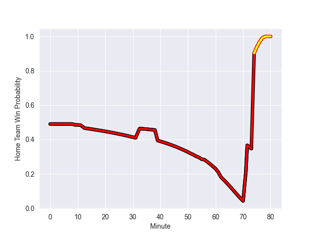

---  
layout: page  
title: Hartpury College at Richmond; 15-19  
date: 2022-10-01 16:00:00 18:00:00 -0500  
categories: match review  
---
# Prediction: Richmond by 3.3

Hartpury College by 1.7 on a neutral field
## Scores over Time

## Win Probability over Time

# Pre-Match Prediction: Hartpury College by 5.2

Richmond by 0.2 on a neutral pitch

|   Away Minutes | Away Player             |   Away elo |   Away Percentile |   Number |   Home Percentile |   Home elo | Home Player        |   Home Minutes |
|---------------:|:------------------------|-----------:|------------------:|---------:|------------------:|-----------:|:-------------------|---------------:|
|             61 | Harry Fry               |      79.43 |               nan |        1 |                14 |      75.01 | Conor Maguire      |             56 |
|             80 | Ellis Shipp             |      74.08 |                13 |        2 |                21 |      77.12 | Callum Torpey      |             62 |
|             62 | Alex Gibson             |      66.7  |                 2 |        3 |                11 |      73.8  | Jimmy Litchfield   |             56 |
|             71 | Jack Davies             |      75.95 |                22 |        4 |                41 |      78.87 | Will Carrick-Smith |             54 |
|             80 | Dale Lemon              |      78.83 |                40 |        5 |                12 |      72.34 | Sam Collingridge   |             80 |
|             80 | AJ MacGinty             |      78.99 |               nan |        6 |                19 |      76.27 | Ethan Benson       |             62 |
|             61 | Joe Howard              |      78.37 |                34 |        7 |                85 |      91.74 | Tobias Saysell     |             80 |
|             76 | Mitch Eadie             |      69.71 |                10 |        8 |                 2 |      62.74 | Mark Bright        |             80 |
|             52 | Jean-Baptiste Bruzulier |      83.72 |                64 |        9 |                12 |      73.74 | Stephen Kerins     |             62 |
|             80 | Jack Lloyd              |      77.94 |                29 |       10 |                38 |      79.26 | Bill Johnston      |             80 |
|             80 | Sam Smith               |      82.58 |               nan |       11 |                28 |      77.67 | Tom Mills          |             70 |
|             80 | Harry Tarling           |      78.71 |                35 |       12 |                29 |      77.97 | Paul Kiernan       |             80 |
|             80 | Matthew McNab           |      76.96 |                22 |       13 |                25 |      77.55 | Paddy Case         |             80 |
|             80 | Bradley Denty           |      77.46 |                26 |       14 |                39 |      79.15 | Alexander O'Meara  |             80 |
|             76 | Tommy Mathews           |      76.46 |                20 |       15 |                15 |      75.25 | Ted Landray        |             54 |
|             28 | Oscar Lennon            |      82.54 |                60 |       16 |                36 |      78.65 | Owain James        |             26 |
|             19 | Harry Short             |      83.25 |                66 |       17 |                35 |      78.56 | David Massey       |             26 |
|             19 | Tom Sims                |      80    |               nan |       18 |                24 |      76.47 | Ntinga Mpiko       |             24 |
|             18 | Sam Rodman              |      79    |                40 |       19 |               nan |      79.56 | Luke Spring        |             24 |
|              9 | Ben Glynn               |      90.52 |               nan |       20 |                19 |      75.98 | Alexander Post     |             18 |
|              4 | Jake Holcombe           |      78.99 |                38 |       21 |                27 |      77.65 | Miles Wakeling     |             18 |
|              4 | Arthur William Lennon   |      80    |               nan |       22 |                 7 |      70.84 | Callum Watson      |             18 |
|             80 | Solomone Kata           |       6.4  |                 0 |       23 |               nan |      79.84 | Zuriel Makele      |             10 |

