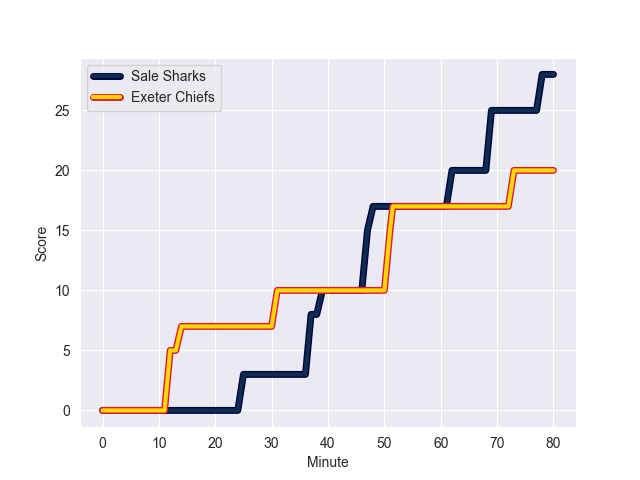
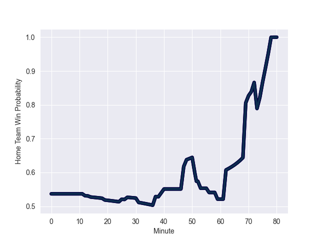

---  
layout: page  
title: Exeter Chiefs at Sale Sharks; 20.0-28.0  
date: 2022-10-01 10:00:00 18:00:00 -0500  
categories: match review  
---
# Prediction: Sale Sharks by 11.4

Sale Sharks by 6.4 on a neutral field
## Scores over Time

## Win Probability over Time

# Pre-Match Prediction: Sale Sharks by 11.9

Sale Sharks by 6.9 on a neutral pitch

|   Away Minutes | Away Player       |   Away elo |   Away Percentile |   Number |   Home Percentile |   Home elo | Home Player         |   Home Minutes |
|---------------:|:------------------|-----------:|------------------:|---------:|------------------:|-----------:|:--------------------|---------------:|
|             62 | Alec Hepburn      |      80.42 |                44 |        1 |                78 |      88.68 | Simon McIntyre      |             40 |
|             62 | Luke Cowan-Dickie |      85.77 |                73 |        2 |                95 |     100.54 | Akker van der Merwe |             56 |
|             62 | Harry Williams    |     100.83 |                95 |        3 |                98 |     114.54 | Coenie Oosthuizen   |             62 |
|             40 | Jack Dunne        |      80.77 |                46 |        4 |                80 |      90.89 | Cobus Wiese         |             71 |
|             19 | Dafydd Jenkins    |      85.05 |                70 |        5 |                75 |      88.3  | Jonny Hill          |             80 |
|             80 | Jannes Kirsten    |      82.41 |                59 |        6 |                71 |      87.05 | Tom Curry           |             80 |
|             80 | Jacques Vermeulen |      91.88 |                83 |        7 |                53 |      81.7  | Ben Curry           |             47 |
|             80 | Sam Simmonds      |      85.79 |                66 |        8 |                91 |     104.1  | Daniel du Preez     |             68 |
|             27 | Stu Townsend      |      84.08 |                64 |        9 |                43 |      80.21 | Gus Warr            |             75 |
|             80 | Harvey Skinner    |      74.86 |                12 |       10 |                30 |      78.17 | Robert du Preez     |             80 |
|             80 | Olly Woodburn     |      97.93 |                87 |       11 |                83 |      94.04 | Tom O'Flaherty      |             73 |
|             80 | Ian Whitten       |      92.73 |                79 |       12 |                99 |     113.7  | Manu Tuilagi        |             59 |
|             80 | Henry Slade       |      97.45 |                87 |       13 |                91 |     101.2  | Sam James           |             80 |
|             71 | Rory O'Loughlin   |      90.94 |                76 |       14 |                19 |      76.15 | Tom Roebuck         |             80 |
|             18 | Jack Yeandle      |      95.08 |                91 |       16 |                48 |      80.9  | Ewan Ashman         |             24 |
|             18 | Josh Iosefa-Scott |      84.3  |                65 |       17 |                87 |      93.78 | Bevan Rodd          |             40 |
|             61 | Ruben van Heerden |      91.74 |                83 |       19 |                83 |      91.59 | Jono Ross           |             21 |
|             40 | Richard Capstick  |      67.92 |                 5 |       20 |                99 |     117.49 | Jean-Luc du Preez   |             33 |
|             53 | Sam Maunder       |      73.22 |                11 |       21 |                92 |     102.45 | Joe Simpson         |              5 |
|              9 | Joe Simmonds      |     101.15 |                91 |       22 |                87 |      95.96 | Sam Hill            |             21 |
|              0 | Solomone Kata     |      76    |                12 |       23 |                77 |      90.85 | Arron Reed          |              7 |

