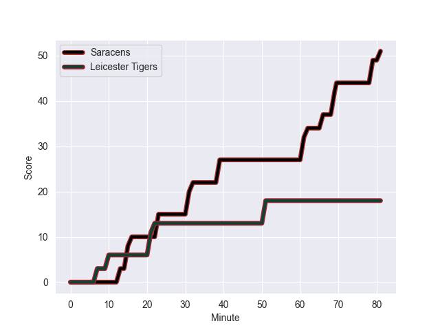
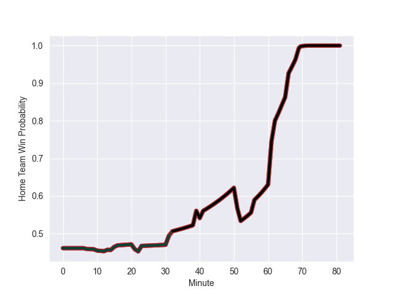

---  
layout: page  
title: Leicester Tigers at Saracens; 18.0-51.0  
date: 2022-10-01 10:00:00 18:00:00 -0500  
categories: match review  
---
# Prediction: Leicester Tigers by 1.8

Leicester Tigers by 6.8 on a neutral field
## Scores over Time

## Win Probability over Time

# Pre-Match Prediction: Leicester Tigers by 0.9

Leicester Tigers by 5.9 on a neutral pitch

|   Away Minutes | Away Player         |   Away elo |   Away Percentile |   Number |   Home Percentile |   Home elo | Home Player        |   Home Minutes |
|---------------:|:--------------------|-----------:|------------------:|---------:|------------------:|-----------:|:-------------------|---------------:|
|             64 | James Cronin        |      94.09 |                88 |        1 |                94 |      99.96 | Mako Vunipola      |             56 |
|             81 | Charlie Clare       |      79.12 |                39 |        2 |                98 |     111.67 | Jamie George       |             40 |
|             52 | Joe Heyes           |      82.54 |                49 |        3 |                18 |      76.33 | Christian Judge    |             52 |
|             81 | Harry Wells         |     104.56 |                95 |        4 |                 1 |      64.04 | Callum Hunter-Hill |             56 |
|             41 | Eli Snyman          |      81.58 |                49 |        5 |                24 |      76.78 | Hugh Tizard        |             81 |
|             81 | Olly Cracknell      |      66.4  |                 0 |        6 |                49 |      81.21 | Theo McFarland     |             81 |
|             81 | Tommy Reffell       |      97.8  |                90 |        7 |                92 |      99.84 | Ben Earl           |             81 |
|             41 | Hanro Liebenberg    |     106.22 |                93 |        8 |                96 |     112.07 | Billy Vunipola     |             69 |
|             52 | Ben Youngs          |      97.33 |                84 |        9 |                28 |      77.45 | Ivan van Zyl       |             68 |
|             81 | Freddie Burns       |     111.62 |                96 |       10 |                96 |     112.24 | Owen Farrell       |             69 |
|             41 | Kini Murimurivalu   |     109.38 |                97 |       11 |                61 |      82.71 | Alex Lewington     |             56 |
|             81 | Jimmy Gopperth      |      99.79 |                90 |       12 |                83 |      95.32 | Nick Tompkins      |             81 |
|             52 | Anthony Watson      |      80.25 |                43 |       14 |                64 |      83.91 | Max Malins         |             81 |
|             81 | Freddie Steward     |      90.43 |                76 |       15 |                 4 |      70.64 | Elliot Daly        |             81 |
|             13 | Joe Taufete'e       |      84.86 |                71 |       16 |                42 |      79.51 | Kapeli Pifeleti    |             41 |
|             17 | Francois van Wyk    |      91.7  |                83 |       17 |                20 |      76.16 | Eroni Mawi         |             25 |
|             29 | Dan Cole            |      96.24 |                91 |       18 |                23 |      76.94 | Marco Riccioni     |             29 |
|             40 | Ollie Chessum       |      81.8  |                53 |       19 |                49 |      80.94 | Andy Christie      |             12 |
|             40 | George Martin       |      91.88 |                83 |       20 |                93 |     100.41 | Jackson Wray       |             25 |
|             29 | Jack van Poortvliet |      92.19 |                82 |       21 |                15 |      74.15 | Ruben de Haas      |             13 |
|             27 | Handre Pollard      |     105.03 |                90 |       22 |                93 |     103.93 | Alex Goode         |             25 |
|             29 | Chris Ashton        |     125.56 |               100 |       23 |                99 |     114.14 | Sean Maitland      |             12 |

