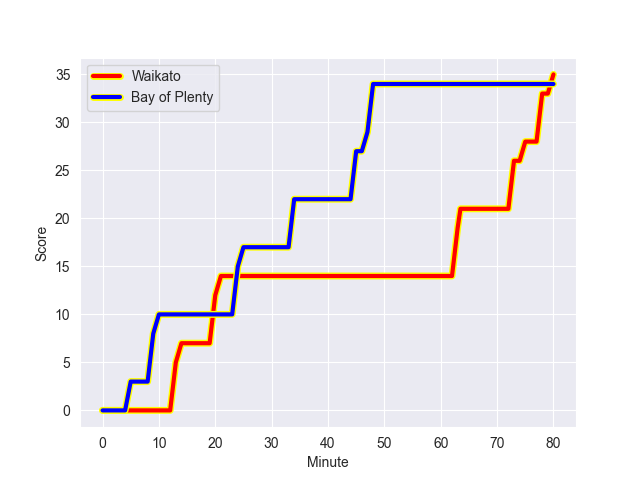
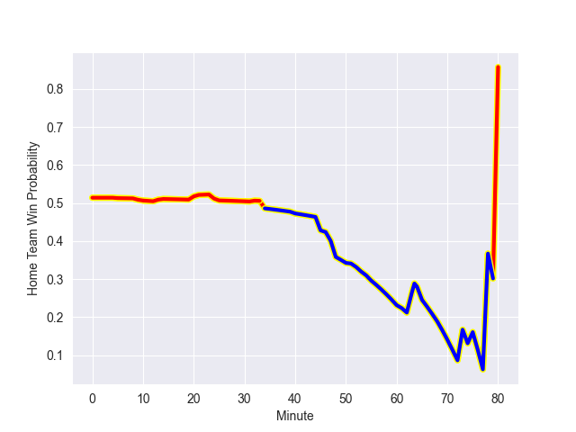

---  
layout: page  
title: Bay of Plenty at Waikato; 34.0-35.0  
date: 2022-10-01 23:35:00 18:00:00 -0500  
categories: match review  
---
# Prediction: Waikato by 5.8

Waikato by 0.8 on a neutral field
## Scores over Time

## Win Probability over Time

# Pre-Match Prediction: Waikato by 6.1

Waikato by 1.1 on a neutral pitch

|   Away Minutes | Away Player            |   Away elo |   Away Percentile |   Number |   Home Percentile |   Home elo | Home Player          |   Home Minutes |
|---------------:|:-----------------------|-----------:|------------------:|---------:|------------------:|-----------:|:---------------------|---------------:|
|             74 | Aidan Ross             |     110.02 |                91 |        1 |                53 |      85.83 | Ollie Norris         |             65 |
|             80 | Kurt Eklund            |     110.94 |                93 |        2 |                98 |     119.57 | Rhys Marshall        |             65 |
|             61 | Tevita Mafileo         |     102.27 |                80 |        3 |                80 |     101.83 | Sosefo Kautai        |             47 |
|             80 | Justin Sangster        |      79.94 |                24 |        4 |                78 |     100.87 | Hamilton Burr        |             80 |
|             80 | Manaaki Selby-Rickit   |      93.08 |                60 |        5 |                90 |     111.86 | Laghlan McWhannell   |             80 |
|             80 | Naitoa Ah Kuoi         |      87.1  |                56 |        6 |                29 |      81.43 | Samipeni Finau       |             51 |
|             80 | Jacob Norris           |      92.63 |                64 |        7 |                76 |      99.65 | Mitchell Jacobson    |             65 |
|             67 | Nikora Broughton       |      81.46 |                25 |        8 |                90 |     110.35 | Luke Jacobson        |             80 |
|             68 | Te Toiroa Tahuriorangi |     109.9  |                88 |        9 |                 5 |      76.32 | Xavier Roe           |             51 |
|             80 | Kaleb Trask            |      84.81 |                46 |       10 |                96 |     120.81 | Damian McKenzie      |             80 |
|             80 | Nigel Ah Wong          |     115.82 |                93 |       11 |                28 |      79.68 | Daniel Sinkinson     |             72 |
|             62 | Kaveinga Finau         |     104.86 |                81 |       12 |                68 |      99.16 | D'Angelo Leuila      |             53 |
|             80 | Joey Walton            |      86.07 |                46 |       13 |                59 |      93.96 | Bailyn Sullivan      |             80 |
|             61 | Leroy Carter           |      80.88 |                37 |       14 |                61 |      88.12 | Mosese Dawai         |             55 |
|             80 | Taylor Haugh           |      78.35 |                17 |       15 |                16 |      78.23 | Tepaea Cook-Savage   |             80 |
|              0 | Nic Souchon            |      82.01 |               nan |       16 |               nan |      80    | Anae Ah-Sue Pita     |             15 |
|             13 | Haereiti Hetet         |      88.1  |                55 |       17 |                27 |      79.54 | Rob Cobb             |             15 |
|             19 | Jeff Thwaites          |     102.67 |                81 |       18 |                28 |      78.97 | George Dyer          |             33 |
|              0 | Veveni Lasaqa          |      81.54 |                38 |       19 |                33 |      79.75 | Patrick McCurran     |             29 |
|              6 | Zane Kapeli            |      97.01 |                68 |       20 |                21 |      79.4  | Jack Lam             |             15 |
|             12 | Luke Donaldson         |      82.46 |                40 |       21 |                41 |      81.74 | Cortez Ratima        |             29 |
|             19 | Wharenui Hawera        |      90.67 |                56 |       22 |                35 |      80.17 | Tana Tuhakaraina     |             27 |
|             18 | Lalamilo Lalamilo      |      79.19 |                20 |       23 |                35 |      80.7  | Liam Coombes-Fabling |             33 |

