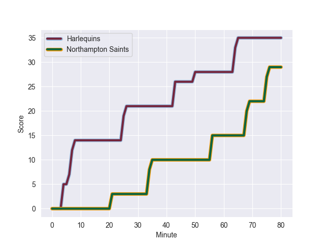
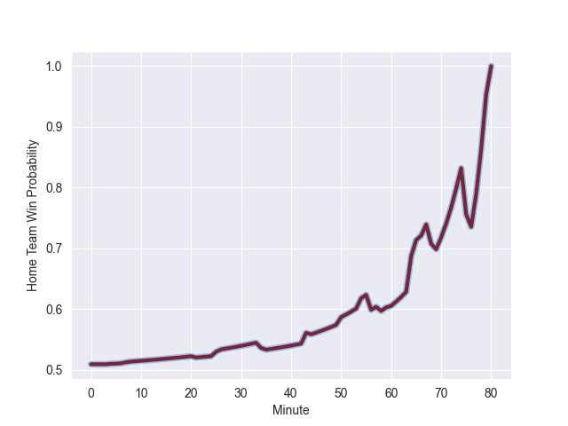

---  
layout: page  
title: Northampton Saints at Harlequins; 29.0-35.0  
date: 2022-10-02 10:00:00 18:00:00 -0500  
categories: match review  
---
# Prediction: Harlequins by 9.0

Harlequins by 4.0 on a neutral field
## Scores over Time

## Win Probability over Time

# Pre-Match Prediction: Harlequins by 9.6

Harlequins by 4.6 on a neutral pitch

|   Away Minutes | Away Player          |   Away elo |   Away Percentile |   Number |   Home Percentile |   Home elo | Home Player           |   Home Minutes |
|---------------:|:---------------------|-----------:|------------------:|---------:|------------------:|-----------:|:----------------------|---------------:|
|             80 | Emmanuel Iyogun      |      81.76 |                55 |        1 |                99 |     111.46 | Joe Marler            |             74 |
|             77 | Sam Matavesi         |      82.31 |                60 |        2 |                66 |      84.17 | Jack Musk             |             60 |
|             58 | Alfie Petch          |      73.82 |                11 |        3 |                97 |     106.13 | Wilco Louw            |             58 |
|             80 | Lukhan Salakaia-Loto |      84.8  |                67 |        4 |                80 |      88.15 | Dino Lamb             |             80 |
|             80 | Alex Coles           |      72.99 |                14 |        5 |                88 |      95.09 | Irne Herbst           |             65 |
|             44 | Angus Scott-Young    |      78.93 |                38 |        6 |                89 |      94.35 | Jack Kenningham       |             80 |
|             66 | Lewis Ludlam         |      97.48 |                91 |        7 |                32 |      78.19 | Will Evans            |             80 |
|             80 | Juarno Augustus      |      78.48 |                33 |        8 |                73 |      87.14 | Archie White          |             66 |
|             68 | Alex Mitchell        |      97.4  |                91 |        9 |                99 |     120.1  | Danny Care            |             66 |
|             80 | Dan Biggar           |     122.41 |                99 |       10 |                90 |     100.71 | Marcus Smith          |             80 |
|             54 | Tom Collins          |     110.03 |                98 |       11 |                65 |      83.31 | Cadan Murley          |             80 |
|             54 | Rory Hutchinson      |      96.36 |                89 |       12 |                61 |      84.25 | Lennox Anyanwu        |             80 |
|             80 | Fraser Dingwall      |      77.94 |                29 |       13 |                78 |      89.55 | Luke Northmore        |             60 |
|             80 | Tommy Freeman        |      88.01 |                77 |       14 |                90 |      97.12 | Joe Marchant          |             80 |
|             80 | George Furbank       |      99.01 |                92 |       15 |                51 |      81.61 | Tyrone Green          |             80 |
|              3 | Mike Haywood         |     108.67 |                98 |       16 |                62 |      82.81 | Sam Riley             |             20 |
|              0 | Oisin Heffernan      |      78.41 |               nan |       17 |                91 |      94.23 | Santiago Garcia Botta |              6 |
|             22 | Paul Hill            |      94.03 |                92 |       18 |                37 |      80.57 | Simon Kerrod          |             22 |
|             36 | Alex Moon            |     109.58 |                97 |       19 |                41 |      78.96 | George Hammond        |             15 |
|             14 | Sam Graham           |      76.27 |               nan |       20 |                72 |      85.3  | Matas Jurevicius      |             14 |
|             12 | Tom James            |      76.42 |                15 |       21 |                65 |      83.94 | Lewis Gjaltema        |             14 |
|             26 | Matt Proctor         |      76.91 |                23 |       22 |                81 |      90.61 | Tommaso Allan         |              0 |
|             26 | Ollie Sleightholme   |      90.05 |                81 |       23 |                75 |      87.09 | Nick David            |             20 |

