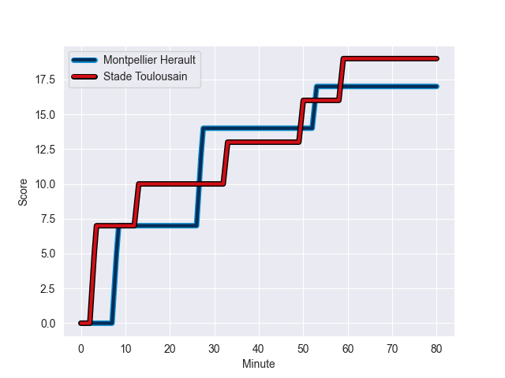
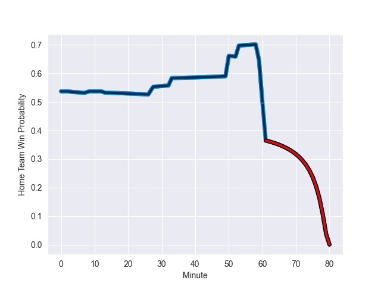

---  
layout: page  
title: Stade Toulousain at Montpellier Herault; 19-17  
date: 2022-10-02 21:05:00 18:00:00 -0500  
categories: match review  
---
# Prediction: Montpellier Herault by 11.6

Montpellier Herault by 6.6 on a neutral field
## Scores over Time

## Win Probability over Time

# Pre-Match Prediction: Montpellier Herault by 5.0

Montpellier Herault by 0.0 on a neutral pitch

|   Away Minutes | Away Player        |   Away elo |   Away Percentile |   Number |   Home Percentile |   Home elo | Home Player                 |   Home Minutes |
|---------------:|:-------------------|-----------:|------------------:|---------:|------------------:|-----------:|:----------------------------|---------------:|
|             46 | David Ainu'u       |      74.44 |                11 |        1 |                94 |      97.12 | Enzo Forletta               |             50 |
|             60 | Guillaume Marchand |      81.6  |                53 |        2 |                94 |     100.17 | Brandon Paenga-Amosa        |             76 |
|             33 | Charlie Faumuina   |     131.95 |               100 |        3 |                65 |      84.16 | Mohamed Haouas              |             50 |
|             80 | Joshua Brennan     |      78.71 |                40 |        4 |                90 |      96.15 | Florian Verhaeghe           |             80 |
|             33 | Thibaud Flament    |     104.75 |                96 |        5 |                84 |      90.93 | Masivesi Dakuwaqa           |             80 |
|             46 | Yannick Youyoutte  |      79.49 |                42 |        6 |                82 |      89.55 | Jacques du Plessis          |             50 |
|             60 | Rynhardt Elstadt   |      91.39 |                85 |        7 |                52 |      81.23 | Alexandre Becognee          |             76 |
|             80 | Selevasio Tolofua  |      88.7  |                77 |        8 |                79 |      89.74 | Zach Mercer                 |             80 |
|             80 | Arthur Retiere     |      76.72 |                22 |        9 |                84 |      92.06 | Léo Coly                    |             61 |
|             60 | Edgar Retiere      |      80    |               nan |       10 |                73 |      87.73 | Louis Carbonel              |             80 |
|             80 | Matthis Lebel      |      97.9  |                91 |       11 |                81 |      90.89 | Gabriel Ngandebe            |             80 |
|             80 | Matthis Lebel      |      97.9  |                91 |       11 |                84 |      90.89 | Gabriel Ngandebe            |             80 |
|             66 | George Tilsley     |      74.76 |                14 |       12 |                83 |      92.73 | Paolo Garbisi               |             80 |
|             80 | Dimitri Delibes    |      80.68 |                44 |       13 |                15 |      74.63 | Thomas Darmon               |             80 |
|             80 | Arthur Bonneval    |      75.91 |                18 |       14 |                81 |      90.89 | Gabriel Ngandebe            |             80 |
|             80 | Arthur Bonneval    |      75.91 |                18 |       14 |                84 |      90.89 | Gabriel Ngandebe            |             80 |
|             80 | Melvyn Jaminet     |      93.06 |                83 |       15 |                94 |     101.6  | Anthony Bouthier            |             80 |
|             47 | Emmanuel Meafou    |      86.28 |                71 |       16 |                45 |      80.65 | Titi Lamositele             |             30 |
|             47 | Dorian Aldegheri   |      97.01 |                93 |       17 |                86 |      94.98 | Nicolaas Janse van Rensburg |             30 |
|             34 | Pierre Bochaton    |      99.14 |                91 |       18 |                73 |      85.45 | Simon-Pierre Chauvac        |             30 |
|             34 | Maxime Duprat      |      80.43 |                42 |       19 |                83 |      90.96 | Gela Aprasidze              |             19 |
|             20 | Thomas Ramos       |     103.29 |                92 |       20 |                61 |      81.87 | Vincent Giudicelli          |              4 |
|             20 | Theo Ntamack       |      80.85 |               nan |       21 |                66 |      84.73 | Marco Tauleigne             |              4 |
|             20 | Guillaume Cramont  |      78.49 |                43 |       22 |                 0 |       2.14 | Solomone Kata               |             80 |
|             14 | Martin Page-Relo   |      80.71 |                49 |       23 |                 0 |       2.14 | Solomone Kata               |             80 |

