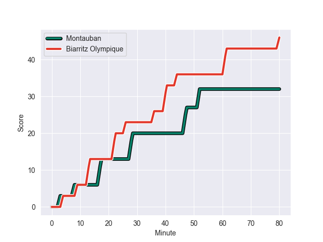
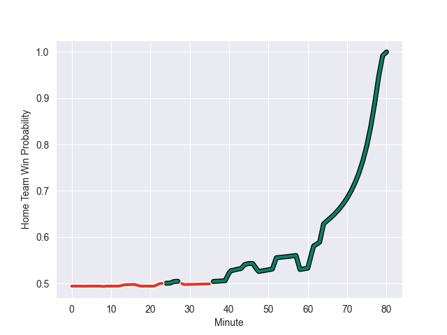

---  
layout: page  
title: Biarritz Olympique at Montauban; 46-32  
date: 2022-10-06 21:00:00 18:00:00 -0500  
categories: match review  
---
# Prediction: Montauban by 4.1

Biarritz Olympique by 0.9 on a neutral field
## Scores over Time

## Win Probability over Time

# Pre-Match Prediction: Biarritz Olympique by 6.3

Montauban by 1.3 on a neutral pitch

|   Away Minutes | Away Player         |   Away elo |   Away Percentile |   Number |   Home Percentile |   Home elo | Home Player        |   Home Minutes |
|---------------:|:--------------------|-----------:|------------------:|---------:|------------------:|-----------:|:-------------------|---------------:|
|             48 | Guy Millar          |      87.43 |                80 |        1 |                88 |      91.92 | Nicolas Agnesi     |             52 |
|             48 | Thomas Sauveterre   |      81.08 |                53 |        2 |                 9 |      73.61 | Arnaud Feltrin     |             42 |
|             48 | Luka Tchelidze      |      76.59 |                18 |        3 |                21 |      76.74 | Victor Laval       |             42 |
|             80 | Johnny Dyer         |      58.82 |                 0 |        4 |                 3 |      65.82 | Dimitri Vaotoa     |             80 |
|             58 | Josh Tyrell         |      83.13 |                61 |        5 |                80 |      89.39 | Alexandre Manukula |             48 |
|             80 | Charlie Francoz     |      79.28 |                41 |        6 |                46 |      80.12 | Stéphane Munoz     |             64 |
|             48 | Elliot Dixon        |      66.11 |                 2 |        7 |                39 |      78.97 | Tjuee Uanivi       |             80 |
|             80 | Mathieu Hirigoyen   |      82.16 |                53 |        8 |                23 |      76.95 | Frédéric Quercy    |             80 |
|             61 | Kerman Aurrekoetxea |      71.21 |                 5 |        9 |                90 |      97.19 | Shaun Venter       |             40 |
|             80 | Baptiste Germain    |      75.54 |                16 |       10 |                85 |      93.51 | Jérôme Bosviel     |             80 |
|             80 | Steeve Barry        |      84.86 |                69 |       11 |                55 |      81.65 | Bastien Guillemin  |             65 |
|             80 | Auguste Cadot       |      82.6  |                55 |       12 |                74 |      87.62 | Taleta Tupuola     |             80 |
|             46 | Tyler Morgan        |      91.83 |                82 |       13 |                75 |      87.89 | Maxime Mathy       |             80 |
|             80 | Henry Speight       |     114.05 |                99 |       14 |                88 |      95.26 | Josua Vici         |             80 |
|             80 | Joe Jonas           |      80.93 |                47 |       15 |                 4 |      68.35 | Segundo Tuculet    |             80 |
|             32 | Baptiste Erdocio    |      80.87 |                49 |       16 |                 2 |      68.03 | Lucas Seyrolle     |             28 |
|             32 | Bastien Soury       |      86.1  |                72 |       17 |                10 |      73.04 | Kevin Firmin       |             38 |
|             32 | Lasha Tabidze       |      81.73 |                46 |       18 |                 7 |      72.9  | Mirian Burduli     |             38 |
|             22 | Johan Aliouat       |      87.88 |                75 |       19 |                 3 |      65.83 | Epeli Momo         |             32 |
|             32 | Simon Augry         |      80.32 |                42 |       20 |                24 |      76.38 | Louis Vincent      |             16 |
|             19 | Barnabe Couilloud   |      81.06 |                52 |       21 |               nan |      66.62 | Anthony Meric      |             40 |
|             34 | Baptiste Fariscot   |      81.69 |                55 |       22 |                92 |     100.99 | Semesa Rokoduguni  |             15 |

