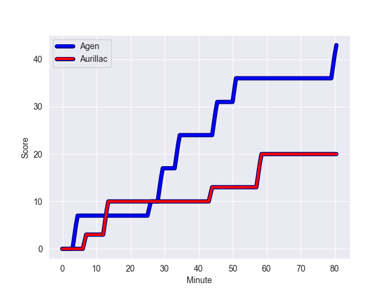
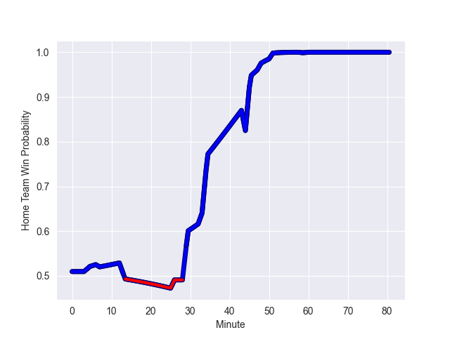

---  
layout: page  
title: Aurillac at Agen; 20-43  
date: 2022-10-07 19:30:00 18:00:00 -0500  
categories: match review  
---
# Prediction: Agen by 6.7

Agen by 1.7 on a neutral field
## Scores over Time

## Win Probability over Time

# Pre-Match Prediction: Agen by 5.9

Agen by 0.9 on a neutral pitch

|   Away Minutes | Away Player           |   Away elo |   Away Percentile |   Number |   Home Percentile |   Home elo | Home Player          |   Home Minutes |
|---------------:|:----------------------|-----------:|------------------:|---------:|------------------:|-----------:|:---------------------|---------------:|
|             48 | Alexandre Plantier    |      87.04 |                79 |        1 |                22 |      76.79 | Hans Lombard-Buret   |             51 |
|             64 | Luka Nioradze         |      89.71 |                82 |        2 |                17 |      75.08 | Loris Zarantonello   |             51 |
|             33 | Giorgi Kartvelishvili |      87    |                78 |        3 |                47 |      80.58 | Malik Hamadache      |             33 |
|             48 | Eoghan Masterson      |      90.67 |                83 |        4 |                38 |      79    | Joe Maksymiw         |             60 |
|             60 | Jean-Baptiste Singer  |      70.98 |                 9 |        5 |                74 |      87.39 | Zak Farrance         |             80 |
|             80 | Beka Shvangiradze     |      80.77 |                50 |        6 |                79 |      87.28 | Arnaud Duputs        |             60 |
|             80 | Maxime Profit         |      81.39 |                48 |        7 |                56 |      81.6  | Camille Gerondeau    |             80 |
|             60 | Latuka Maituku        |      69.58 |                 8 |        8 |                65 |      84.6  | Fotu Lokotui         |             80 |
|             65 | Mikheil Alania        |      74.44 |                13 |        9 |                 2 |      66.73 | Tane Takulua         |             57 |
|             80 | Antoine Aucagne       |      77.16 |                21 |       10 |                 3 |      68.47 | Raphael Lagarde      |             51 |
|             80 | AJ Coertzen           |      86.33 |                73 |       11 |                96 |     105.7  | Timilai Rokoduru     |             64 |
|             80 | Lucas Vaccaro         |      75.81 |                18 |       12 |                68 |      86.09 | Kolinio Ramoka       |             80 |
|             80 | Elijah Niko           |      75.85 |                18 |       13 |                33 |      78.49 | Pita Ahki            |             80 |
|             26 | Simeli Yabaki         |      76.5  |                21 |       14 |                 0 |      55.06 | Loris Tolot          |             80 |
|             80 | Anderson Neisen       |      70.52 |                 6 |       15 |                61 |      84.36 | Jean-Marcelin Buttin |             80 |
|             54 | Marc Palmier          |      83.24 |                63 |       16 |                19 |      75.56 | Walter Desmaison     |             47 |
|             47 | Tim Daniel-Meissen    |      74.99 |                 8 |       17 |                85 |      90.58 | Clement Martinez     |             29 |
|             32 | Jean-Jacques Gymael   |      80.9  |                49 |       18 |                79 |      89.78 | Thomas Vincent       |             29 |
|             32 | Robert Rodgers        |      78.41 |               nan |       19 |                 2 |      66.23 | Florent Guion        |             29 |
|             20 | Dylan Cretin          |      88.36 |                77 |       20 |                26 |      77.9  | Dorian Bellot        |             23 |
|             20 | Georgi Javakhia       |      80.96 |                49 |       21 |                74 |      85.56 | Antoine Erbani       |             20 |
|             16 | Theo Lachaud          |      73.39 |                12 |       22 |                78 |      88.79 | William Demotte      |             20 |
|             15 | Hugo Bouyssou         |      68.54 |                 3 |       23 |                28 |      77.85 | Christian Lacombe    |             16 |

