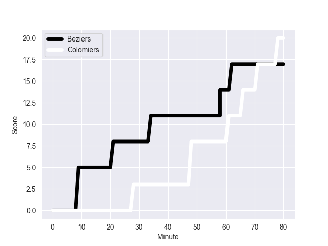
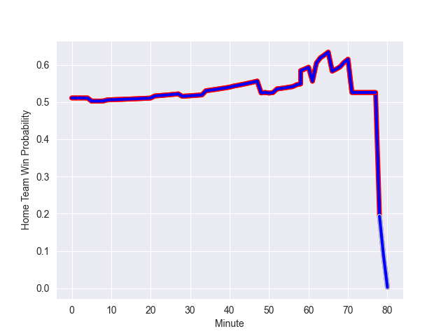

---  
layout: page  
title: Colomiers at Beziers; 20-17  
date: 2022-10-07 19:00:00 18:00:00 -0500  
categories: match review  
---
# Prediction: Beziers by 3.1

Colomiers by 1.9 on a neutral field
## Scores over Time

## Win Probability over Time

# Pre-Match Prediction: Colomiers by 2.6

Colomiers by 2.4 on a neutral pitch

|   Away Minutes | Away Player           |   Away elo |   Away Percentile |   Number |   Home Percentile |   Home elo | Home Player           |   Home Minutes |
|---------------:|:----------------------|-----------:|------------------:|---------:|------------------:|-----------:|:----------------------|---------------:|
|             50 | Hugo Djehi            |      80.95 |                50 |        1 |                35 |      77.73 | Giorgi Akhaladze      |             52 |
|             50 | Thomas Larrieu        |      83.59 |                67 |        2 |                11 |      72.69 | Clément Esteriola     |             80 |
|             41 | Marco Fepulea'i       |      81.64 |                54 |        3 |                17 |      75.51 | Jamie Hagan           |             52 |
|             80 | Jean Thomas           |      72.88 |                14 |        4 |                43 |      79.31 | Clément Bitz          |             80 |
|             50 | Alexandre Ricard      |      77.58 |                31 |        5 |                71 |      86.42 | Pierre Gayraud        |             50 |
|             80 | Pierre-Samuel Pacheco |      75.53 |                18 |        6 |                22 |      75.76 | Jean-Baptiste Barrère |             80 |
|             80 | Waël Ponpon           |      71.9  |                 9 |        7 |                60 |      82.25 | Pierrick Gunther      |              5 |
|             50 | Aldric Lescure        |      87.99 |                80 |        8 |                42 |      79.4  | Thomas Hoarau         |             80 |
|             57 | Edoardo Gori          |      78.54 |                33 |        9 |                53 |      80.21 | Jean Victor Goillot   |             52 |
|             80 | Romuald Séguy         |      71.47 |                 8 |       10 |                29 |      78.15 | Romain Uruty          |             80 |
|             57 | Alexis Palisson       |      85.58 |                70 |       11 |                64 |      83.11 | Raffaele Costa Storti |             80 |
|             80 | Johan Deysel (Jnr)    |      90.66 |                80 |       12 |                72 |      85.46 | Jarrod Poi            |             63 |
|             80 | Fabien Perrin         |      95.02 |                86 |       13 |                39 |      79.49 | Paul Recor            |             80 |
|             80 | Valentin Saurs        |      69.75 |                 5 |       14 |                23 |      77.27 | Pierre Courtaud       |             69 |
|              8 | Max Auriac            |      77.02 |                29 |       15 |                55 |      82.8  | Gabin Lorre           |             80 |
|             72 | Peni Rokoduguni       |      77.77 |                28 |       16 |                 0 |      59.97 | Éloi Massot           |             75 |
|             39 | Robin Bellemand       |      80.33 |               nan |       17 |                44 |      79.5  | John Madigan          |             30 |
|             30 | Jorick Dastugue       |      85.97 |                75 |       18 |                94 |     102.03 | Josh Valentine        |             28 |
|             30 | Angus Wagner          |      78.96 |                38 |       19 |                75 |      84    | Jon Zabala Arrieta    |             28 |
|             30 | Guillaume Tartas      |      85.74 |                75 |       20 |                28 |      77.77 | Francisco Fernandes   |             28 |
|             30 | Maxime Granouillet    |      71.63 |                11 |       21 |                92 |      99.39 | Watisoni Votu         |             17 |
|             23 | Ugo Seguela           |      85.89 |                72 |       22 |                23 |      76.46 | Victor Dreuille       |             11 |
|             23 | Michele Campagnaro    |      94.62 |                86 |       23 |                 0 |      -2.47 | Solomone Kata         |             80 |

