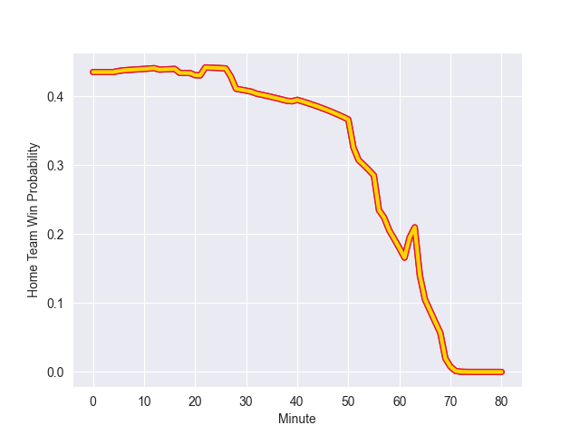

---  
layout: page  
title: Exeter Chiefs at Bristol Rugby; 50.0-14.0  
date: 2022-10-07 14:45:00 18:00:00 -0500  
categories: match review  
---
# Prediction: Exeter Chiefs by 8.0

Exeter Chiefs by 13.0 on a neutral field
## Scores over Time

## Win Probability over Time

# Pre-Match Prediction: Exeter Chiefs by 7.4

Exeter Chiefs by 12.4 on a neutral pitch

|   Away Minutes | Away Player          |   Away elo |   Away Percentile |   Number |   Home Percentile |   Home elo | Home Player     |   Home Minutes |
|---------------:|:---------------------|-----------:|------------------:|---------:|------------------:|-----------:|:----------------|---------------:|
|             58 | Alec Hepburn         |      85.42 |                74 |        1 |                95 |      98.83 | Ellis Genge     |             71 |
|             52 | Jack Yeandle         |     100.05 |                96 |        2 |                17 |      75.59 | Will Capon      |             63 |
|             58 | Harry Williams       |     103.53 |                96 |        3 |                93 |      95.89 | Kyle Sinckler   |             58 |
|             52 | Jannes Kirsten       |      85.85 |                75 |        4 |                47 |      78.7  | John Hawkins    |             58 |
|             80 | Jonny Gray           |      86.87 |                73 |        5 |                78 |      89.09 | Joe Joyce       |             80 |
|             62 | Jacques Vermeulen    |      92.43 |                86 |        6 |                68 |      83.67 | Chris Vui       |             80 |
|             80 | Christ Tshiunza      |      77.46 |                27 |        7 |                12 |      73.78 | Jake Heenan     |             41 |
|             80 | Richard Capstick     |      76.48 |                25 |        8 |                17 |      74.09 | Magnus Bradbury |             80 |
|             58 | Jack Maunder         |      89.17 |                71 |        9 |                77 |      86.87 | Harry Randall   |             51 |
|             71 | Joe Simmonds         |     103.34 |                96 |       10 |                76 |      87.64 | Callum Sheedy   |             58 |
|             80 | Olly Woodburn        |     103.46 |                94 |       11 |                43 |      79.9  | Richard Lane    |             80 |
|             80 | Rory O'Loughlin      |      93.86 |                87 |       12 |                68 |      85.04 | Sam Bedlow      |             80 |
|             80 | Henry Slade          |     103.55 |                94 |       13 |                 4 |      68.26 | Piers O'Conor   |             80 |
|             80 | Jack Nowell          |     113.29 |                98 |       14 |                 9 |      72.32 | Toby Fricker    |             74 |
|             52 | Stuart Hogg          |      91.38 |                78 |       15 |                92 |      99.1  | Charles Piutau  |             71 |
|             28 | Luke Cowan-Dickie    |      84.63 |                71 |       16 |                13 |      74.26 | Jake Kerr       |             17 |
|             22 | Josh Iosefa-Scott    |      85.52 |                69 |       17 |                62 |      82.64 | Jake Woolmore   |             15 |
|             22 | Patrick Schickerling |      84.83 |                68 |       18 |                81 |      87    | Max Lahiff      |             22 |
|             28 | Ruben van Heerden    |      88.56 |                78 |       19 |                41 |      78.85 | Ed Holmes       |             22 |
|             18 | Dave Ewers           |     112.67 |                99 |       20 |                84 |      89.61 | Daniel Thomas   |             39 |
|             22 | Sam Maunder          |      71.3  |                 8 |       21 |                60 |      82.92 | Tom Whiteley    |             29 |
|             28 | Harvey Skinner       |      78.79 |                34 |       22 |               nan |      94.89 | AJ MacGinty     |             22 |
|              9 | Solomone Kata        |      -2.72 |                 0 |       23 |                 9 |      72.34 | Jack Bates      |              9 |

