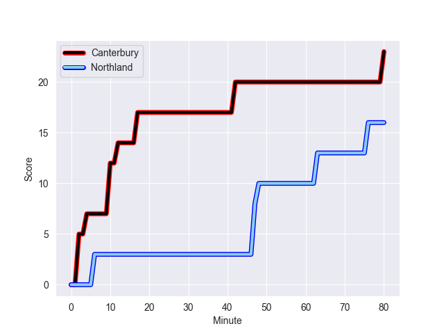
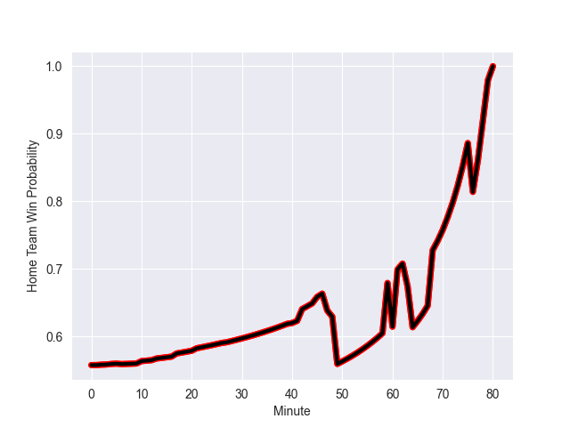

---  
layout: page  
title: Northland at Canterbury; 16.0-23.0  
date: 2022-10-07 23:35:00 18:00:00 -0500  
categories: match review  
---
# Northland (1254.68) at Canterbury (1355.38); 16.0-23.0

# Prediction: Canterbury by 15.1

Canterbury by 10.1 on a neutral field
## Scores over Time

## Win Probability over Time

# Pre-Match Prediction: Canterbury by 17.8

Canterbury by 12.8 on a neutral pitch

|   Away Minutes | Away Player           |   Away elo |   Away Percentile |   Number |   Home Percentile |   Home elo | Home Player        |   Home Minutes |
|---------------:|:----------------------|-----------:|------------------:|---------:|------------------:|-----------:|:-------------------|---------------:|
|             45 | Jarred Adams          |      87.52 |                80 |        1 |                64 |      83.09 | Tamaiti Williams   |             64 |
|             52 | Bruce Kauika-Petersen |      73.7  |                12 |        2 |                88 |      92.39 | Brodie McAlister   |             59 |
|             80 | Ofa Tu'ungafasi       |     107.27 |                97 |        3 |                92 |      94.62 | Oli Jager          |             60 |
|             80 | Josh Goodhue          |      78.25 |                33 |        4 |                54 |      82.38 | Sam Darry          |             21 |
|             80 | Sam Caird             |      61.84 |                 1 |        5 |                69 |      85.49 | Zach Gallagher     |             80 |
|             80 | Rob Rush              |      77.82 |                29 |        6 |                85 |      91.33 | Dom Gardiner       |             80 |
|             59 | Jonah Mau'u           |      80.71 |                50 |        7 |                93 |     100.63 | Tom Christie       |             80 |
|             80 | Matt Polwart-Matich   |      85.78 |                69 |        8 |                72 |      86.82 | Billy Harmon       |             80 |
|             61 | Sam Nock              |      84.61 |                67 |        9 |                39 |      79.66 | Mitchell Drummond  |             49 |
|             60 | Rivez Reihana         |      76.51 |                20 |       10 |                64 |      83.64 | Fergus Burke       |             80 |
|             80 | Heremaia Murray       |      79.21 |                40 |       11 |                98 |     111.18 | George Bridge      |             80 |
|             27 | Blake Hohaia          |      78.13 |                30 |       12 |                50 |      81.78 | Rameka Poihipi     |             80 |
|             80 | Tamati Tua            |      85.88 |                67 |       13 |                70 |      86.47 | Braydon Ennor      |             27 |
|             80 | Jone Macilai-Tori     |      84.21 |                67 |       14 |                86 |      92.71 | Manasa Mataele     |             59 |
|             80 | Joshua Moorby         |      83.84 |                59 |       15 |                88 |      96.4  | Chay Fihaki        |             80 |
|             28 | Ross Wright           |      77.43 |                26 |       16 |                56 |      82.41 | George Bell        |             21 |
|             26 | Coree Te Whata-Colley |      75.45 |                16 |       17 |                82 |      89.12 | Finlay Brewis      |             16 |
|              9 | Sila Puafisi          |      75.82 |                18 |       18 |                89 |      92.61 | Owen Franks        |             20 |
|             35 | Allan Craig           |      81.48 |                51 |       19 |                78 |      87.31 | Corey Kellow       |             59 |
|             21 | Sam McNamara          |      81.61 |                49 |       20 |                52 |      81.89 | Liam Allen         |              0 |
|             19 | Lisati Milo-Harris    |      73.71 |                11 |       21 |                93 |     100.42 | Willi Heinz        |             31 |
|             20 | Daniel Hawkins        |      66.03 |                 1 |       22 |                76 |      88.96 | Dallas McLeod      |             53 |
|             53 | Rene Ranger           |      82.16 |                50 |       23 |                13 |      75.02 | Ngatungane Punivai |             21 |

