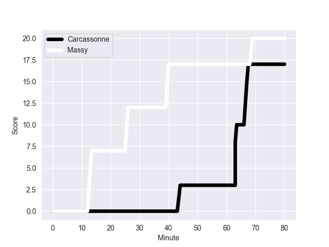

---  
layout: page  
title: Massy at Carcassonne; 20-17  
date: 2022-10-07 19:30:00 18:00:00 -0500  
categories: match review  
---
# Massy (1187.53) at Carcassonne (1201.9); 20-17

# Prediction: Carcassonne by 6.4

Carcassonne by 1.4 on a neutral field
## Scores over Time

## Win Probability over Time

# Pre-Match Prediction: Carcassonne by 7.9

Carcassonne by 2.9 on a neutral pitch

|   Away Minutes | Away Player           |   Away elo |   Away Percentile |   Number |   Home Percentile |   Home elo | Home Player              |   Home Minutes |
|---------------:|:----------------------|-----------:|------------------:|---------:|------------------:|-----------:|:-------------------------|---------------:|
|             50 | Fernandez Correa      |      67.39 |                 3 |        1 |                18 |      75.33 | Jules Martinez           |             45 |
|             59 | Randy Grelleaud       |      80    |               nan |        2 |                25 |      77.53 | Raphael Carbou           |             63 |
|             48 | Nicolas Ferrer        |      78.26 |                32 |        3 |                19 |      76.2  | Soso Bekoshvili          |             40 |
|             80 | Marco Fuser           |      91.1  |                84 |        4 |                28 |      76.99 | Romain Manchia           |             74 |
|             47 | Dion Evrard Oulai     |      63.49 |                 2 |        5 |                62 |      83.28 | Rynard Ligtoring Landman |             50 |
|             80 | Jean Maurice Decubber |      77.54 |                27 |        6 |                95 |     105.5  | Rob Harley               |             80 |
|             80 | Alexandre Loubiere    |      81.56 |                56 |        7 |                30 |      78.07 | Tim Agaba                |             80 |
|             26 | Yohann Gbizie         |      78.28 |                33 |        8 |                55 |      82.44 | Etienne Herjean          |             50 |
|             58 | Gaetan Pichon         |      83.25 |                60 |        9 |                67 |      84.61 | Samuel Marques           |             49 |
|             80 | Massimo Ortolan       |      78.64 |                33 |       10 |                22 |      76.81 | Baptiste Mouchous        |             80 |
|             80 | Nathan Farissier      |      80.91 |                50 |       11 |                 6 |      70.02 | Maxime Marty             |             80 |
|             47 | JJ Taulagi            |      77.81 |                27 |       12 |                63 |      84.81 | Pierre Aguillon          |             36 |
|             80 | Victorien Jacomme     |      76.09 |                19 |       13 |                12 |      73.47 | Nick Grigg               |             80 |
|             58 | Yanis Dit Robaglia    |      78.23 |                31 |       14 |                85 |      94.01 | Martin Dulon             |             80 |
|             80 | Juan Kotze            |      84.83 |                63 |       15 |                17 |      75.63 | Clément Clavières        |             80 |
|             54 | Thibaud Lanen         |      81.12 |                50 |       16 |                41 |      79.17 | Damien Añon              |             44 |
|             33 | Abongile Nonkontwana  |      74.59 |               nan |       17 |                 1 |      61.1  | Vakhtangi Akhobadze      |             40 |
|             33 | Mathieu Guillomot     |      73.03 |                10 |       18 |                 8 |      72.48 | Youssef Amrouni          |             35 |
|             32 | Guiterembi Vickos     |      79.32 |                40 |       19 |                80 |      88.74 | Pierre Pages             |             31 |
|             30 | Tijde Visser          |      80.38 |               nan |       20 |                26 |      77.48 | Aaron Carroll            |             30 |
|             22 | Martin Carré          |      77.63 |                29 |       21 |                56 |      80.69 | Gregory Annetta          |             30 |
|             22 | Benjamin Prier        |      86.74 |                75 |       22 |                40 |      78.88 | Connor Sa                |             17 |
|             21 | Jayson Rodrigues      |      78.26 |                32 |       23 |                27 |      77.56 | Simon Meka               |              6 |

