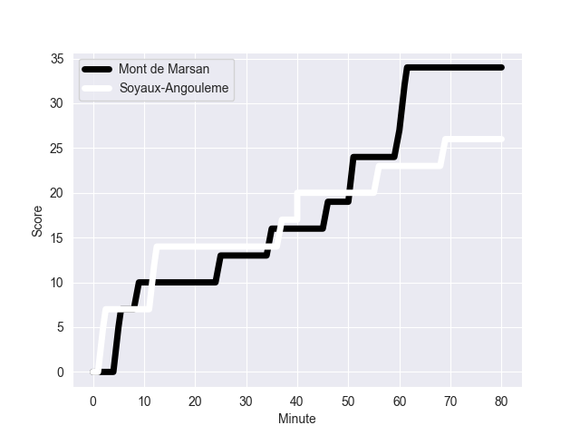

---  
layout: page  
title: Soyaux-Angouleme at Mont de Marsan; 26-34  
date: 2022-10-07 19:30:00 18:00:00 -0500  
categories: match review  
---
# Soyaux-Angouleme (1165.03) at Mont de Marsan (1288.25); 26-34

# Prediction: Mont de Marsan by 17.3

Mont de Marsan by 12.3 on a neutral field
## Scores over Time

## Win Probability over Time

# Pre-Match Prediction: Mont de Marsan by 16.4

Mont de Marsan by 11.4 on a neutral pitch

|   Away Minutes | Away Player          |   Away elo |   Away Percentile |   Number |   Home Percentile |   Home elo | Home Player           |   Home Minutes |
|---------------:|:---------------------|-----------:|------------------:|---------:|------------------:|-----------:|:----------------------|---------------:|
|             27 | Khatchik Vartanov    |      81.32 |                45 |        1 |                46 |      80.5  | Jean-Luc Innocente    |             60 |
|             47 | Patxi Bidart         |      77.96 |                26 |        2 |                 1 |      67.62 | Simon Labouyrie       |             40 |
|             47 | Seydou Diakité       |      80.68 |                53 |        3 |                77 |      86.31 | Lasha Macharashvili   |             40 |
|             25 | Sikeli Nabou         |      86.05 |                71 |        4 |                27 |      76.84 | Aston Fortuin         |             80 |
|             80 | Janse Roux           |      75.98 |                22 |        5 |                62 |      83.32 | Romana Graham         |             80 |
|             80 | Robin Copeland       |      75.45 |                21 |        6 |                81 |      88.67 | Aurélien Lisena       |             40 |
|             80 | Germain Burgaud      |      81.17 |                52 |        7 |                93 |      99.74 | Nicolas Garrault      |             80 |
|             52 | Yassine Jarmouni     |      70.64 |                 8 |        8 |                67 |      85.18 | Mike Faleafa          |             70 |
|             45 | Lucas Rubio          |      74.54 |               nan |        9 |                 2 |      68.07 | Christophe Loustalot  |             76 |
|             80 | Jacob Botica         |      83.31 |                63 |       10 |                90 |      99.88 | Willie du Plessis     |             72 |
|             80 | Marvin Lestremau     |      63.46 |                 1 |       11 |                44 |      79.9  | Simao Broeiro Bento   |             80 |
|             80 | Mathis Lafon         |      81.54 |                51 |       12 |                76 |      88.39 | Jules Even            |             80 |
|             56 | Ledua Mau            |      76.3  |                19 |       13 |                90 |      97.82 | Jeronimo de la Fuente |             50 |
|             80 | Kamilieni Raivono    |      84.12 |                67 |       14 |                20 |      76.31 | Alexandre de Nardi    |             80 |
|             52 | Rémi Brosset         |      77.11 |                24 |       15 |                98 |     108.91 | Yoann Laousse Azpiazu |             80 |
|             55 | Matt Beukeboom       |      75.7  |                19 |       16 |                80 |      86.59 | Romain Laterrade      |             40 |
|             53 | Omar Odishvili       |      83.04 |                64 |       17 |                63 |      81.63 | Gheorge Gajion        |             40 |
|             35 | Manu Saubusse        |      80.59 |                48 |       18 |                54 |      81.36 | Léo Banos             |             40 |
|             33 | Omar Dahir           |      71.29 |                 6 |       19 |                87 |      93.78 | Ambrose Curtis        |             30 |
|             33 | Rayne Barka          |      79.8  |                46 |       20 |                75 |      85.72 | Thomas Bultel         |             20 |
|             28 | Nicolas Martins      |      79.55 |               nan |       21 |                20 |      75.34 | Thibault Tauleigne    |             10 |
|             28 | Pierre Lafitte       |      69.74 |                 5 |       22 |                56 |      80.99 | Joris Pialot          |              8 |
|             24 | Inaki Ayarza Saporta |      80.59 |                44 |       23 |                51 |      80.99 | Martin Doan           |              4 |

