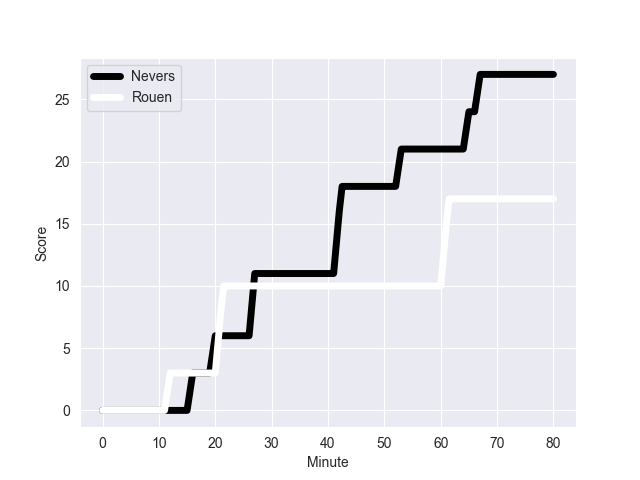
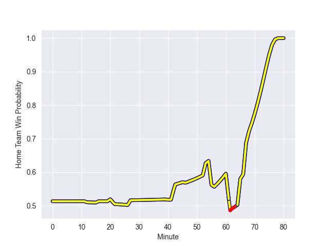

---  
layout: page  
title: Rouen at Nevers; 17-27  
date: 2022-10-07 19:30:00 18:00:00 -0500  
categories: match review  
---
# Prediction: Nevers by 1.1

Rouen by 3.9 on a neutral field
## Scores over Time

## Win Probability over Time

# Pre-Match Prediction: Rouen by 3.2

Rouen by 8.2 on a neutral pitch

|   Away Minutes | Away Player           |   Away elo |   Away Percentile |   Number |   Home Percentile |   Home elo | Home Player        |   Home Minutes |
|---------------:|:----------------------|-----------:|------------------:|---------:|------------------:|-----------:|:-------------------|---------------:|
|             46 | Antoine Fournier      |     101.37 |                79 |        1 |                52 |      85.97 | Aitor Kitutu       |             56 |
|             46 | Cameron Orr           |      91.85 |                60 |        2 |                49 |      88.59 | Issam Hamel        |             56 |
|             40 | Mohamed Boughanmi     |      98.44 |                72 |        3 |                10 |      77.29 | Aselo Ikahehegi    |             46 |
|             80 | John-Charles Astle    |      80.02 |                24 |        4 |                29 |      80.77 | Maxence Barjaud    |             46 |
|             46 | Shay Kerry            |      99.57 |                72 |        5 |                15 |      78.31 | Lado Chachanidze   |             80 |
|             62 | Lucas Costa           |      81.98 |                44 |        6 |                 4 |      73.93 | Luka Plataret      |             55 |
|             80 | Fabien Vincent        |      85.39 |                54 |        7 |                91 |     113    | Hugues Bastide     |             80 |
|             80 | Valentino Mapapalangi |     101.64 |                75 |        8 |                85 |     107.24 | Shaun Adendorff    |             80 |
|             46 | Florent Campeggia     |      99.79 |                71 |        9 |                26 |      79.66 | Guillaume Manevy   |             80 |
|             68 | Thibault Olender      |      82.06 |                39 |       10 |                52 |      87.53 | Shaun Reynolds     |             68 |
|             80 | Malcolm Bertschy      |      79.79 |                29 |       11 |                33 |      80.42 | Christian Erasmus  |             80 |
|             80 | JT Jackson            |      99.48 |                69 |       12 |                58 |      93.8  | Rudy Derrieux      |             80 |
|             52 | Taylor Gontineac      |      84.25 |                41 |       13 |                 1 |      70.43 | Alifereti Loaloa   |             80 |
|             80 | Paul Surano           |      93.74 |                67 |       14 |                80 |     101.92 | Lucas Blanc        |             80 |
|             80 | Peter Lydon           |      99.86 |                72 |       15 |                52 |      88.48 | Benjamin Dumas     |             55 |
|             40 | Cody Thomas           |      79.31 |                27 |       16 |                23 |      79.37 | Cleopas Kundiona   |             34 |
|             34 | Soulemane Camara      |      81.17 |                36 |       17 |                46 |      85.62 | Lasha Jaiani       |             34 |
|             34 | Joris Lezat           |      76.74 |                 9 |       18 |                96 |     118.34 | Jason-Colin Fraser |             25 |
|             34 | Mathieu Bonnot        |     108.03 |                90 |       19 |                16 |      78.14 | Thomas Zenon       |             25 |
|             34 | Jean Leleu            |      91.14 |                56 |       20 |                 6 |      75.53 | Quentin Beaudaux   |             24 |
|             28 | Alex Luatua           |      93.54 |                59 |       21 |                 8 |      76.95 | Tomike Mataradze   |             24 |
|             18 | Willy N'Diaye         |      82.42 |                45 |       22 |                64 |      93.1  | Yohan Le Bourhis   |             12 |
|             12 | Marius Marty          |      77.61 |                12 |       23 |                 0 |       3.13 | Solomone Kata      |             80 |

