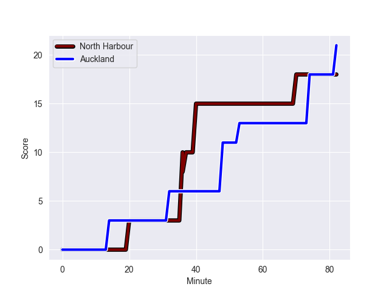
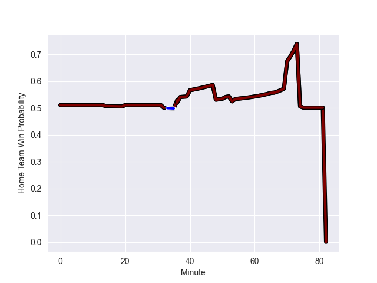

---  
layout: page  
title: Auckland at North Harbour; 21.0-18.0  
date: 2022-10-07 02:05:00 18:00:00 -0500  
categories: match review  
---
# Prediction: North Harbour by 2.5

Auckland by 2.5 on a neutral field
## Scores over Time

## Win Probability over Time

# Pre-Match Prediction: Auckland by 5.1

North Harbour by 0.1 on a neutral pitch

|   Away Minutes | Away Player         |   Away elo |   Away Percentile |   Number |   Home Percentile |   Home elo | Home Player       |   Home Minutes |
|---------------:|:--------------------|-----------:|------------------:|---------:|------------------:|-----------:|:------------------|---------------:|
|             54 | Alex Hodgman        |     103.67 |                82 |        1 |                41 |      82.65 | Tevita Langi      |             72 |
|             54 | Soane Vikena        |      78.46 |                15 |        2 |                83 |     103.97 | Ray Niuia         |             51 |
|             37 | Angus Ta'avao       |     119.25 |                97 |        3 |                85 |     105.06 | Nic Mayhew        |             70 |
|             82 | Patrick Tuipulotu   |     109.75 |               nan |        4 |                60 |      93.06 | Isoa Nasilasila   |             82 |
|             82 | Hamish Dalzell      |     102.56 |                77 |        5 |                27 |      80.39 | Felix Kalapu      |             51 |
|             82 | Akira Ioane         |     112.08 |                90 |        6 |                56 |      86.81 | Tamarau McGahan   |             82 |
|             82 | Blake Gibson        |     101.8  |                80 |        7 |                52 |      85.53 | Jed Melvin        |             65 |
|             66 | Jackson Pugh        |      78.58 |                13 |        8 |                89 |     110.52 | Cameron Suafoa    |             82 |
|             82 | Taufa Funaki        |      73.06 |                 1 |        9 |                47 |      84.76 | Jamie Booth       |             82 |
|             82 | Simon Hickey        |     107.6  |                83 |       10 |                78 |     103.71 | Bryn Gatland      |             40 |
|             82 | Tomas Aoake         |      97.44 |                73 |       11 |                99 |     127.25 | Tevita Li         |             48 |
|             82 | Harry Plummer       |     113.16 |                89 |       12 |                56 |      92.43 | Henry Taefu       |             82 |
|             75 | AJ Lam              |      76.77 |                 8 |       13 |                38 |      82.65 | Moses Leo         |             82 |
|             82 | Roger Tuivasa-Sheck |      76.3  |                 9 |       14 |                90 |     110.55 | Mark Telea        |             82 |
|             82 | Jordan Trainor      |     112.3  |                92 |       15 |                89 |     110.02 | Shaun Stevenson   |             82 |
|             28 | Leni Apisai         |      90.77 |                51 |       16 |                30 |      81.92 | Luteru Tolai      |             31 |
|             28 | Jordan Lay          |      96.98 |                70 |       17 |               nan |      80.81 | Sam Davies        |             10 |
|             45 | Marcel Renata       |      95.24 |                65 |       18 |                91 |     110.14 | Alex Fidow        |             12 |
|              0 | Josh Beehre         |      81    |                30 |       19 |                65 |      96.2  | Danny Drake       |             31 |
|             16 | Terrell Peita       |      81.47 |                32 |       20 |                39 |      83.81 | Lotu Inisi        |             17 |
|              0 | Manu Paea           |      74.19 |                 3 |       21 |                27 |      81.07 | Siaosi Nginingini |              0 |
|              7 | Corey Evans         |      80.08 |                18 |       22 |                12 |      77.92 | Fine Inisi        |             34 |
|              0 | Jock McKenzie       |      81.48 |                33 |       23 |                50 |      84.53 | Kade Banks        |             42 |

