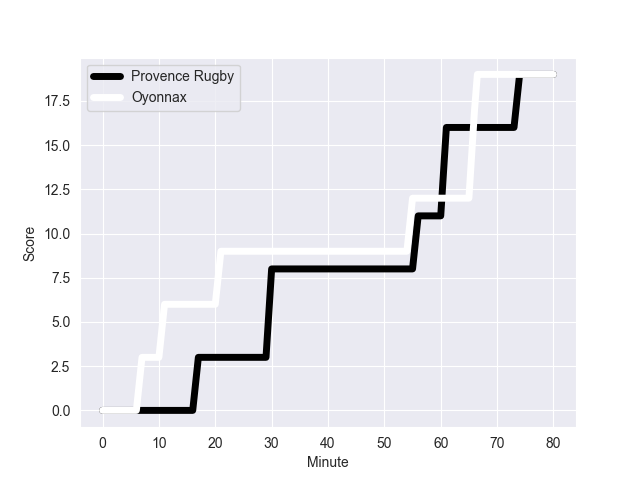
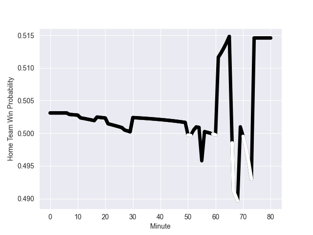

---  
layout: page  
title: Oyonnax at Provence Rugby; 19-19  
date: 2022-10-07 21:00:00 18:00:00 -0500  
categories: match review  
---
# Prediction: Provence Rugby by 5.6

Provence Rugby by 0.6 on a neutral field
## Scores over Time

## Win Probability over Time

# Pre-Match Prediction: Provence Rugby by 8.8

Provence Rugby by 3.8 on a neutral pitch

|   Away Minutes | Away Player             |   Away elo |   Away Percentile |   Number |   Home Percentile |   Home elo | Home Player        |   Home Minutes |
|---------------:|:------------------------|-----------:|------------------:|---------:|------------------:|-----------:|:-------------------|---------------:|
|             52 | Tommy Raynaud           |      72.02 |                 7 |        1 |                75 |      85.79 | Federico Wegrzyn   |             50 |
|             68 | Teddy Durand            |      75.72 |                17 |        2 |                 3 |      70.12 | German Kessler     |             53 |
|             60 | Thomas Laclayat         |      84.8  |                71 |        3 |                56 |      81.4  | Luke Tagi          |             56 |
|             80 | Phoenix Battye          |     110.05 |                97 |        4 |                80 |      89.43 | Jérôme Dufour      |             80 |
|             56 | Hugo Fabregue           |      85.83 |                68 |        5 |                91 |      97.48 | Kane Douglas       |             50 |
|             80 | Kevin Lebreton          |      79.98 |                45 |        6 |                56 |      81.65 | Guillaume Piazzoli |             27 |
|             56 | Loïc Credoz             |      69.48 |                 4 |        7 |                 4 |      69.72 | Bilel Taieb        |             80 |
|             80 | Rory Grice              |     101.9  |                93 |        8 |                40 |      79.46 | Carl Axtens        |             80 |
|             80 | Yvan David              |      79.93 |               nan |        9 |                93 |     100.38 | Jonathan Ruru      |             80 |
|             80 | Jules Soulan            |      81.98 |                55 |       10 |                85 |      94.13 | Enzo Selponi       |             80 |
|             80 | Aurelien Callandret     |      85.67 |                71 |       11 |                37 |      78.91 | Lester Etien       |             80 |
|             60 | Taylor Paris            |      73.45 |                12 |       12 |                79 |      89.72 | Louis Marrou       |             80 |
|             80 | Pedro Bettencourt Avila |      76.4  |                20 |       13 |                74 |      87.75 | Alivereti Raka     |             69 |
|             80 | Darren Sweetnam         |      86.97 |                64 |       14 |                74 |      86.72 | Nadir Bouhedjeur   |             80 |
|             80 | Tony Ensor              |      74.29 |                13 |       15 |                64 |      85.41 | Florent Massip     |             80 |
|             28 | Adrien Bordenave        |      61.16 |                 1 |       16 |                33 |      78.54 | Charles Malet      |             23 |
|             24 | Steve Mafi              |      72.16 |                11 |       17 |                 2 |      65.71 | Julius Nostadt     |             30 |
|             24 | Denis Marchois          |     115.4  |                98 |       18 |                 0 |      52.83 | Jessy Jegerlehner  |             30 |
|             12 | Benjamin Geledan        |      77.75 |                24 |       19 |                18 |      75.15 | Clément Chartier   |             30 |
|             20 | Thibault Berthaud       |      70.91 |                 5 |       20 |                24 |      77.38 | Lucas Martin       |             27 |
|             20 | Gaby Lovobalavu         |      82.34 |                53 |       21 |                 1 |      62.01 | David Lolohea      |             24 |
|             80 | Solomone Kata           |      -3.11 |                 0 |       22 |                32 |      78.21 | Hugo Navizet       |             11 |

