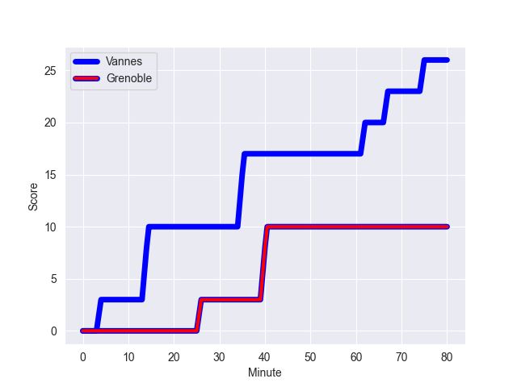
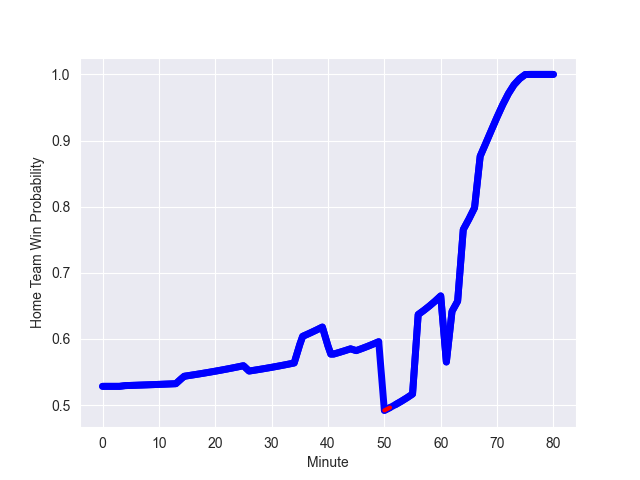

---  
layout: page  
title: Grenoble at Vannes; 10-26  
date: 2022-10-07 19:30:00 18:00:00 -0500  
categories: match review  
---
# Prediction: Vannes by 10.6

Vannes by 5.6 on a neutral field
## Scores over Time

## Win Probability over Time

# Pre-Match Prediction: Vannes by 10.1

Vannes by 5.1 on a neutral pitch

|   Away Minutes | Away Player         |   Away elo |   Away Percentile |   Number |   Home Percentile |   Home elo | Home Player           |   Home Minutes |
|---------------:|:--------------------|-----------:|------------------:|---------:|------------------:|-----------:|:----------------------|---------------:|
|             67 | Eli Eglaine         |      71.2  |                 7 |        1 |                40 |      79.35 | Charles-Henri Berguet |             45 |
|             45 | Jean Charles Orioli |      82.66 |                62 |        2 |                81 |      88.23 | Pat Leafa             |             45 |
|             56 | Regis Montagne      |      76.94 |                23 |        3 |                98 |     109.04 | John Afoa             |             57 |
|             41 | José Duarte Madeira |      83.97 |                64 |        4 |                79 |      89.36 | Edoardo Iachizzi      |             80 |
|             80 | Pio Muarua          |      87.49 |                74 |        5 |                48 |      80.49 | Ewan Thomas Johnson   |             61 |
|             80 | Antonin Berruyer    |      80    |                48 |        6 |                97 |     110.48 | Francisco Gorrissen   |             80 |
|             80 | Steeve Blanc-Mappaz |      86.66 |                77 |        7 |                 1 |      64.73 | Gregoire Bazin        |             57 |
|             67 | Loic Godener        |      79.93 |                43 |        8 |                62 |      83.9  | Joe Edwards           |             80 |
|             67 | Eric Escande        |      85.98 |                71 |        9 |                14 |      74.43 | Hugo Zabalza          |             57 |
|             67 | Romain Barthelemy   |      80.93 |                47 |       10 |                24 |      77.26 | Maxime Lafage         |             76 |
|             80 | Lucas Dupont        |      81.44 |                54 |       11 |                81 |      89.85 | Nicolas Freitas       |             80 |
|             80 | Bautista Ezcurra    |      87.35 |                73 |       12 |                26 |      77.73 | Sacha Valleau         |             50 |
|             64 | Romain Trouilloud   |      84.62 |                64 |       13 |                63 |      84.7  | Theo Costosseque      |             80 |
|             80 | Wilfried Hulleu     |      79.18 |                39 |       14 |                56 |      81.65 | Nathanael Hulleu      |             80 |
|             80 | Hugo Trouilloud     |      78.67 |                37 |       15 |                72 |      86.05 | Romaric Camou         |             80 |
|             39 | Levi Douglas        |      74.12 |                19 |       16 |               nan |      80.34 | Ximun Bessonart       |             35 |
|             35 | Mathis Sarragallet  |      76.56 |                22 |       17 |                58 |      83.64 | Théo Beziat           |             35 |
|             24 | Vincent Vial        |      79.07 |               nan |       18 |                43 |      80.57 | Branden Holder        |             30 |
|             16 | Romain Fusier       |      76.79 |                26 |       19 |                21 |      77.72 | Will Percillier       |             23 |
|             13 | Felipe Ezcurra      |      85.72 |                71 |       20 |                79 |      90.68 | Léon Boulier          |             23 |
|             13 | Thomas Fortunel     |      84.25 |                65 |       21 |                87 |      90.78 | Paga Tafili           |             23 |
|             13 | Marko Gazzotti      |      80    |               nan |       22 |                 6 |      67.68 | Myles Edwards         |             19 |
|             13 | Sam Nixon           |      88.28 |                84 |       23 |                95 |     103.45 | Regis Lespinas        |              4 |

