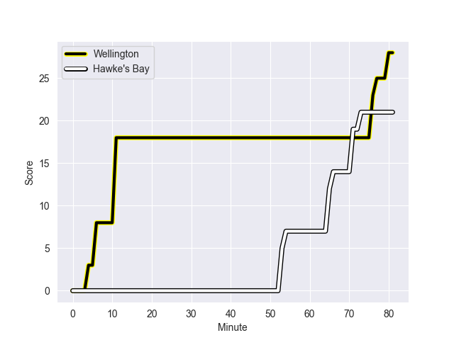
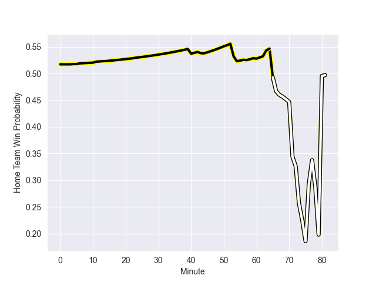

---  
layout: page  
title: Hawke's Bay at Wellington; 21.0-28.0  
date: 2022-10-07 21:05:00 18:00:00 -0500  
categories: match review  
---
# Prediction: Wellington by 7.1

Wellington by 2.1 on a neutral field
## Scores over Time

## Win Probability over Time

# Pre-Match Prediction: Wellington by 8.0

Wellington by 3.0 on a neutral pitch

|   Away Minutes | Away Player          |   Away elo |   Away Percentile |   Number |   Home Percentile |   Home elo | Home Player           |   Home Minutes |
|---------------:|:---------------------|-----------:|------------------:|---------:|------------------:|-----------:|:----------------------|---------------:|
|             77 | Pouri Rakete-Stones  |      89.87 |                58 |        1 |                58 |      90.31 | Xavier Numia          |             73 |
|             69 | Tyrone Thompson      |      77.34 |                 8 |        2 |                91 |     109.96 | Asafo Aumua           |             81 |
|             44 | Joe Apikotoa         |     100.65 |               nan |        3 |                38 |      82.09 | PJ Sheck              |             68 |
|             60 | Isaia Walker-Leawere |     108.88 |                88 |        4 |                64 |      95.72 | James Blackwell       |             73 |
|             81 | Tom Parsons          |     100.78 |                74 |        5 |                45 |      84.89 | Dominic Bird          |             81 |
|             81 | Marino Mikaele-Tu'u  |      88.93 |                61 |        6 |                36 |      81.55 | Caleb Delany          |             67 |
|             42 | Sam Smith            |      79.82 |               nan |        7 |                89 |     108.78 | Du'Plessis Kirifi     |             81 |
|             81 | Devan Flanders       |      84.96 |                40 |        8 |                29 |      81.84 | Peter Lakai           |             81 |
|             63 | Brad Weber           |     114.76 |                94 |        9 |                92 |     114.08 | TJ Perenara           |             67 |
|             81 | Lincoln McClutchie   |      92.88 |                61 |       10 |                69 |      97.4  | Jackson Garden-Bachop |             81 |
|             43 | Lolagi Visinia       |      90.03 |                63 |       11 |                34 |      80.64 | Pepesana Patafilo     |             81 |
|             81 | Danny Toala          |      83.66 |                40 |       12 |                57 |      93.36 | Peter Umaga-Jensen    |             73 |
|             81 | Stacey Ili           |     104.46 |                79 |       13 |                76 |     102.72 | Billy Proctor         |             81 |
|             57 | Neria Fomai          |      82.27 |                45 |       14 |                99 |     132.68 | Julian Savea          |             40 |
|             81 | Chase Tiatia         |     105.19 |                81 |       15 |                59 |      93.64 | Ruben Love            |             81 |
|             21 | Kianu Kereru-Symes   |      81.79 |                32 |       16 |               nan |      80    | Josh Southall         |              0 |
|              4 | Mark Braidwood       |      99.48 |                74 |       17 |               nan |      99.72 | Ha'amea Ahio          |              0 |
|             37 | Joel Hintz           |      81.45 |                35 |       18 |                57 |      89.52 | Tietie Tuimauga       |             21 |
|             21 | Bryn Evans           |     113.53 |                92 |       19 |                29 |      80.06 | Taine Plumtree        |              8 |
|             30 | Josh Kaifa           |      94.73 |                68 |       20 |                19 |      79.54 | Keelan Whitman        |             14 |
|             18 | Ere Enari            |      87.37 |                51 |       21 |                90 |     111.38 | Richard Judd          |             14 |
|             24 | Caleb Makene         |     104.6  |                80 |       22 |                26 |      80.63 | Aidan Morgan          |              8 |
|             38 | Ollie Sapsford       |      81.24 |                36 |       23 |                41 |      81.74 | Connor Garden-Bachop  |             41 |

