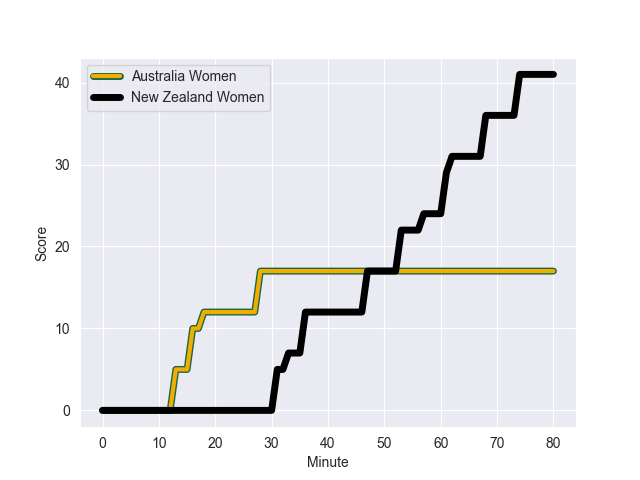
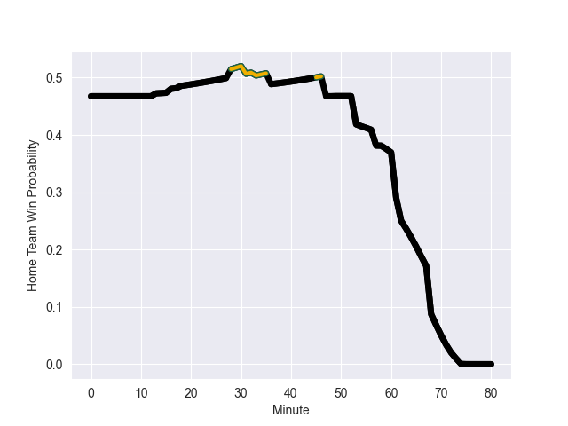

---  
layout: page  
title: New Zealand Women at Australia Women; 41.0-17.0  
date: 2022-10-08 02:15:00 18:00:00 -0500  
categories: match review  
---
# Prediction: New Zealand Women by 0.6

New Zealand Women by 5.6 on a neutral field
## Scores over Time

## Win Probability over Time

# Pre-Match Prediction: New Zealand Women by 0.5

New Zealand Women by 5.5 on a neutral pitch

|   Away Minutes | Away Player             |   Away elo |   Away Percentile |   Number |   Home Percentile |   Home elo | Home Player             |   Home Minutes |
|---------------:|:------------------------|-----------:|------------------:|---------:|------------------:|-----------:|:------------------------|---------------:|
|             49 | Pip Love                |      80    |               nan |        1 |               nan |      79.84 | Liz Patu                |             54 |
|             49 | Luka Connor             |      80    |               nan |        2 |               nan |      80    | Adiana Talakai          |             49 |
|             57 | Amy Rule                |      80    |               nan |        3 |               nan |      80    | Bridie O'Gorman         |             62 |
|             49 | Joanah Ngan-Woo         |      80    |               nan |        4 |               nan |      80    | Sera Naiqama            |             54 |
|             80 | Chelsea Bremner         |      80    |               nan |        5 |               nan |      80    | Atasi Lafai             |             64 |
|             58 | Charmaine McMenamin     |      89.92 |               nan |        6 |               nan |      80    | Emily Chancellor        |             80 |
|             80 | Sarah Goss              |      92.66 |               nan |        7 |               nan |      78.16 | Shannon Parry           |             80 |
|             80 | Liana Mikaele-Tu'u      |      80    |               nan |        8 |               nan |      79.57 | Grace Hamilton          |             65 |
|             68 | Kendra Cockseage        |      92.98 |               nan |        9 |               nan |      80    | Iliseva Batibasaga      |             58 |
|             80 | Ruahei Demant           |      80    |               nan |       10 |               nan |      80    | Arabella McKenzie       |             80 |
|             80 | Portia Woodman          |      93.83 |               nan |       11 |               nan |      80    | Ivania Wong             |             80 |
|             80 | Amy du Plessis          |      80    |               nan |       12 |               nan |      80.23 | Sharni Williams         |             62 |
|             67 | Stacey Waaka            |      90.02 |               nan |       13 |               nan |      80    | Georgina Friedrichs     |             80 |
|             80 | Ruby Tui                |      80    |               nan |       14 |               nan |      80    | Bienne Terita           |             80 |
|             62 | Renee Holmes            |      80    |               nan |       15 |               nan |      80    | Pauline Piliae-Rasabale |             62 |
|             31 | Georgia Ponsonby        |      80    |               nan |       16 |               nan |      80    | Ashley Marsters         |             31 |
|             31 | Awhina Tangen-Wainohu   |      80    |               nan |       17 |               nan |      78.95 | Emily Robinson          |             26 |
|             23 | Santo Taumata           |      80    |               nan |       18 |               nan |      80    | Eva Karpani             |             18 |
|             31 | Maiakawanakaulani Roos  |      80    |               nan |       19 |               nan |      80    | Michaela Leonard        |             26 |
|             22 | Kendra Reynolds         |      80    |               nan |       20 |               nan |      80    | Grace Kemp              |             31 |
|             12 | Arihiana Marino-Tauhinu |      80    |               nan |       21 |               nan |      80    | Layne Morgan            |             22 |
|             13 | Hazel Tubic             |      83.65 |               nan |       22 |               nan |      78.93 | Trilleen Pomare         |             18 |
|             18 | Sylvia Brunt            |      80    |               nan |       23 |               nan |      80    | Lori Cramer             |             18 |

